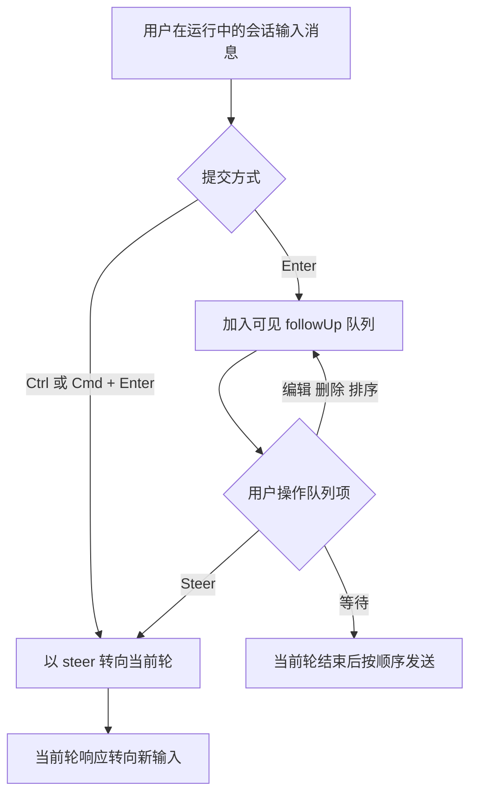
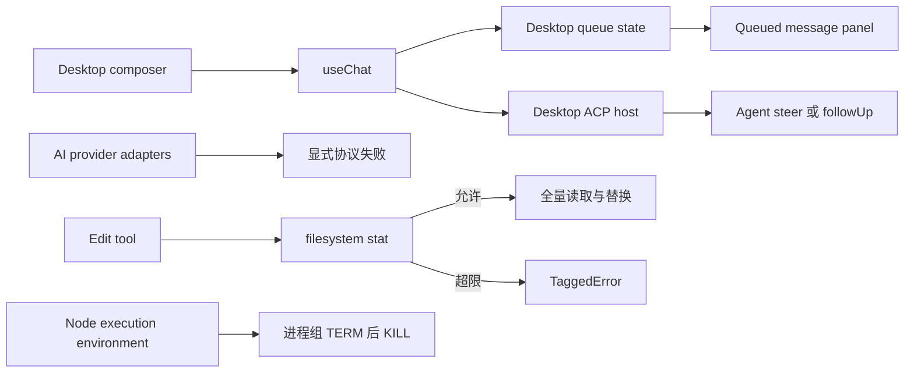
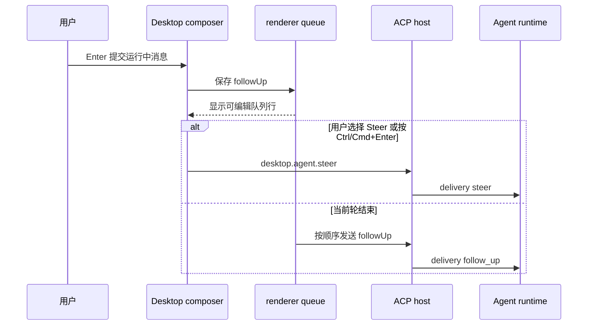

# Harness Playbook 问题核验与分阶段收敛

功能名称：Harness Playbook 问题核验与分阶段收敛
开始日期：2026-09-21
被提名的负责人：jayden

## 意图（AI 当前理解）

`docs/harness-playbook-analysis.md` 混合了仍然存在的缺陷、已经修复的问题、证据不足的判断和需要另开架构设计的方向。本需求先修四个边界清楚的缺陷，再基于修复后的代码审计剩余架构触点。

- 要解决：Desktop 运行中输入没有进入可见队列；Provider 把畸形工具参数静默改成 `{}`；Edit 可无界读取大文件；Shell 父进程提前退出时可能取消进程组硬杀定时器。
- 准备交付：四项局部修复，以及一份逐条核验原分析文档的架构触点清单。
- 本轮不做：Director、ConVar、Journal/配置重写、Sandbox 重设计、工具暴露面重构、Renderer 协议重构、PTY 账本、投机压缩或其他架构实现。
- 已确定：第一阶段不调整或新增架构；Desktop 队列交互和样式参考 Synara，同时遵守 JAI Desktop 的共享组件、图标和 `cn` 规则；第二阶段只给出证据、owner 和下一份 RFC 边界。
- 还不确定：无。具体阈值、错误文案和测试落点由实施时按现有接口与测试模式确定，不改变本 RFC 的外部行为。

## 概述

第一阶段处理四个可以在现有模块边界内完成的问题。Desktop 恢复 `followUp` 与 `steer` 的可见交互；AI Provider 遇到无法解析的工具参数时停止本次模型输出；Edit 在读取文件前检查大小；Node execution environment 保证发送 `SIGTERM` 后仍按约定完成进程组 `SIGKILL`。

第二阶段回看 `docs/harness-playbook-analysis.md` 的其余主张。审计结果按“已解决、局部缺陷、需要架构改动、证据不足或不采纳”分类，不在本需求中实现架构方案。

## 回顾

四项局部修复完成并通过各自检查后，由负责人回顾第二阶段的分类、证据和下一份 RFC 边界。结果记录在 T5 的执行记录及本 RFC 的后续更新中。

- [ ] 复盘完成

## 动机

原分析文档写于多项后续改动之前。`input_queued` 恢复、Shell 输出上限、环境清洗和 OS sandbox 已有实现，不能重复规划。仍存在的四个问题则有当前代码证据：

1. `app/desktop/src/hooks/use-chat.ts` 声明了 `onMessageQueued` 和队列输入，但运行中发送路径仍直接调用 `desktop.agent.followUp`，队列 UI 没有收到消息。
2. `packages/ai/src/providers/openai.ts`、`anthropic.ts` 和 `openai-responses.ts` 在工具参数 JSON 解析失败时使用 `{}`，把 Provider 协议错误推迟成难以理解的工具参数错误。
3. `packages/agent/src/harness/tools/edit.ts` 在替换前整文件读取，缺少基于现有 filesystem `stat` 的大小检查。
4. `packages/agent/src/harness/node/environment.ts` 在父进程 close 后清除 `forceKillTimer`，忽略 `SIGTERM` 的后代进程可能逃逸。

用户会直接感知 Desktop 输入是否排队、能否立即发生，以及队列是否可管理。其余三项影响失败语义、宿主内存和进程清理，适合先在现有 owner 内修复。

## 指南级的介绍

### 本次范围

第一阶段交付：

- Desktop 运行中按 Enter 将消息加入输入框上方的可见队列。
- `Ctrl+Enter` 或 `Cmd+Enter` 将当前草稿作为 `steer` 发送，立即发生当前轮。
- 已排队消息提供 Steer、编辑、删除和排序；当前轮结束后按队列顺序发送。
- 三个 Provider Adapter 不再把畸形工具参数替换为 `{}`。
- Edit 在全量读取前对超限文件返回领域错误。
- 中止 Shell 时，父进程提前退出不会取消必要的进程组硬杀。

第二阶段交付一份架构触点审计。它不修改架构代码，也不把原分析文档中的建议自动视为结论。

### 使用流程与示例

队列面板参考 Synara 的 composer stacked panel：它紧贴输入框上方，每行显示单行预览和行内操作。JAI 只参考信息层级与交互，不复制 Synara 的依赖或源码。

Provider 示例：模型输出的工具参数为截断 JSON 时，本轮以明确的 Provider/协议错误结束，工具不会收到伪造的空对象。

Edit 示例：目标文件超过允许的全量编辑大小时，工具在 `stat` 后返回可识别的 `TaggedError`，不会先把文件读入内存。

进程示例：Shell 启动了忽略 `SIGTERM` 的后代进程后被中止，即使父 shell 先退出，约定时间后的 `SIGKILL` 仍发送给进程组。

### 验收标准

- AC1：运行中的 Desktop 会话按 Enter 后，消息出现在输入框上方的队列中，不立即进入当前轮。
- AC2：运行中的 Desktop 会话按 `Ctrl+Enter` 或 `Cmd+Enter` 后，消息通过现有 `steer` 路径转向当前轮。
- AC3：队列项支持 Steer、编辑、删除和排序；Steer 成功后移除对应队列项，失败时不丢失原消息。
- AC4：当前轮正常结束后，队列按用户可见顺序逐条发送，已有排队消息不会被静默丢弃。
- AC5：队列面板参考 Synara 的 stacked composer 结构，并复用 JAI `src/components/ui/*`、`useIcon`/`useIcons` 和主题样式。
- AC6：OpenAI Chat Completions、Anthropic 和 OpenAI Responses 遇到无法解析的工具参数时，不执行带 `{}` 的工具调用，并返回可诊断失败。
- AC7：Edit 对超限文件在全量读取前失败，错误使用 `better-result`/`TaggedError` 约定，不新增裸业务异常。
- AC8：Shell 中止测试覆盖“父进程先退出、后代忽略 SIGTERM”的情况，硬杀仍然发生。
- AC9：四项修复不引入新的 durable store、调度层、配置层、兼容层或第二事实源。
- AC10：第二阶段逐条分类原分析文档的剩余主张，并为需要架构改动的项目写明当前证据、事实 owner、受影响状态或协议和建议的下一份 RFC 边界。
- AC11：已经由现有 Issue 或当前代码解决的项目不会重复进入架构任务。

## 参考实现级别的介绍

四项修复留在现有 owner 内：

Desktop 继续使用现有 queue store、`ChatMessageQueue`、ACP `steer`/`followUp` 和 RPC DTO。实现需要补齐接线及交互，不新建第二套队列。队列的事实仍是 renderer 的可丢弃输入状态；Session 消息与 Operation 事实仍由 Agent journal 持有。

Synara 作为行为和视觉参考：默认 follow-up 行为为 Queue，`Ctrl/Cmd+Enter` 临时选择相反模式，队列行提供 Steer/Delete/Edit。JAI 本次固定 Enter 入队、`Ctrl/Cmd+Enter` steer，不增加新的用户配置项。允许根据 JAI 现有 composer 尺寸、主题和动效调整视觉细节。

Provider Adapter 在组装最终 Assistant tool call 时验证参数。解析失败应进入现有 Adapter stream 的失败语义，不尝试猜测、补全或纠正 JSON。错误不得携带未筛选 SDK 对象越过 RPC/UI 边界。

Edit 使用 execution environment 已有 `stat` contract 做预检。阈值应是当前工具实现的固定安全边界，除非仓库已有等价常量；本阶段不增加配置系统。只有需要全量读入的 Edit 受该限制，流式 Read 的语义留给第二阶段审计。

进程终止继续使用现有 Unix 进程组实现。修复应把“父进程 close”与“整个进程组已经无需硬杀”分开，保证后代清理，同时避免在正常完成后误杀复用 PID 的无关进程。Windows 行为不在本任务中重构。

相关项目规则来自根 `AGENTS.md`：可恢复失败使用 `Result<T, E>`；领域错误使用 `TaggedError`；Desktop 复用共享 UI 组件和 Hugeicons 图标上下文；Tailwind 条件组合使用 `cn`；不保留兼容层；不为单一实现新增 interface/factory/strategy。

验证使用各 owner 已有命令：

- Desktop：`bun run --cwd app/desktop typecheck`、`bun test app/desktop`，并人工检查 queue/steer 键盘与队列行交互。
- AI：`bun run --cwd packages/ai typecheck`、`bun run --cwd packages/ai test`。
- Agent：`bun run --cwd packages/agent typecheck`、`bun test packages/agent`。

## 缺点

Renderer 队列仍是易失状态。应用退出后的队列恢复不在本阶段范围内，因为这会触及输入事实的 durable ownership。固定的 Edit 上限也可能拒绝少量原本能成功处理的大文件；错误需要告诉调用方改用分块方式。进程组测试依赖 Unix 进程语义，跨平台覆盖仍有限。

第二阶段只给出架构边界，不直接减少架构债务。这样能防止在旧分析结论尚未核验时扩大改动面。

## 理由和替代方案

直接执行原分析文档中的六条演进路线会重复已经完成的工作，并把局部缺陷和产品架构选择混在一次改动中。本方案先处理已有接口内的明确错误，再决定哪些问题值得单独设计。

Desktop 也可以把运行中 Enter 继续直接映射为 `followUp` RPC，但用户无法查看、修改或提升优先级，现有队列组件继续闲置。另一个方案是只提供 steer，不保留队列；这会让普通补充信息打断当前工作。当前方案保留两种语义。

畸形 JSON 可以尝试自动补全，但需要定义修复策略、可信边界和可观测性，属于 corrective inference 架构。本阶段选择明确失败。

Edit 可以改成流式 patch 引擎，进程管理也可以抽象成统一 Job。两者都超出局部修复范围，留给第二阶段判断。

## 现有技术

JAI 已有 `steer`、`followUp`、renderer queue store、队列组件和 ACP delivery 字段，缺的是完整接线与一致交互。Synara 的实现提供了经过使用的参考：`resolveFollowUpDispatchMode` 区分 Queue/Steer，`ComposerQueuedHeader` 和 `QueuedComposerActions` 展示队列行及 Steer/Delete/Edit，`useChatQueuedTurns` 处理提升失败后的回插和自动排空。

现有 Issue 已覆盖若干旧结论：`#87` 处理 queued-input/interrupted recovery，`#94` 处理进程输出限制，`#100`/`#105` 处理 OS sandbox 与进程清理基础能力，`#91` 处理 Harness authority/boundary。第二阶段必须读取当前代码与这些记录，不能只依据分析文档。

## 未解决的问题

接受前必须解决：无。

实施中验证：

- Edit 上限采用仓库已有常量还是在 Edit owner 内定义固定值。
- ACP steer 失败时 renderer 队列的回插位置和错误提示是否已有可复用模式。
- Unix 测试环境如何稳定构造忽略 `SIGTERM` 的后代进程并证明清理完成。

范围外：

- Renderer 队列是否需要 durable 恢复。
- Follow-up 行为是否做成用户设置。
- Windows Job Object、统一 Job 生命周期和工具进程隔离。
- Corrective inference、模型 quirks、配置入树、Director、ConVar、工具面和渲染协议重构。

## 未来的可能性

T5 若确认某项需要架构调整，应为该项另开 RFC。下一份 RFC 只能包含有当前代码证据、明确 owner 和可验收产品行为的改动，不沿用原分析文档的宽泛路线图。

## 第二阶段审计结论

2026-09-21，T5 已按当前源码、测试和 Issue 元数据完成核验。完整证据与逐项分类见 [T5 执行记录](./05-audit-architecture-touchpoints.md)。

- 已解决：Desktop queue/steer、Provider 畸形参数、Edit 大文件预检、Shell 进程组硬杀，以及既有 Issue 已覆盖的输出限制、Harness 四轴、macOS/Linux Shell sandbox。`ToolCatalog` 当前只有 `SearchTools`/`ExecuteTool` 两个动态前门，原文“13 个 schema 全部常驻”不成立。
- 局部缺陷：当前分支 Usage 仍累计全部 operation records；本地 UDS 位于 `os.tmpdir()` 且没有显式 socket mode/受控父目录。两项都可在现有 owner/interface 内修复，不需要架构 RFC。
- 需要架构改动：分支感知的 Session mode/model；durable queued input 的 fresh-Host 崩溃策略；ACP controller/spectator attachment；child-agent execution context 继承；Host 选择的 operation model capability snapshot；Terminal logical replay。受信 Extension 隔离只在新的 threat model 明确后启动。
- 证据不足或不采纳：durable `turnCount`、Director/ConVar、统一 Job、投机压缩、Quirks/corrective inference、Read 通用物化器、`dyn`/AutoQA、聊天弹性槽位、工具长日志、全面 Rust/Stub 重写。它们缺少当前失败场景、遥测或会预防性扩大协议。

建议顺序：先单独修 Usage projection 和 local socket 权限；架构上先做 branch-aware Session execution configuration，再修订仍为 open 的 #87 以决定 queued-input crash policy，然后做 operation model capability snapshot。Spectator、child-agent、Terminal 和 Extension trust model 按真实产品场景分别立项，不合并成 Harness 总重构。

## 子任务

- [T1 Desktop 运行中队列与 Steer 交互](./01-desktop-queue-steer.md)
- [T2 拒绝畸形 Provider 工具参数](./02-reject-malformed-tool-arguments.md)
- [T3 为 Edit 增加大文件熔断](./03-bound-edit-file-input.md)
- [T4 保证 Shell 进程组硬杀](./04-process-group-hard-kill.md)
- [T5 核验剩余架构触点](./05-audit-architecture-touchpoints.md)

## JN 确认记录

2026-09-21，jayden 在会话中确认完整 RFC 与 T1-T5 任务范围，并授权开始实施。确认覆盖第一阶段四项局部修复，以及随后只读产出架构触点审计的第二阶段；不包含任何架构改造实现。

## 最终验收

2026-09-21，T1-T5 均按 completed 关闭，父需求整体 Review 通过，代码未提交。

- AC1-AC5：Desktop 运行中 Enter 入队、`Ctrl/Cmd+Enter` steer、队列 Steer/编辑/删除/排序和逐项排空已接通；Steer 成功后精确移除，失败保留。
- AC6：OpenAI Chat Completions、Anthropic、OpenAI Responses 的畸形或非 object 工具参数均以 `ai_provider.invalid_tool_arguments` 终止，不执行伪造空参数。
- AC7：Edit 在两次全文件读取前执行固定 10 MiB `stat` 预检，超限和 stat failure 都不会先读取文件。
- AC8：Unix 真实进程树测试证明父 shell 先退出后，忽略 `SIGTERM` 的后代仍在宽限期后被清理。
- AC9：改动保持在既有 Desktop renderer queue、AI adapter、Edit owner 和 Node execution environment 内，没有新增 durable store、配置层、兼容层或调度抽象。
- AC10-AC11：T5 已逐项分类原分析主张，记录事实 owner、状态/协议、跨模块边界、用户问题、下一 RFC 边界与明确不做范围；#87/#91/#94/#100/#105 状态已通过 GitHub 重新核验。

最终检查：

- `bun run --cwd app/desktop typecheck`：通过。
- `bun test app/desktop`：254 pass，0 fail。
- `bun run --cwd app/desktop i18n:validate`：483 messages，2 locales，通过。
- `bun run --cwd packages/ai typecheck`、`bun run --cwd packages/ai test`：通过，52 pass。
- `bun run --cwd packages/agent typecheck`、`bun test packages/agent`：通过，245 pass。
- `git diff --check`：通过；Desktop 受影响文件未新增原生 button、直接图标库引用或 JSX class 拼接。
- 针对改动文件的 `biome check` 无错误；唯一 warning 是 `chat-column.tsx` 在 HEAD 已存在的未使用 `MessageIcon`，不属于本需求改动。
