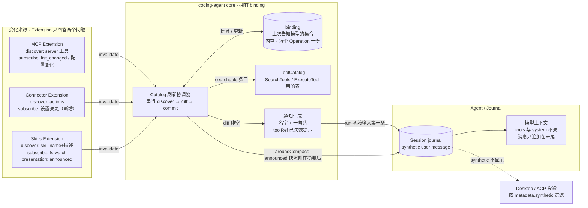
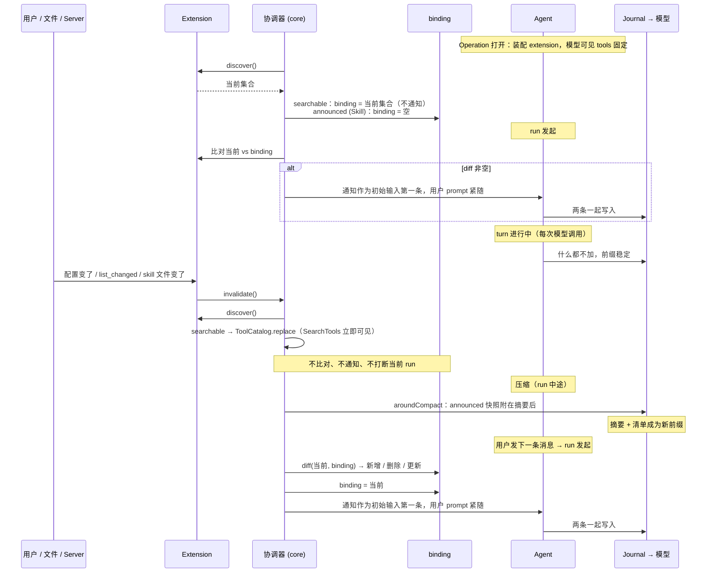
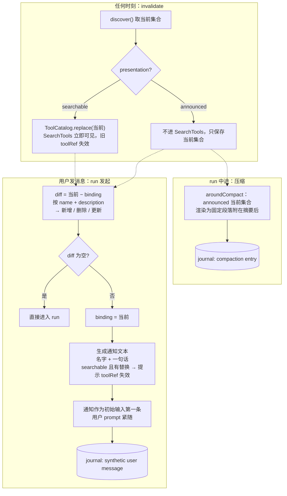
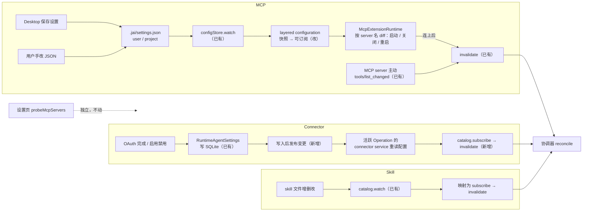

# 需求说明: 能力变化通知（Capability Change Notice）

日期:2026-09-11

## 问题
Agent 运行期间，可用能力会变：MCP server 增删或其工具列表变化、Connector 完成授权或被启用/禁用、Skill 文件被增删改。现在这些变化要么到不了正在跑的会话，要么到了也没人告诉模型：

- MCP / Connector 的工具已经藏在固定的 `SearchTools` + `ExecuteTool` 前门后面，catalog 刷新不会改动模型可见的 tools，不破坏 prompt cache；但刷新后没有任何消息，模型只有再主动搜索才会发现，而且之前拿到的 `toolRef` 已全部失效，继续用会报错。
- Skill 是三者里唯一会破坏 cache 的：`Skill` 工具的 description 是一个 getter，每次请求重新读 catalog 拼 `<available_skills>`。Skill 文件一变，下一次请求的 tools payload 就变了，Anthropic 从 tools 开始的整个前缀全部失效。文件监听只更新 slash command 表，模型不知道；运行中调用已改动的 skill 只会得到一个 tool error。
- 用户在 Desktop 设置页保存 MCP 配置、或直接手改 `.jai/settings.json`，正在跑的 Operation 里的 MCP runtime 不会增删 server，要等下次新开 Operation。Connector OAuth 完成只把凭据写进 server 的 SQLite，正在跑的 Operation 里的 connector service 不知道，调用仍因未连接失败。

受影响的是所有在会话中途改动能力的用户，以及依赖 prompt cache 控制成本和延迟的每一次模型调用。

## 期望结果
- 三种来源在会话中途发生的增删改，都会以一条**写进会话记录、只给模型看、用户界面不显示**的 synthetic user 消息告知模型：新增了什么、删除了什么、更新了什么，以及旧引用是否失效。通知只在用户发出下一条消息、新 run 发起时投递，作为初始输入的第一条、用户 prompt 紧随；不打断正在进行的 run，不使用 `steer`。消息只追加在末尾，不改历史，不动 tools 与 system prompt，cache 前缀保持稳定。
- 模型可见的 tools 数组在整个 Operation 内不再变化。`Skill` 工具的 description 改为固定文案，可用 skill 清单改为：首次 run 发起时注入一条全量清单，之后变化走增量通知，压缩时把当前全量清单作为固定段落附在压缩摘要后，压缩后的同一 run 内没有缺口。
- "模型当前被告知的能力集合"（binding）由 coding-agent core 统一持有和比对；extension 只负责回答"现在有什么"和"可能变了"，不记旧状态、不生成通知、不感知压缩。
- Desktop 保存 MCP 设置、手改 JSON、Connector OAuth 完成，都会传到正在跑的 Operation：MCP runtime 按新旧配置增删 server，connector service 重读凭据，随后走同一条通知链。
- 设置页的"测试连接"探测保持独立，不与运行中的连接合并。

## 图解

### 分工：谁拥有什么

### 生命周期：一次变化从到达到被模型看到

### reconcile：唯一的一段逻辑

### 触发源：三条路怎么接进来

## 影响范围
会改到的模块:
- `packages/coding-agent`：extension 契约（catalog 的投递方式声明）、catalog 刷新协调器（binding、diff、通知投递）、run 发起与压缩后的注入点
- `packages/extension/src/skills`：`Skill` 工具 description 固定，skill 清单改为 catalog 形式对外
- `packages/extension/src/mcp`：runtime 响应配置变化增删 server
- `packages/extension/src/connector`：catalog 补 `subscribe`，响应 server 侧设置变更
- `packages/coding-agent` extension host adapter：layered configuration 从一次快照改为可订阅
- `app/server`：`RuntimeAgentSettings` 写入后的变更通知；ACP / Desktop 投影对隐藏消息的处理核对

长期保存的数据与维护方:
- 通知消息作为 user message 写入 Session journal（`@jai/agent` journal 维护，SQLite），带 `metadata.synthetic: true`。不新增表、不新增字段类型；沿用 `RuntimeHost` 切换 workspace 时已在用的系统生成消息形式。
- binding 是每个 Operation 的内存状态，可丢弃，Operation 打开时重建；不持久化。
- MCP 声明配置仍在 `.jai/settings.json`（`configStore` 维护）；Connector 配置仍在 server SQLite `runtime_agent_settings`（`RuntimeAgentSettings` 维护）。两者只读不改结构。

## 边界
- Skill 不进入 `SearchTools` 目录；它只走清单注入与增量通知。
- 不改 `SearchTools` / `ExecuteTool` 的 schema 或搜索行为。
- 不合并设置页的 `probeMcpServers` 与运行中的 MCP 连接；不改 `mcp-settings.ts` 的探测逻辑。
- 通知只给名字和一句描述，不附带完整 schema 或 skill 正文。
- 用户界面完全不显示通知，不做折叠提示。
- 不对已写入 journal 的旧通知做清理或改写。
- 不处理 Agent Plugin 目录的运行中变化（它通过 Skills / MCP 间接生效，不单独建来源）。

## 工作量
大。通知通道是三种来源共用的基础，需先单独交付并用 MCP 已有的 `tools/list_changed` 触发源验证端到端；Skill 的清单迁移、MCP 配置热更新、Connector 设置送达各自涉及不同 workspace 和不同触发源，可以并行、也需要分别检查。

## 已确认的现状
- 模型可见 tools 在 Agent 构造时固定为静态工具 + `SearchTools` + `ExecuteTool`；catalog 刷新只调 `ToolCatalog.replace`，不改模型可见列表，但使所有旧 `toolRef` 失效（`packages/coding-agent/src/runtime/tool-catalog.ts`，`packages/coding-agent/src/runtime/assemble.ts`）。
- `ExtensionCatalogRefreshCoordinator.#discoverAndCommit` 是唯一同时持有新旧两份 catalog 的位置（`packages/coding-agent/src/sdk/extensions.ts`）。
- Extension catalog 契约只有 `discover` 与 `subscribe(invalidate)`，注释明确 invalidate 不携带任何可变状态（`packages/coding-agent/src/sdk/extensions/contract.ts`）。
- `Skill` 工具的 description 为 getter，读 `catalog.snapshot.skills`；skills catalog 已有 fs watch、debounce 与 `revisionOf` 哈希（`packages/extension/src/skills/index.ts`、`catalog.ts`）。
- Anthropic adapter 在 system、最后一个 tool 定义、最后一条 user 消息的最后一个 block 三处打 cache breakpoint（`packages/ai/src/providers/anthropic.ts`）。追加在末尾的 user 消息不影响前缀。
- 系统生成的 user 消息带 `metadata.synthetic: true`；写进 journal 时可跨会话保留，`beforeModelCall` 注入的请求级 system context 不写 journal。ACP / Desktop 投影按 `metadata.synthetic` 过滤前者。本需求使用 durable synthetic user message。
- `AgentInput` 接受 `AgentMessage[]`，run 发起时可以把通知与用户 prompt 一起作为初始输入（`packages/agent/src/core/agent.ts`）。`steer` 与用户自己的 steer 消息共用队列，本需求不使用它。
- harness 提供 `aroundCompact` 洋葱式 middleware，可以在默认摘要生成后修改结果再写入 compaction entry（`packages/agent/src/harness/hooks.ts`）。
- extension 拿到的 layered configuration 在 activate 时拍一次快照，`persistent: false`，之后不再更新（`packages/coding-agent/src/sdk/extensions/host-adapters.ts`）；而 `configStore.watch` 已在监听 user 与 project 的 `.jai/settings.json`，目前只用于更新权限快照（`packages/coding-agent/src/runtime/create-coding-agent.ts`）。
- MCP runtime 的 server 表只在构造时从配置建立（`packages/extension/src/mcp/runtime.ts`）；已连接 server 的 `ToolListChangedNotification` 与重连会 `invalidate`。
- Connector catalog 没有 `subscribe`；`MemoryConnectorService.applyConfiguration` 只换 connections / credentials / policy；OAuth 完成只调 `saveConnectorOAuth` 写 SQLite（`app/server/src/connectors/oauth-runtime.ts`，`app/server/src/config/runtime-agent-settings.ts`）。
- `RuntimeMcpSettingsController` 同时持有 `save` 与基于 `probeMcpServers` 的 `status`，探测是独立于 Agent runtime 的第三条连接（`app/server/src/runtime-capabilities/mcp-settings.ts`）。

## 参考对象
- 统一前门的缓存论证见 [JAI 统一工具前门](../research/tools/_jai-unified-tool-frontdoor.md)。
- Claude Code 的做法（用户元数据消息承载 skill / MCP 清单、末尾注入热更新提示、压缩后重建）作为行为参考，不严格遵循；本仓库 journal 只能追加，因此"重建第一条消息"等价为"压缩后追加一条新快照"。
