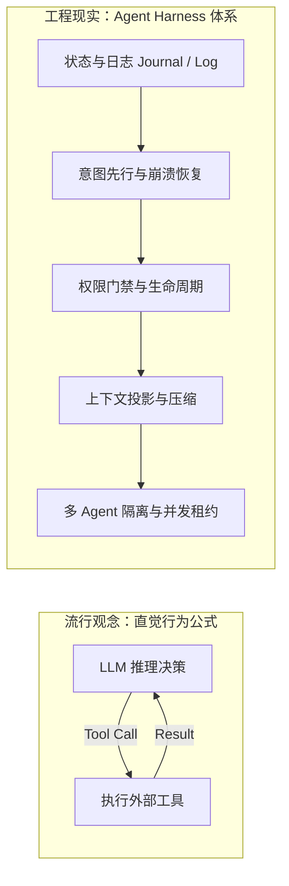
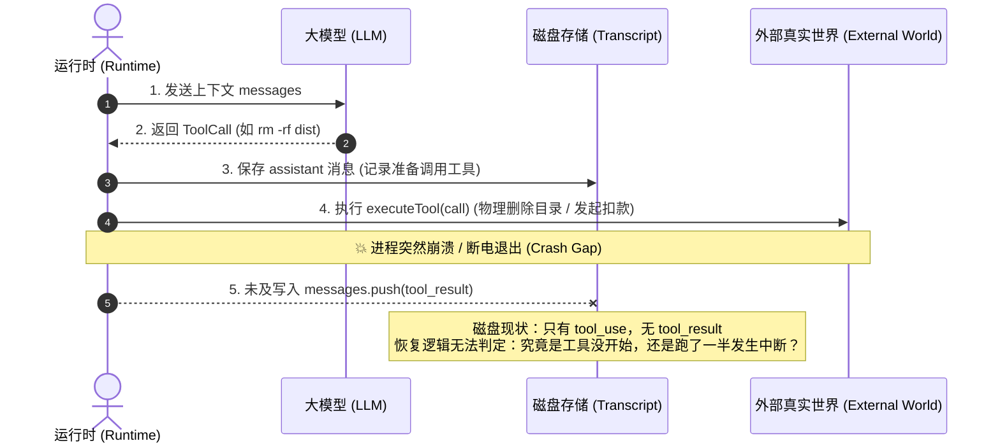
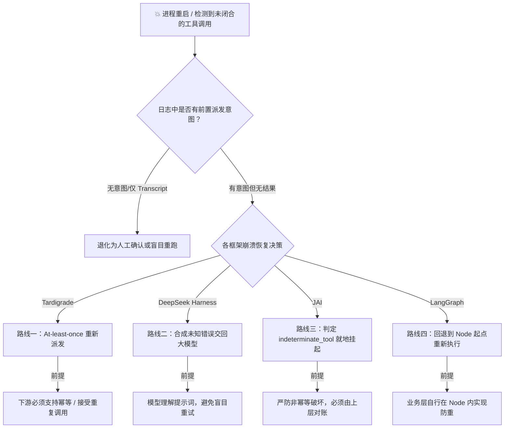
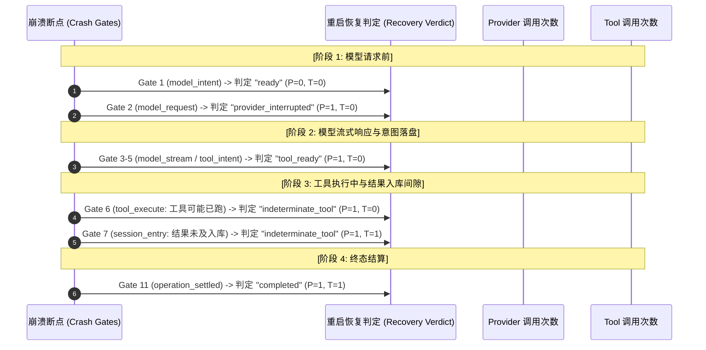
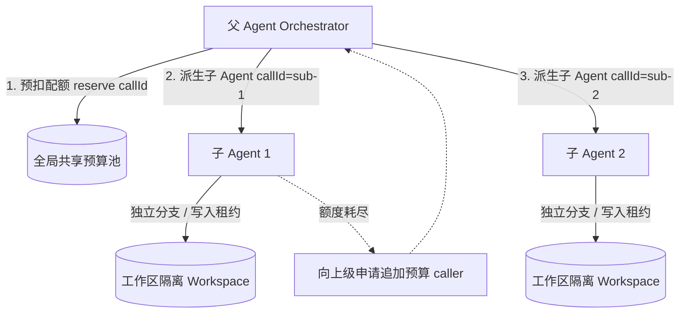

# Agent 不等于 LLM + Tool + Context：循环之外的那部分才拉开差距

写于 2026-09-04。文中讨论的八个框架均基于具体版本源码：Tardigrade `c338df7`、DeepSeek Harness `76fda72`、pi `dd7e816`（main 分支）、Claude Code 2.1.260、opencode `70f7411`、LangGraph `81bf17b`、we0-agent-x 本地工作树、JAI `212a098`。所有技术细节均对应具体文件与行号，完整对比证据参见 [agent-harness-comparison.md](agent-harness-comparison.md)。

## 1. 所谓「工具在循环里跑」，到底是谁给的定义

在各类技术文章和教程里，几乎每个人都见过这个公式：`Agent = LLM + Tools + Loop`。

这句话不是外行随口编的，它有非常清晰的行业出处。

Anthropic 在 2024 年 12 月的 [Building effective agents](https://www.anthropic.com/engineering/building-effective-agents) 中写道：

> Agents can handle sophisticated tasks, but their implementation is often straightforward. They are typically just LLMs using tools based on environmental feedback in a loop.

Amp 创始人 Thorsten Ball 在 2025 年 4 月的 [How to Build an Agent](https://ampcode.com/notes/how-to-build-an-agent) 中表达得更直截了当：

> It's an LLM, a loop, and enough tokens. It's what we've been saying on the podcast from the start. The rest, the stuff that makes Amp so addictive and impressive? Elbow grease.

Simon Willison 随后在 2025 年 9 月将其[收敛为精炼的一句话](https://simonwillison.net/2025/Sep/18/agents/)：

> An LLM agent runs tools in a loop to achieve a goal.

这三段表述都没错，但它们定义的是 Agent 呈现出的**外部行为特征**：模型阅读上下文，决定调用什么工具，宿主系统执行工具，再把执行结果反馈给模型继续推理。

很多人记住了「LLM 调工具跑循环」的简洁概括，却常常忽略了 Thorsten Ball 紧接着说的后半句：核心循环只要几行代码，真正让系统具备工程可用性的，全靠后面那些苦工（Elbow grease）。



很快，同一批推动者就把重心转向了这些「剩下的部分」。Anthropic 在 2025 年 11 月专门发文探讨长任务运行底座 [Effective harnesses for long-running agents](https://www.anthropic.com/engineering/effective-harnesses-for-long-running-agents)，研究如何让 Agent 跨越多个 Context Window 稳定工作；OpenAI 在 2026 年 2 月发表 [Harness engineering](https://openai.com/index/harness-engineering/)，指出团队的工程核心已经转向设计运行环境与反馈回路；DeepSeek 官方架构页更是直接给出了 `Agent = Model + Harness` 的等式。

Harness（支架/线束）指的就是包裹在推理循环外层的那套工程底座：持久化存储、崩溃恢复、状态隔离、权限拦截与并发调度。循环本身十行代码就能跑通，但外层这套机制的设计，直接决定了一个 Agent 是只能在终端里陪人即时打字，还是能在无人值守的环境下稳妥跑完长达数小时的复杂任务。这篇文章就从那十行代码开始，层层拆解八个主流框架在每一个关键节点上的设计取舍。

## 2. 从十行最简循环，到致命的崩溃间隙

绝大多数 Agent 教程展示的核心逻辑都长成这样：

```ts
// 最简 Agent 循环（TypeScript 描述）
type Message = { role: "system" | "user" | "assistant" | "tool"; content: string; tool_calls?: ToolCall[] };

async function runNaiveLoop(systemPrompt: string, userQuery: string) {
  const messages: Message[] = [
    { role: "system", content: systemPrompt },
    { role: "user", content: userQuery }
  ];

  while (true) {
    const response = await llm.chat(messages);
    messages.push(response);
    if (!response.tool_calls || response.tool_calls.length === 0) {
      return response.content;
    }
    for (const call of response.tool_calls) {
      const result = await executeTool(call); // 💥 执行具有外部破坏性的动作
      messages.push({ role: "tool", content: JSON.stringify(result) }); // 💥 结果回填
    }
  }
}
```

在本地交互、网络良好且任务简短时，这段代码跑得非常顺畅。但致命的隐患就潜伏在第 17 行与第 18 行之间。

假设模型决定执行命令 `bash("rm -rf dist && npm run build")`。`executeTool` 开始执行，`dist` 目录在第 1 秒被成功删除；跑到第 3 秒，进程突然由于宿主 OOM、机器断电或人为中断而退出。



重启后的新进程读取先前持久化的 `messages`，看到的最后一条记录是 assistant 说的「准备调用 bash」，而第 18 行的 `messages.push` 根本没机会执行。对于新进程的恢复逻辑而言，这次工具调用**在记录中看起来从未发生过**。

如果新进程直接重新执行这一步，`rm -rf dist` 顶多报个目录不存在；但如果这一步是 `git push --force`、调用银行接口扣款、或是向生产数据库执行结构变更，盲目重跑就会直接造成灾难性的二次副作用破坏。

这里必须区分两种看似相似、实则职责完全不同的记录形式：

- **会话记录（Transcript）**回答的是「聊到哪了」：记录人与模型的对话历史，既用于给模型装配上下文，也用于前端交互回显。它的特点是**工具执行成功并返回后，才把结果追加进去**。如果进程在执行中途崩溃，会话记录里不会留下任何这一步是否真正触发过的证据。
- **执行日志（Operation Journal）**回答的是「做到哪了」：记录系统的执行状态机。它的核心原则是**在工具真正派发前，必须先落盘一行「我要开始执行了」的前置意图记录**；等执行完毕，再写入对应的确认结果。即使中途崩溃，那条前置意图依然留存在磁盘上。

Claude Code 的本地存储就是典型的会话记录设计。以其在本地目录 `~/.claude/projects/` 下一份 1478 行的会话文件为例：

```text
$ jq -r '.type' 8a78d37e-….jsonl | sort | uniq -c | sort -rn
 610 assistant
 374 user
  82 last-prompt
  81 permission-mode
  ...
$ jq -r 'if has("seq") then "has_seq" else "no_seq" end' … | sort | uniq -c
1478 no_seq
intent_records 0
```

整份日志中没有单调递增的全局操作序号，也没有独立的前置意图事件。`tool_use` 嵌在 assistant 消息体内，`tool_result` 紧跟在下一条 user 消息中。换句话说，Claude Code 的 Transcript 和前面那段十行循环里的 `messages` 数组在本质上是一样的：只有工具拿到结果后，记录才会出现。

把前面的崩溃场景代入进来：当进程在 `npm run build` 跑到一半时被杀，Transcript 文件的末尾只留下一条带 `tool_use` 的 assistant 消息，后面没有任何 `tool_result`。这份记录同时兼容两种截然不同的物理事实——工具压根没开始跑，或者工具已经跑了一半并产生了外部破坏。恢复逻辑从磁盘读到的字节完全相同，根本无从分辨。它被逼入了两难：要么冒险重新触发（承担重复执行非幂等操作的风险），要么直接抛锚等待人工排查。

官方文档提供了 `--resume` 与 `--continue` 用于会话接续，但在工具中途崩溃时的容错策略上并没有做强保证。对于有人值守的终端 CLI 工具，这种设计是务实且合理的：开发者就坐在屏幕前，瞄一眼终端输出就知道构建完成与否，手动敲一句话就能继续。但如果场景换成后台无人值守、需要连续运行几个小时的长周期任务，没有任何人在场做人工仲裁，恢复逻辑就必须仅凭磁盘数据精确判断「这一步到底做过没有」。Transcript 无法提供这个判定依据，系统就必须引入第二种记录。

## 3. 意图先行：在产生副作用前留下痕迹

要解决中途丢失状态的问题，最直接的改进是在循环中引入前置意图落盘：

```ts
// 意图先行（Intent-Before-Effect）执行模型
interface JournalStore {
  append(event: JournalEvent): Promise<void>;
}

type JournalEvent =
  | { type: "tool_dispatched"; callId: string; tool: string; args: unknown; idempotencyKey: string }
  | { type: "tool_completed"; callId: string; result: unknown }
  | { type: "tool_failed"; callId: string; error: unknown };

async function executeWithJournal(journal: JournalStore, call: ToolCall) {
  const idempotencyKey = `call:${call.id}`;
  
  // 1. 产生外部副作用前：先行持久化派发意图
  await journal.append({
    type: "tool_dispatched",
    callId: call.id,
    tool: call.name,
    args: call.args,
    idempotencyKey,
  });

  try {
    // 2. 触发真实世界执行（调用 API / 写磁盘 / 跑命令）
    const result = await executeTool(call, { idempotencyKey });
    
    // 3. 执行成功后：写入终态确认结果
    await journal.append({ type: "tool_completed", callId: call.id, result });
    return result;
  } catch (error) {
    await journal.append({ type: "tool_failed", callId: call.id, error });
    throw error;
  }
}
```

引入意图落盘后，再次遭遇相同的崩溃，新进程从日志里读到的不再是空白，而是：存在一条 `tool_dispatched` 记录，但缺少对应 `callId` 的 `tool_completed` 或 `tool_failed`。

此时系统明确获知了一个关键事实：**这个工具已经被派发出去，且很有可能已经在外部世界产生了副作用，但最终执行结果未知。**

和 Transcript 相比，这里多出来的信息就是「可能已经做过」这几个字。虽然它依然无法证明外部操作到底有没有彻底完成，但它把此前致命的未知盲区，转化成了一个可被程序捕获、校验和决策的明确状态。

状态明确之后，后续的恢复路径取决于该操作本身的性质：

- **幂等操作**可以安全重跑：例如 `mkdir -p`、按主键读取数据，或者下游 API 支持基于 `idempotency key` 自动去重（携带同一 Key 重试时服务端直接返回原结果，不重复扣费）。对于这类操作，重跑一次与只跑一次效果相同。
- **非幂等操作**一旦重跑就是真实的二次执行：例如 `git push --force`、没有防重机制的转账接口、或是含有破坏性逻辑的 Shell 脚本。如果系统对这类操作采取「挂了就自动重试」的策略，其提供的执行保证就退化成了充满风险的 **at-least-once（至少执行一次）**。

面对这种悬空状态，一个 Harness 在架构上实际上只有三种应对策略：无视风险一律重跑；把「结局未知」作为观察结果交回给模型由其自行决策；或者直接挂起任务等待外部人工确认。在第 6 节中，我们将看到各大框架如何在这三条道路上站队。不过在此之前，我们还需要先看一个常常被开发者忽略的副作用来源。

## 4. 模型调用本身也是不可逆且计费的副作用

很多系统在设计时只防备了本地工具的副作用，却忽略了大模型推理本身同样是一次耗时、按 Token 计费且无法撤销的网络 I/O。请求一旦发给 Provider，计费便已开始；如果响应在完全流回并写入磁盘前进程崩溃，费用已经发生，但新进程手里空无一物。

模型调用与本地工具的区别在于代价的形态：工具重复执行会破坏外部环境的状态，而模型重复执行消耗的是真金白银。正因如此，模型调用通常允许自动重试，但前提是必须受到严格的次数上限约束。如果网络抖动或解析异常引发连续崩溃，每次重启都无脑重新请求大模型，账单就会呈倍数级失控增长。要准确限制重试次数，系统就必须明确知道当前调用已经失败过几次，而这个计数只能从崩溃前持久化的前置记录中读取。

因此，重视持久化可靠性的框架对大模型调用同样遵循意图先行。以 Tardigrade 的底层实现为例，它在向 Provider 发起实际请求之前，必须先向事件日志追加一条 `ModelCalled` 标记（[machine.ts#L456-L469](https://github.com/clavia-labs/tardigrade/blob/c338df71a2765a3a599740456446d5ad97f28240/packages/agent/src/inference/machine.ts#L456-L469)）：

```ts
// The mark records the attempt BEFORE the inference, appended by the act itself: a
// died attempt leaves its mark, the next derivation counts it, the bound holds.
// callId is the provider idempotency key (shared across retries of one logical
// attempt); ordinal is the occurrence the dedup key reads.
const mark = modelCalled({ callId: input.attempt, model: selected, ordinal: input.ordinal, … })
yield* events.append([mark])
```

当系统崩溃重启后，只需检索日志中同一个 Attempt 下累积了多少条未收到响应的 `ModelCalled`，就能精确算出这次推理已经失败过几次；一旦超出配置的 `giveUpAfter` 阈值，状态机便会直接判定为 `TurnFailed` 终止重试。JAI 中对应的机制是 `model_attempted`，在请求发起前预先分配好 `assistantEntryId`，恢复时以此 ID 为索引点查结果是否成功入库。

到这里，会话记录与执行日志的边界已经彻底清晰：前者只在模型与工具均已返回后才被动追加对话，后者则在任何不可逆的外部交互发生前主动落盘意图。接下来，我们看八个主流框架分别把这些运行期事实存成了怎样的物理形态。

## 5. 八个框架对「事实」的三种存储形态

底层的存储形态直接决定了恢复逻辑在重启后能掌握多少事实。如果只存对话消息，系统看到的便只有分不清真实历史的 Transcript；只有引入了细粒度日志，系统才能在恢复期拿到那些关键的意图记录。目前主流框架的持久化方案主要呈现为三种形态：

```mermaid
graph TD
  subgraph EventSourcing["第一类：纯追加事件日志 (Event Sourcing)"]
    E1[Event 1: UserPrompt] --> E2[Event 2: ToolDispatched]
    E2 --> E3[Event 3: ToolCompleted]
    E3 -->|纯函数 Fold / Reduce| S1[推导出的运行时状态 State]
  end
  subgraph Checkpointing["第二类：状态快照 (State Checkpoints)"]
    C1[Superstep 1 Snap] --> C2[Superstep 2 Snap]
    C2 -->|Direct Load| S2[恢复出的内存快照 State]
  end
  subgraph Transcript["第三类：纯消息会话 (Transcript Only)"]
    M1[User Msg] --> M2[Assistant Msg 带 tool_use]
    M2 --> M3[Tool Result Msg]
    M3 -->|Array Dump| S3[当前 messages 数组]
  end
```



### 第一类：纯追加事件日志（Event Log）
不直接维护可变的状态快照，唯一持久化的事实是一张按时间顺序单调追加的事件表，当前系统的全部状态均通过对历史事件日志的纯函数重放（Fold / Reduce）实时派生。

- **Tardigrade**：最纯粹的事件驱动实现，底层仅包含一张 SQLite 三列表（[platform/bun/src/host.ts#L175-L183](https://github.com/clavia-labs/tardigrade/blob/c338df71a2765a3a599740456446d5ad97f28240/platform/bun/src/host.ts#L175-L183)）。`key` 字段上的 Partial Unique 索引是它整套去重机制的地基：同一个 Key 只能写入一次，所以「这一步做过没有」等价于「这个 Key 在表里有没有」：

```ts
yield* sql`CREATE TABLE events (
  seq INTEGER NOT NULL PRIMARY KEY,
  key TEXT,
  event TEXT NOT NULL
) WITHOUT ROWID`
yield* sql`CREATE UNIQUE INDEX events_key ON events (key) WHERE key IS NOT NULL`
```

- **DeepSeek Harness**：基于 JSONL / Zstd 的只追加 `SessionEvent` 流，每次上下文装配通过 `deriveMessages()` 从日志重构。
- **JAI**：在 SQLite 中采用单调递增序号维护双 Journal（Session 会话树 + Operation 执行事实），状态快照仅作为只读缓存。
- **pi（main 分支）**：AgentHarness 采用结构化操作事件记录运行状态。

### 第二类：状态快照（State Checkpoint）
不保留微观的事件序列，而是在特定步骤边界对上下文状态进行全量或增量快照存储。

- **LangGraph**：在图调度的每个 Super-step 结束时，将所有 Channel 的当前数据打包保存为一个 Checkpoint，同时维护一份 `pending_writes` 暂存同一步骤内已执行成功的节点写入。
- **we0-agent-x**：基于 SQL 表对 Message 与 Part 实体进行原位覆盖（Upsert），架构文档中明确声明不采用 Event Sourcing。

### 第三类：纯消息会话（Transcript Only）
只持久化结构化对话消息本身，缺乏独立于对话上下文之外的运行期状态机日志。

- **Claude Code**：按会话存放扁平的 JSONL 文件。
- **opencode**：采用可变 Part 表结合一张只追加 Event 表，但崩溃恢复的依据依然是 Part 记录的当前状态。

大多数直接拿官方 SDK 拼出来的自研 Agent 都落在第三类，因为 SDK 交给你的就是一个 `messages` 数组，存下来就是 Transcript。

这三种存储形态的差异，在遭遇崩溃时会迅速转化为完全不同的恢复难题：事件日志派能在记录中精准定位到「已派发、无结果」的悬空条目，因此必须建立专门的对账与闭环策略；快照派由于缺少工具级的派发流水，核心关注点退化为「应该回退到哪一个步骤边界重新执行」；而纯消息派由于缺乏运行期状态证据，通常只能直接把控制权交还给用户。下面我们就顺着这几条路线，逐一拆解各框架的恢复机制。

## 6. 工具调用中途崩溃，四种框架的应对路线

第 3 节末尾提到，Harness 在面对「结果未知」时主要有三种选择：重跑、交给模型、停下来等待人工。结合快照派的「从节点边界重跑」，八个框架的实践可以归纳为四条路线。



### 路线一：缺结果就重新派发（At-least-once）
**代表框架：Tardigrade**

Tardigrade 的 Reconciler 核心调度逻辑非常直接：只要当前状态派生出的 Transition 在日志中找不到对应 Key 的结果，就重新触发执行（[reconciler.ts#L204-L218](https://github.com/clavia-labs/tardigrade/blob/c338df71a2765a3a599740456446d5ad97f28240/packages/core/src/runtime/reconciler.ts#L204-L218)）。

值得注意的是，Tardigrade 对模型与工具采用了不对称的持久化策略。模型调用前有前置的 `ModelCalled` 意图记录，而原生工具调用前却没有：工具的 Key 直接绑定在返回事件 `ToolReturned` 上（[tool.ts#L33-L48](https://github.com/clavia-labs/tardigrade/blob/c338df71a2765a3a599740456446d5ad97f28240/packages/agent/src/component/tool.ts#L33-L48)）：

```ts
effect({
  key: `tr:${call.callId}`,
  act: (input, signal) =>
    Effect.gen(function* () {
      const result = yield* tool.run(input.arguments, { … })
      return [toolReturned({ callId: input.callId, result, … })]
    })
})
```

因此对于工具而言，Tardigrade 在崩溃恢复时并不能区分「尚未执行」与「执行了一半但未落盘」。在它的 Reconciler 视角下，只要日志中缺失对应 Key 的返回事件，该工作就属于未完成状态，必须重新触发。这一设计在 Tardigrade 的状态机体系中高度自洽：Reconciler 唯一的职责就是驱动所有缺失结果的 Transition，工具自然没有特例。官方文档也直言其提供的是 At-least-once 保证（[why.md#L67](https://github.com/clavia-labs/tardigrade/blob/c338df71a2765a3a599740456446d5ad97f28240/docs/explanations/why.md#L67)）。

作者在 2026 年 9 月提交的 [PR #360](https://github.com/clavia-labs/tardigrade/pull/360) 中明确说明了这种设计的边界：

> External calls remain at least once across the gap between the side effect and its recorded outcome. The guide calls out idempotency keys and repeat-safe operations because event keys cannot make an external service transactional with the log.

这条设计在它的默认环境里成立：沙箱里的 JS 工具，以及接受 `idempotency key` 的 Provider。换成一个原生 Bash 工具，重跑 `git push --force` 就是再执行一次。Tardigrade 没有替你判断这一点，它把判断的责任交给了接入工具的开发者。

### 路线二：合成未知错误，由模型决定是否重试
**代表框架：DeepSeek Harness**

DeepSeek Harness 在工具调度前会先向日志追加 `tool/call`。当系统从异常中断中恢复时，如果发现某个调用处于悬空状态，它不会自动重跑，而是在日志末尾合成一条结构化的未知结果（[repair.ts#L91-L134](https://github.com/deepseek-ai/deepseek-harness/blob/76fda729799fe9b3848dbe2c211d4b231032b81e/packages/core/session/src/repair.ts#L29-L134)）：

```ts
for (const [callId, { step, callSeq }] of pendingCalls) {
  const started = callSeq !== undefined
  const message: ToolResultMessage = deepFreeze({
    text: started
      ? 'The tool call was interrupted after it was recorded, but no result was durably recorded. Its outcome is unknown. Decide whether to retry from the tool semantics: retry only if the operation is read-only or idempotent; if it may have side effects, first verify external state or ask the user. Do not retry blindly.'
      : 'The tool call was interrupted before the Harness recorded it as started. Retry it if it is still needed.',
  })
  closers.push({ type: 'tool/result', /* error: TOOL_OUTCOME_UNKNOWN | TOOL_NOT_STARTED */ })
}
closers.push({ type: 'turn/end', /* reason: { kind: 'interrupted' } */ })
```

它细致地划分了两种情况：`tool/call` 已落盘（可能做了）标为 `TOOL_OUTCOME_UNKNOWN`，还没落盘（肯定没做）标为 `TOOL_NOT_STARTED`。随后补上一条 `turn/end`，让日志对 Provider 而言形成一段合法闭合的对话记录。大模型在下一轮推理中读到这段提示，自行决定是先通过 `ls` 查看构建产物是否存在，还是向用户发起确认。

这条路线把第 3 节的「未知状态」如实传达给了模型。优势在于流程能够自动闭环，无需人工在场介入；代价在于判断的可靠性高度依赖模型对提示词的理解深度——若模型忽略了「Do not retry blindly」的警告，该路线就会退化为危险的盲目重试。

### 路线三：挂起流程，等待人工或外部对账
**代表框架：JAI**

JAI 在恢复期通过纯函数 `recoverOperation` 对双 Journal 进行比对。一旦发现已派发的工具缺失确认结果，立刻返回 `indeterminate_tool` 判定（[recovery.ts#L113-L126](packages/agent/src/harness/operations/recovery.ts#L17-L159)）：

```ts
const incompleteDispatches = dispatches.filter((d) => !evidence.sessionEntryIds.has(d.resultEntryId));
if (incompleteDispatches.length > 0) {
  if (terminal) {
    return corrupted(`Operation "${operationId}" is terminal while a dispatched tool has no durable outcome`);
  }
  return Result.ok({ status: "indeterminate_tool", operationId, dispatches: … });
}
```

宿主接收到该判定后，会将该 Session 标记为挂起（Parked）状态，拒绝后续的继续执行、页面导航与取消请求（[host.ts#L642-L662](app/server/src/runtime/host.ts#L642-L666)）：

```ts
/** Starts exactly one recovered provider-safe operation; indeterminate tools are deliberately parked. */
resume(verdicts) {
  if (verdict.status === "indeterminate_tool") {
    this.#indeterminate = new RuntimeHostIndeterminateTool({
      message: `Operation "${verdict.operationId}" requires tool reconciliation before it can resume`, …
    });
    return Result.ok(undefined);
  }
```

这是四条路线里最保守的一条：既不冒险自动重跑，也不交由大模型猜测。这种严密的代价在源码中也能直接看到：错误文案提示需要工具对账（Requires tool reconciliation），但仓库中目前尚未提供专门的解挂 UI 或 CLI 指令，`rg reconcil` 仅命中这条错误文案本身。也就是说，JAI 目前能极其可靠地停下来，但从挂起中重新恢复的流程仍待完善。

### 路线四：回退到步骤起点，开发者自负幂等责任
**代表框架：LangGraph**

LangGraph 属于状态快照派，其持久化记录中没有工具级别的细粒度派发流水，因此前三条路线对它均不适用。它能看到的最细粒度是 Node：上一个成功的 Super-step 之后、下一个 Checkpoint 之前发生的所有操作，恢复时均从 Node 起点全量重来。[官方文档](https://docs.langchain.com/oss/python/langgraph/interrupts)给出了明确约束：

> When execution resumes (after you provide the requested input), the runtime restarts the entire node from the beginning—it does not resume from the exact line where `interrupt` was called. This means any code that ran before the `interrupt` will execute again.
>
> Side effects called before `interrupt` must be idempotent.

框架不替开发者判断哪一行代码具有副作用，而是要求开发者自行将有副作用的操作拆分为独立 Node，或者在业务代码中内嵌幂等逻辑。这实际上是把第 3 节的判断题交还给了应用层。

另外两个框架 opencode 与 we0-agent-x 采用了更为精简的处理：崩溃后直接把处于 Pending / Running 状态的 Part 标记为中断，既不重跑也不合成提示，等待用户输入下一条指令。we0-agent-x 额外增加了一步，根据工具元数据中的 `has_side_effects` 字段进行粗粒度分流——无副作用的操作自动重试，有副作用的操作直接标记中断。效果上接近路线三，但没有进行全局锁定，用户可以直接继续对话。

| 恢复策略 | 代表框架 | 核心机制 | 优势 | 代价 |
|---|---|---|---|---|
| **重跑（At-least-once）** | Tardigrade | 缺结果即重新派发 | 全自动自治恢复，无需人工介入 | 要求下游严格支持幂等或防重键 |
| **补全未知交回模型** | DeepSeek Harness | 注入 `TOOL_OUTCOME_UNKNOWN` 虚拟结果 | 流程自动闭环，赋予模型判断机会 | 依赖大模型的环境理解与推理稳定性 |
| **挂起等待人工对账** | JAI | 判为 `indeterminate_tool` 并锁定状态 | 杜绝未经确认的重复副作用 | 流程中断，需要人工或上层系统介入 |
| **节点级重放** | LangGraph | 从当前 Node 起点重新执行 | 框架内核简单，模型易理解 | 开发者需自行在业务层保证幂等 |

四条路线各有权衡：Tardigrade 以「要求下游必须幂等」换取了免人工介入的全自动运行；DeepSeek Harness 以「信任模型能够理解提示」换取了流程的自动闭合；JAI 以「坚决就地挂起」换取了杜绝一切二次副作用破坏；LangGraph 则以「要求开发者自行拆分节点并保障幂等」换取了最为轻薄的框架内核。架构选型取决于具体场景中接入了多少非幂等工具，以及出现异常时是否有运维人员在场。

## 7. 把一次崩溃走完：11 个断点

前面几节反复探讨了不同阶段的崩溃判定，这一节我们将一次完整的推理与执行过程切开，看各个断点上恢复逻辑到底输出了什么。JAI 在集成测试 `crash-gate.test.ts` 中通过 Gate 机制在一个推理回合里插入了 11 个离散的崩溃断点，逐一断言其恢复判定以及 Provider 与 Tool 的实际调用次数（[crash-gate.test.ts#L194-L206](app/server/test/operations/crash-gate.test.ts#L193-L206)）：



```ts
// JAI 11 个崩溃断点的实际测试断言
const checkpoints = [
  { expected: { type: "model_intent" },                       recovery: "ready",                providerCalls: 0, toolCalls: 0 },
  { expected: { type: "model_request", assistantEntryId: … }, recovery: "provider_interrupted", providerCalls: 1, toolCalls: 0 },
  // …
  { expected: { type: "tool_execute", toolCallId: "call-1" }, recovery: "indeterminate_tool",   providerCalls: 1, toolCalls: 0 },
  { expected: { type: "session_entry", entryId: "tool-result-1" }, recovery: "indeterminate_tool", providerCalls: 1, toolCalls: 1 },
];
```

每一行的 `expected` 代表崩溃发生时的拦截门，`recovery` 是重启后 Reducer 给出的恢复判定，后两项数字记录了从恢复启动到 Run 结束期间 Provider 与 Tool 被实际调用的次数。我们挑出四个最具代表性的点来剖析：

1. **崩在 `model_intent` 门上**：日志中尚无任何记录，系统判定为 `ready`，从头安全启动。此前 Provider 实际调用为 0 次，因此重新发起不构成重复计费。
2. **崩在 `model_request` 门上**：`model_attempted` 意图已成功落盘，但对应的助手响应未及写入，系统判定为 `provider_interrupted`。此时允许重新请求模型，原因正如第 4 节所述：模型重跑消耗的是 Token 费用而非物理状态，且 `model_attempted` 的累积计数确保了重试不会无限制循环。
3. **崩在 `tool_intent` 门上**（即代码省略号处）：助手消息携带的 `tool_use` 已入库，但 `tool_dispatched` 意图尚未记录。此时工具绝对尚未执行，系统可以直接派发该工具，无需重新消耗 Token 询问模型。
4. **崩在 `tool_execute` 门上**与**崩在 `session_entry` 门上**：前者 `toolCalls: 0`，代表工具尚未真正执行；后者 `toolCalls: 1`，代表工具已经执行完毕，但返回结果未能及时写入 Journal。这两个截然不同的物理断点，获得的恢复判定完全相同，均为 `indeterminate_tool`。

最后两个断点极其耐人寻味。一个工具实际上完全没跑，一个工具实际上已经跑完，但从持久化 Journal 的视角来看，两者呈现出的事实一模一样：都存在 `tool_dispatched` 意图，都缺少 `resultEntryId` 确认结果。恢复逻辑只能严格基于磁盘上的确定性事实进行裁决，因此必须一致判定为未知状态并挂起。这就是第 3 节强调「可能做过」的精确工程含义：意图记录把系统的模糊不确定性收敛成了一个可被程序捕获、可被单测验证的受控状态，但它无法替物理世界抹平断电瞬间的信息差。在这两个断点上，系统必须稳妥地停下来。

## 8. 扩展深度、持久审批与 UI 协议

前七节集中阐述了持久化事实与崩溃恢复。这是八个框架差异最大、也是后期最难重构的底层逻辑，但并不是唯一的技术分水岭。在实际工程落地中，还有三处架构设计深刻影响着系统的能力边界，每一处都可以用同一个问题来检验：当进程崩溃重启后，这个能力与状态还在不在？

### 扩展模型的介入深度

不同扩展模型的接口形态与控制深度有着天壤之别：

```ts
// 1. 进程外 Shell Hook 形式（Claude Code）
// 外部命令返回退出码 2 即可阻止步骤，返回 JSON 可注入参数
type ShellHookDecision = { exitCode: 0 | 2; updatedInput?: Record<string, unknown>; permissionDecision?: "allow" | "deny" };

// 2. 进程内可变切面拦截器（opencode / JAI / pi v1）
interface InProcessHooks {
  transformContext?(messages: Message[]): Promise<Message[]>;
  beforeToolCall?(call: ToolCall): Promise<{ proceed: boolean; modifiedArgs?: unknown }>;
  afterToolCall?(call: ToolCall, result: unknown): Promise<unknown>;
}

// 3. 同构状态机 Component（Tardigrade）
// 权限、预算、压缩均实现为纯函数组件，直接生成状态视图与待执行任务
interface ComponentMachine<State, View, Event> {
  initial(): State;
  step(state: State, event: Event): State;
  output(state: State): { view: View; transitions: Transition[] };
}
```

- **Shell / 进程外 Hook（Claude Code）**：提供 30 多个具名生命周期事件，外部脚本返回退出码 2 即可拦截该步骤，输出 JSON 可以改写 `permissionDecision` 或 `updatedInput`。这种机制能够精准拦截单步调用，但无法介入推理循环内部：开发者无法利用 Hook 实现自定义的上下文压缩策略或 Token 预算分配，因为 Hook 无法直接触达和改写内部的 `messages` 数组。
- **进程内拦截器（opencode 21 个、pi v1 33 个、JAI 6 + 9 个）**：允许插件在运行时直接改写消息列表与工具集，能够灵活实现上下文裁剪与全局调度。其代价在于插件与宿主同进程运行，插件异常可能直接导致宿主崩溃。
- **同构 Component（Tardigrade）**：不设独立的 Hook 概念，权限（Permissions）、预算（Budget）、压缩（Compaction）均被实现为标准的 Component，与 Agent 内核共享完全一致的 `initial / step / output` 状态机接口（[component.ts#L14-L24](https://github.com/clavia-labs/tardigrade/blob/c338df71a2765a3a599740456446d5ad97f28240/packages/core/src/component/component.ts#L14-L24)）。扩展能力与核心内核完全同构，这带来了极强的表达力，但也使其核心抽象在三周内经历过剧烈的接口变更。

### 等待人工审批的状态是否持久化
高危工具的调用往往需要人工授权。在终端即时交互中，开发者通常在几秒钟内就能确认；但在无人值守的长任务中，等待授权的过程可能长达数小时，期间宿主完全可能经历版本重启、系统更新或机器维护。
- **内存等待**：opencode 使用内存中的 `Map<ID, Deferred>` 管理挂起的权限请求（[permission/index.ts#L18-L106](https://github.com/sst/opencode/blob/70f74112e3f4a33ea1af8209c979a5060d7d2a36/packages/opencode/src/permission/index.ts#L18-L106)），进程退出时 Finalizer 会向所有等待项发送 `RejectedError`。重启后该请求彻底消失，任务要么直接中断，要么只能从头重新询问模型。JAI 目前同样将运行期审批视为可丢弃的内存状态管理。
- **持久化等待**：Tardigrade 将权限审批建模为带 Key 的 Actor 请求，发起与决策均作为不可变事件记录在日志中；LangGraph 则利用 `interrupt()` 机制将等待状态持久化至 Checkpoint。无论进程如何重启，等待用户点击确认的状态始终得以完好保留。

### UI 客户端的事件流断点续传
前端网络发生瞬断或用户多端切换时，事件流的同步机制直接决定了用户体验。它决定了三项核心功能能否实现：多窗口协同查看同一会话、后台任务执行完毕后完整回溯过程、以及通过精准重放历史事件进行故障复现。
- **带 Seq 的断点续传**：Tardigrade 的 SSE 流直接以日志 `seq` 作为事件 `id`，客户端携带 `Last-Event-ID` 标头重连即可无缝补发缺失事件；JAI 的 Desktop 协议采用带 Seq 的信封包装，前端检测到序号跳跃时主动拉取全量 Snapshot 进行对齐。
- **无序号广播**：Claude Code 的 `stream-json` 与 opencode 默认的 `/event` 仅提供单向数据广播，重连后必须全量重新拉取历史记录来重构界面。

## 9. 多 Agent 并行：廉价模型无法解决的并发状态瓶颈

行业中常有一种直觉想法：「多 Agent 并行协作只要换用超廉价模型打满并发就解决了」。这种想法把并发协作简单理解成了网络 I/O 吞吐问题。然而在真实的系统实现中，多 Agent 协作的核心瓶颈几乎全部集中在三个共享维度的状态一致性上：身份、预算、写入隔离。这些状态治理难题与调用成本的高低毫无关联。



### 子 Agent 的身份标识与去重
当父 Agent 并发派生五个子 Agent 时，如果在重放期间重复执行了派发逻辑，系统如何确保不会意外膨胀出十个子 Agent？这个问题本质上就是第 7 节所讨论的派发动作的 At-least-once 难题。

Tardigrade 的解决方案是将派发调用的 `callId` 直接作为子 Agent 的唯一 Identity（[agents.ts#L43-L54](https://github.com/clavia-labs/tardigrade/blob/c338df71a2765a3a599740456446d5ad97f28240/packages/agent/src/packages/agents.ts#L43-L54)）：

```ts
// Every call is its own agent: the child's identity is the call's id, so a Promise.all of five
// runs is five agents by construction, and no name exists to collide on.
// …
// The call id is the child's identity AND the message id, so a replayed dispatch reaches the
// same child and is absorbed as a duplicate.
```

子 Agent 的实例 ID 与调用的 `callId` 严格一致。当派发逻辑在重放期间再次执行时，重复发送的消息会直接命中已有的同 ID 子 Agent，作为重复消息被天然吸收。这与第 5 节中 SQLite `events_key` 唯一索引的思路如出一辙：依赖 Key 去重，而非依赖全局互斥锁。

opencode 的 `task` 工具通过创建带有 `parentID` 的子 Session 隔离任务，默认深度限制为 1；JAI 的 `SpawnAgent` 在同进程中拉起独立的 Agent 实例，设置并发上限为 4；Claude Code 则为每个子 Agent 独立维护对应的 `subagents/agent-<id>.jsonl` 文件。

### 全局预算的原子划扣与防双扣
在并发多 Agent 系统中，父 Agent 通常会对整轮任务设置总体的 Token 或费用预算。五个子 Agent 并发执行时，任何一个子任务的派发若被重复执行，就会导致预算被重复扣除，进而引发预算误报耗尽。

Tardigrade 在派生子 Agent 前，会首先以 `callId` 为 Key 从父级预算池中预先划扣份额（[agents.ts#L484-L489](https://github.com/clavia-labs/tardigrade/blob/c338df71a2765a3a599740456446d5ad97f28240/packages/agent/src/packages/agents.ts#L484-L489)）：

```ts
// Draw from the run's single budget before the child spawns, …
// The draw is keyed on this call's id, so a re-driven code body reuses its grant and never draws twice.
const budget = yield* Effect.promise(() => reserve(ctx.callId, want))
if (budget <= 0) return { error: "the run's budget is exhausted; no budget to spawn this agent" }
```

划扣操作与 `callId` 强绑定后，重放逻辑只会复用已有额度而不会产生二次扣减。当子 Agent 自身额度耗尽时，可通过 `caller()` 将预算追加请求动态上溯至发起调用的父级 Thread（[budget.ts#L47-L51](https://github.com/clavia-labs/tardigrade/blob/c338df71a2765a3a599740456446d5ad97f28240/packages/agent/src/component/budget.ts#L47-L51)）。在另外七个框架中，我们尚未看到等价的细粒度预算上溯机制。

### 并发写入冲突与上下文隔离
若多个子 Agent 并行探索时直接向同一个 `messages` 数组中追加数据，对话时序就会产生错乱；若同时修改同一个工作区，文件状态就会被互相踩踏覆盖。
- JAI 采用分支树（Branch Tree）结构，为每个探索分支分配独立的 Session 树节点；
- LangGraph 借助 Subgraph 隔离局部运行状态；
- pi 在 `harness-v2/j4` 分支的设计中，为每个并行分支引入独立的 Lane、Operation Log 与任务队列，并在 SQLite 层设计了带租约机制的 `writer_leases`，通过排他锁明确拒绝第二个并发写者的覆写。需要说明的是，该机制目前位于设计文档与 Substrate 模块中，主产品路径尚未完全接入。

子 Agent 身份标识、全局预算防双扣、并发写入隔离，再加上第 8 节讨论的审批状态持久化，构成了多 Agent 并发协作中真正需要攻克的状态壁垒。这些问题完全属于分布式状态管理的范畴，单纯依赖廉价大模型打满并发，无法抹平任何一处状态冲突。

## 10. 架构选型与工程取舍

不同的应用场景对 Harness 的要求截然不同，不存在放之四海皆准的最优解：

1. **交互式终端辅助工具（如 Claude Code）**：用户始终在场，随时可以观察输出或强制中断。此时「会话记录 + 进程外 Hook」是最轻量高效的架构，不需要为了引入事件溯源而增加系统复杂度；
2. **后台长周期、涉及不可逆副作用的自动化任务**：必须具备意图先行的 Operation Journal。在恢复策略上，如果下游无法提供严格的幂等去重能力，宁可选择挂起流程交由人工或上层编排对账（如 JAI / DeepSeek Harness），也不应进行盲目的自动重试；
3. **流程确定、可建模为状态图的工作流**：LangGraph 等状态快照框架在开发体验与心智模型上更为直接，只要在业务层确保节点幂等，就能获得极佳的容错与状态回溯能力；
4. **事件溯源的极致实践**：如果想深入研究纯函数状态机与不可变日志的结合，Tardigrade 的 `reconciler.ts` 与 DeepSeek Harness 的 `repair.ts` 是非常高质量的参考范例。但在引入这类抽象时需要保持审慎，避免将尚在剧烈演进中的内核协议直接移植到自身生产环境中。

回到开头那三段行业定义。「LLM 加工具加循环」准确概括了 Agent 的行为起点，这个定义简洁而有力。但正如 Tardigrade 作者在 PR #360 中所写的那样——`event keys cannot make an external service transactional with the log`。第一句话十行代码就能写完，而第二句话所揭示的持久化、一致性与容错边界，才是构建工业级 Agent Harness 的全部核心所在。

