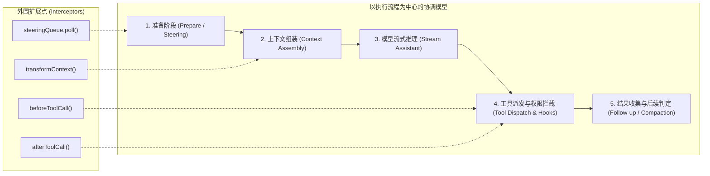
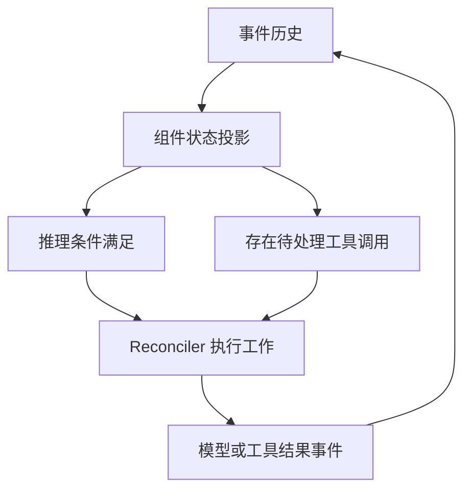
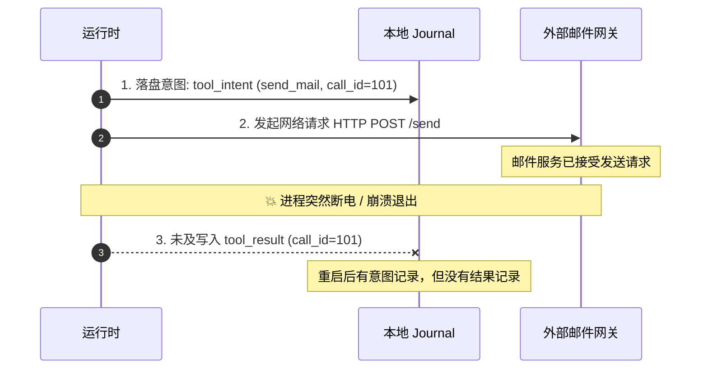
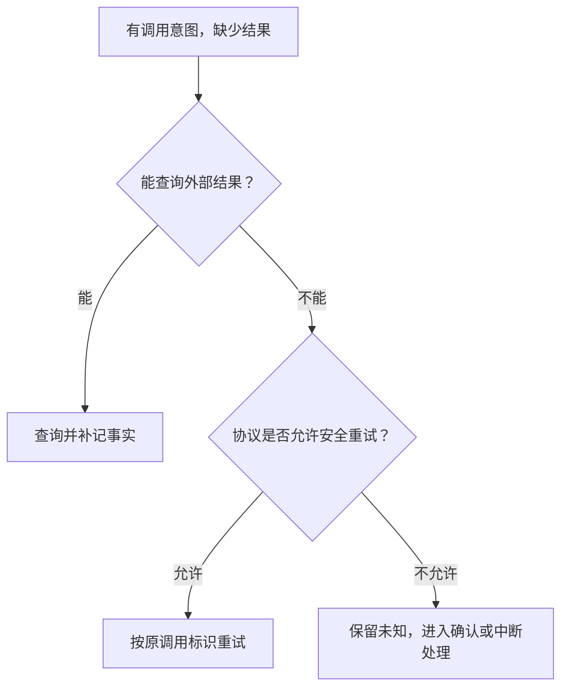
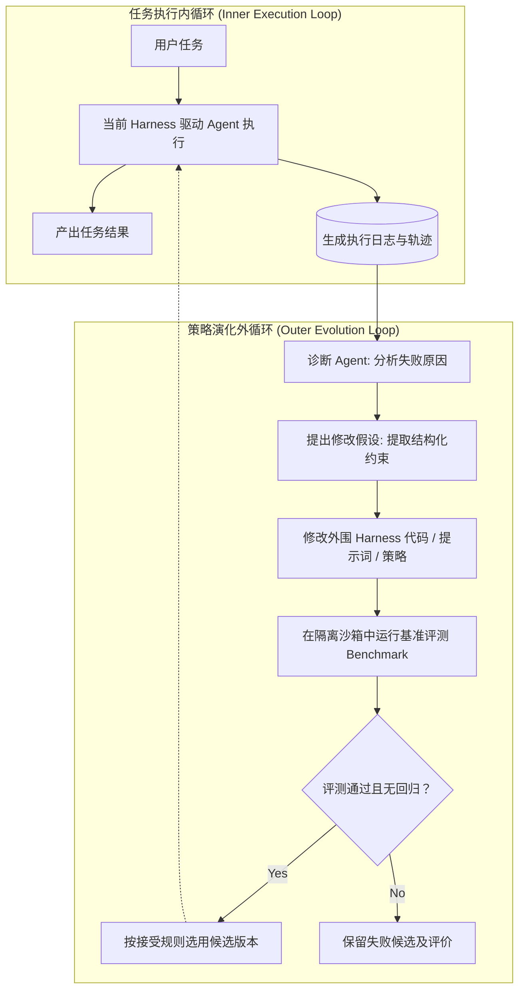

# Agent Loop 写在哪里：从运行时设计差异到自进化

最初研究 Agent 时，很多人会引用一个简明公式：`Agent = LLM + Tools + Loop`。

模型读取上下文，决定调用工具；宿主执行工具，把结果交回模型；模型继续推理，直到任务结束。Anthropic 在《Building effective agents》中，也用“模型基于环境反馈反复调用工具”来概括这种工作方式。[原文](https://www.anthropic.com/engineering/building-effective-agents)

这个概括解释了 Agent 的动作特征，但没有规定运行时该如何落地。同样一套“模型调用—工具执行—环境反馈”的过程，可以写成一个明确的集中协调循环，可以由多个组件按状态声明驱动，也可以表现为一组行为围绕共享图响应变化。

**各家实现都需要循环。分歧在于：模型调用、工具执行与下一轮推理之间的衔接，是由集中式执行流程规定，还是由组件的状态与行为规则共同表达？**

在短平快的任务里，这种差异并不明显。一旦 Agent 需要压缩上下文、等待人工审批、接收中途插入的约束、管理并行任务，甚至根据历史失败调整自身策略时，底层的运行时设计就会直接影响系统的表达方式与演进空间。

这篇文章围绕三个问题展开：
1. **下一步工作由谁决定？**
2. **运行状态以什么为依据？**
3. **过去的经历如何沉淀为改进未来运行的经验？**

> 阅读范围：本文重点比较运行时的架构重心与设计取舍，不作产品能力排名。主要案例包括 Pi、OpenCode、Codex、DeepSeek Harness、Pi v2 开发分支、Tardigrade 和 ActiveGraph，并以 LangGraph 作为补充对照。源码结论限定于文末列出的版本和文件；Pi v2 的设计目标与已实现部分分别说明。

---

## 1. 从十行循环开始：谁负责协调复杂工作

一个最小的工具调用循环，可以用下面的 TypeScript 风格伪代码表示。本文代码均为解释结构而简化的示意，省略完整类型、错误处理与平台协议；具体 API 以所附源码为准。

```ts
async function runAgent(messages) {
  while (true) {
    const response = await model.generate(messages);
    messages.push(response);

    if (response.toolCalls.length === 0) return response.text;

    for (const call of response.toolCalls) {
      const result = await executeTool(call);
      messages.push({ role: "tool", toolCallId: call.id, result });
    }
  }
}
```

这里包含两个不同层次的职责：

- **任务决策**：模型决定读哪个文件、运行什么命令；
- **执行协调**：运行时决定何时请求模型、如何派发工具、何时把结果交回给模型。

本文讨论的重心是后者。

假设用户要求 Agent 修复代码库中的 bug，并限定不能破坏既有公开接口。Agent 读代码、改文件、跑测试，直观上完全符合十行循环的模式。但随着执行深入，一系列工程问题会接踵而至：

- 上下文接近上限时，先做压缩，还是先处理用户中途补充的约束？
- 某个工具调用等待审批时，其他无依赖的任务能否继续推进？
- 执行中途用户叫停，哪些动作该取消，哪些中间结果必须保留？
- 进程异常崩溃重启后，如何准确区分已完成、未完成和结果未知的操作？

这些问题无法单靠模型做出更准的选择来解决，必须由运行时给出确定答案。随着需求增加，原本简陋的循环逐步演化成组织模型调用、工具执行、上下文管理和控制信号的完整系统。业内通常把这套围绕模型运行的机制称为 Harness；本文将其中负责状态与执行协调的部分称为 **Agent 运行时**。

---

## 2. 过程式协调：Pi、OpenCode 与 Codex

一种最直观的做法，是由核心流程统筹各阶段的先后顺序，再通过工具、服务和扩展拦截点接入具体功能。Pi、OpenCode 和 Codex 的核心执行路径都采用了这种组织方式，不过三者在模块拆分和持久化机制上各有侧重。



### Pi：围绕主循环暴露扩展点

在 Pi 的 Agent Core 中，`runLoop()` 负责初始化每轮执行、读取 steering 消息、调用 `streamAssistantResponse()`、派发工具，并根据停止条件与 follow-up 队列决定是否继续。

`transformContext`、`beforeToolCall`、`afterToolCall` 等扩展接口，允许开发者介入上下文组装与工具执行：

| 扩展位置 | 应用可以参与的工作 |
| :--- | :--- |
| 上下文转换 | 调整模型将要读取的内容 |
| 工具调用前后 | 拦截调用、处理结果或记录信息 |
| Steering 与 follow-up | 将外部输入纳入后续执行 |

这些扩展点由主循环在固定的执行节点触发。

这种设计的优势在于结构清晰：开发者明确知道自己在哪个阶段插入了逻辑，主循环掌握阶段之间的流转。这并不意味着所有代码都堆在一个函数里；合理的函数拆分、服务封装和插件机制同样能让代码保持整洁模块化。[执行循环源码](https://github.com/earendil-works/pi/blob/da840b6216578c2a571d0374ac6a2091a83f9d91/packages/agent/src/agent-loop.ts) · [接口说明](https://github.com/earendil-works/pi/blob/main/packages/agent/README.md)

另外需要区分底层 Agent Core 与上层的 Coding Agent。后者已经支持了会话的保存、恢复与分叉，底层有一个循环并不代表整个系统只有一个易失的内存 `messages` 数组。[Pi 会话说明](https://github.com/earendil-works/pi/blob/main/packages/coding-agent/README.md#sessions)

### OpenCode：会话级循环协同多项产品能力

OpenCode 的 `SessionPrompt.runLoop` 负责读取会话消息、调度子任务或压缩任务、评估上下文窗口容量，随后准备 Agent、模型和工具，交由处理器执行。`SessionProcessor` 则处理模型输出流和工具状态，向调用方返回继续、终止或触发压缩等指令。[调度流程](https://github.com/anomalyco/opencode/blob/bbd72fb8b0bb6de580d2041a0150016227c63ac0/packages/opencode/src/session/prompt.ts) · [输出处理器](https://github.com/anomalyco/opencode/blob/bbd72fb8b0bb6de580d2041a0150016227c63ac0/packages/opencode/src/session/processor.ts)

这依然是典型的过程式协调：即使上下文压缩和子任务已经拆为独立服务，依然由主流程统一裁决先执行什么、后执行什么。当前实现采用了 Effect 库，但选用哪种异步或依赖管理库，并不会改变它在调度层面属于过程式协调的事实。

### Codex：执行循环与历史重建并存

Codex 开源实现中的 `run_turn()` 同样维护着清晰的回合循环：处理待接收输入、捕获本次请求上下文、发起模型采样，并根据后续任务与上下文容量安排继续执行或触发压缩。[回合执行](https://github.com/openai/codex/blob/52e73e3a548ae5310c7765995b9803dd538b82b0/codex-rs/core/src/session/turn.rs)

与此同时，Codex 专门设计了 `rollout_reconstruction` 模块，利用持久化的 rollout 项、压缩记录与上下文快照重建会话状态。这是一个重要的工程参考：系统完全可以一边通过明确的执行流程协调工作，一边依靠历史记录重建运行状态。[历史重建](https://github.com/openai/codex/blob/52e73e3a548ae5310c7765995b9803dd538b82b0/codex-rs/core/src/session/rollout_reconstruction.rs)

因此，这三个案例的共性不能简单总结为“状态与日志脱节”，更不是“没有日志”。准确的特征是：**它们的核心执行路径主要由中心流程统一调度，各项功能通过该流程预设的阶段、服务与接口接入系统。**

这种设计在主路径明确的任务中很顺手：调模型、跑工具、看反馈、不断迭代。但当越来越多功能需要维护自身状态、优先级和等待条件时，协同成本就会显现：每增加一个新机制，除了实现业务本身，还得仔细梳理它与现有执行各阶段的时序耦合。

---

## 3. 两个正交问题：状态从何而来，工作由谁决定

在进一步对比前，需要理清几个容易混在一起的概念：“有事件”、“有日志”、“状态由日志推导”、“事件驱动调度”，它们各自处在不同维度。

本文把“以执行流程为中心”和“以组件、行为规则为中心”视为两种调度倾向。后者内部还分化为 Tardigrade 的状态对齐协调和 ActiveGraph 的事件队列匹配，不能混为一谈。

状态的来源则是另一个独立维度。同一个运行时可以同时维护会话记录、操作日志、内存投影和快照，也可能只对局部状态提供重建能力。我们不能把一个系统非黑即白地归入“纯日志派”或“纯快照派”。

| 设计问题 | 关注点 | 代表性取舍 |
| :--- | :--- | :--- |
| **状态以什么为依据？** | 当前值、检查点，或可用于重建状态的持久事件历史 | 检查点保存的状态，以及事件历史派生的投影；两者可以组合 |
| **下一步由谁决定？** | 明确的协调流程，或组件、行为声明的可执行工作 | 过程循环 `runLoop`（Pi） vs 组件输出 `output.transitions`（Tardigrade） |
| **历史记录了什么？** | 对话内容、配置变化、执行意图、结果，或这些内容的组合 | 会话记录 Transcript vs 操作流水 Operation Journal |
| **恢复执行依据什么？** | 哪些持久事实足以识别未完成工作，以及如何处理未知结果 | 恢复位置、重试条件与未知结果的处理协议 |

事件溯源的核心，是把持久化的事件流作为系统状态的事实来源。在确定的投影规则下，当前状态可以通过重放历史推导出来。状态平时依然可以缓存在内存、写入数据库或定期做快照；关键在于它与事件历史之间存在确定的派生关系。

在实时运行中，系统不必每次从头重放所有历史，通常采用纯函数增量折叠（Fold / Reduce）：

```ts
// 状态从事件流纯函数派生
type Reducer<State, Event> = (state: State, event: Event) => State;

function foldEvents<State, Event>(initial: State, events: Event[], step: Reducer<State, Event>): State {
  return events.reduce(step, initial);
}
```

恢复时，系统可以从头重放，也可以从某个可信快照叠加后续增量事件来重建。这套机制约束的是状态的来源与可追溯性，它本身并没有强制要求调度逻辑必须写成组件或状态机。

### DeepSeek Harness：日志投影与可插拔循环共存

DeepSeek Harness 的架构设计将 Session Log 定为模型上下文的来源，通过 `deriveMessages()` 纯函数从中投影出给模型的历史。与此同时，它保留了默认的 Agent Loop，并通过 Cordis 插件系统暴露扩展点；模型适配、工具注册、会话日志乃至执行循环本身都可以作为插件进行替换。[架构说明](https://github.com/deepseek-ai/deepseek-harness/blob/master/docs/architecture.md)

```ts
// 概念示意：状态来源和执行协调可以分别设计
const messages = deriveMessages(sessionLog);
await selectedAgentLoop.run({ messages, tools });
```

这个设计直观地说明了两个维度的解耦：系统既可以严格要求上下文能够从日志完整重建，又可以保留一个结构清晰的驱动流程来安排执行。插件化解决的是模块可替换性，事件日志解决的是事实来源，两者各司其职。

### Pi v2：把执行过程建模为可恢复的 Operation

Pi 的 `harness-v2/j4` 分支展示了一个兼顾过程与持久化的演进方向。其 Durable AgentHarness 设计把 Session 拆解为会话树、Lane、Lane 操作日志和全局事实。会话树保存对话内容；Lane 隔离不同分支的执行空间；操作日志则落盘接受请求、尝试执行、工具启动、排队与结束等细粒度事实。[设计文档](https://github.com/earendil-works/pi/blob/f7f933c6e0a127bd2b56336338512092fec0399d/packages/agent/docs/harness-v2.md)

其纯函数 `reduceLaneState()` 能在崩溃恢复时，从有限的操作日志中推导出 Lane 当前的编排状态，精确识别未完成的操作、等待返回的工具批次和排队中的输入：

| 恢复时需要回答的问题 | 所需的持久信息 |
| :--- | :--- |
| 哪项工作已被接受但尚未结束？ | Operation 的接受与结束记录 |
| 哪批工具仍缺少结果？ | 工具批次、启动和结果记录 |
| 哪些输入仍待处理？ | 队列及其处理进度 |

此时持久化的重点已经超出“对话进行到哪一步”，延伸到“系统接受了哪些工作、哪些尚未收尾”。[Reducer 源码](https://github.com/earendil-works/pi/blob/f7f933c6e0a127bd2b56336338512092fec0399d/packages/agent/src/harness/reducer.ts)

值得注意的是，该设计把操作日志主要定位为崩溃恢复的凭据，正常执行时并不频繁回读；扩展机制依然区分事件监听与拦截 Hook。因此，它更接近“过程式执行加上可重建的细粒度操作状态”，与 Tardigrade 的组件化调度在思路层面上仍有区别。

同时需要说明实际落地进度：在本文核对的 `f7f933c` 提交中，`AgentHarness.prompt()`、`resume()` 等方法仍是未实现的占位符，且设计文档明确将上层 Coding Agent 的迁移排在当前范围之外。[实现状态](https://github.com/earendil-works/pi/blob/f7f933c6e0a127bd2b56336338512092fec0399d/packages/agent/src/harness/agent-harness.ts)

---

## 4. Agent Loop 写在哪里：Tardigrade 与 ActiveGraph

如果不用一个主函数自上而下地串联模型与工具，Agent 该如何驱动任务前进？

这里需要区分两个层次：
- **底层驱动循环**：负责轮询、派发并落实具体工作；
- **业务层 Agent Loop**：表达模型推理、工具执行与反馈循环之间的交互语义。

在最简实现中，两者揉在一个函数里。而 Tardigrade 和 ActiveGraph 则把业务交互逻辑下沉到组件和规则中，底层只保留通用的驱动器。

### Tardigrade：由状态投影推导待执行工作

Tardigrade 中的组件接收事件更新内部状态，并向外暴露供上层消费的 `view` 以及当前满足条件的 `transitions`。其结构可以概括为三个纯逻辑函数：

```ts
// 结构示意，省略泛型、服务依赖和取消协议
const component = {
  initial: () => initialState,
  step: (state, event) => nextState,
  output: (state) => ({ view, transitions }),
};
```

`step` 负责解释已发生的事实，`output` 则声明当前状态下可见的视图和满足触发条件的工作。组件本身只做纯状态计算，副作用交由底层运行时执行。[组件概念](https://tardigrade.sh/docs/concepts)

其底层协调器 `Reconciler` 运行在 `createActorReconciler()` 的 `settle` 循环中。简化逻辑如下：

```ts
async function settle(actor, log) {
  while (true) {
    // 首次读取历史，随后增量消费新事件
    const projected = await synchronizeProjections(actor, log);
    const enabled = enabledTransitions(projected);

    if (enabled.length === 0) return;

    // 概括实际派发逻辑：检查状态是否仍有效，执行并记录结果
    const progress = await advanceWork(enabled, projected.watermark, log);
    if (!progress) return; // 当前工作受阻，交还控制权

    // 日志推进后重新推导，避免沿用过期的工作列表
  }
}
```

协调器根据事件键识别已提交的工作，处理 Guard 条件、取消信号与并发控制。派发前它会比对日志水位线；一旦日志推进，立即重新同步状态投影并计算可执行项。这个底层的 `while` 循环只负责调度 Transition，并不直接写死“先调模型、后调工具”的具体业务顺序。[Reconciler 源码](https://github.com/clavia-labs/tardigrade/blob/924a5c034c954c2dbcc85db238e7259ac614c22c/packages/core/src/runtime/reconciler.ts)

那么模型和工具的交替往返是如何发生的？关键在推理组件声明的触发条件：若当前回合已结束，或者仍有未返回结果的 `ToolCalled`，组件便不产生新的模型调用：

```ts
function inferenceOutput(turn) {
  if (!turn.active || turn.terminated) return [];
  if (turn.hasUnansweredToolCalls) return [];
  return [callModelTransition(turn)];
}
```

当模型发出调用工具的请求时，产生 `ToolCalled` 事件；工具组件监听该调用，执行工具并产出 `ToolReturned` 事件。`ToolReturned` 写入日志后更新了状态投影，使得原本阻塞的模型调用条件重新得到满足，进而触发下一轮推理。[推理实现](https://github.com/clavia-labs/tardigrade/blob/924a5c034c954c2dbcc85db238e7259ac614c22c/packages/agent/src/inference/machine.ts) · [工具实现](https://github.com/clavia-labs/tardigrade/blob/924a5c034c954c2dbcc85db238e7259ac614c22c/packages/agent/src/component/tool.ts)

| 当前事实所形成的状态 | 满足条件的工作 | 产生的后续事实 |
| :--- | :--- | :--- |
| 回合活跃，无等待中的工具调用，其他推理条件满足 | 调用模型 | `ToolCalled` 或回合终止事件 |
| 有可处理且尚未返回的工具调用 | 执行对应工具 | `ToolReturned` |
| 工具已返回，回合仍未结束，其他条件满足 | 再次调用模型 | 下一轮模型结果 |
| 回合已经结束或取消 | 不再启用该回合的推理 | 等待新的工作 |

这就带来了一个显著的架构转变：**工具执行完毕后，不需要由工具函数直接去调用下一轮推理；工具结果写入状态后，推理规则自然被重新激活。**



上下文压缩也可以用完全相同的模式表达：监控组件追踪 token 消耗，达到阈值即声明压缩任务；压缩结果落盘后更新状态，后续的上下文组装自然基于新状态生成。父组件在组合子组件时，主要负责裁决优先级并处理互斥条件。[设计动机与压缩示例](https://tardigrade.sh/docs/why)

### ActiveGraph：事件驱动与图模式匹配

ActiveGraph 把事件流投影为包含对象与关系的共享图。Behavior 通过事件订阅、过滤规则以及图模式参与执行。它的调度核心是事件队列与规则匹配，与 Tardigrade 的状态对齐机制有所不同。[行为机制](https://docs.activegraph.ai/concepts/behaviors/)

`Runtime._loop()` 的核心调度逻辑如下：

```python
def run_loop():
    while (event_queue or delayed_work) and budget_remaining():
        if should_yield():
            return

        if event_queue:
            event = event_queue.pop()
            matches = registry.match(event, graph)

            for behavior in matches:
                if not budget_remaining():
                    break
                if behavior.has_delay:
                    schedule(behavior, event)
                else:
                    invoke(behavior, event, graph)

        fire_due_delayed_behaviors()
```

运行时分别派发普通、LLM 和关系 Behavior。行为在执行时既能修改图结构，也能发射新事件；符合规则的新事件再次入队，触发后续匹配。需要说明的是，运行时会对内部生命周期事件做过滤，并非所有日志事件都会无差别地激活业务行为。[运行时源码](https://github.com/yoheinakajima/activegraph/blob/8aedb1866cf5dce056af97529152ffd6f468a1ed/activegraph/runtime/runtime.py)

官方 BabyAGI 示例展示了多个行为如何协同完成一个业务循环：

| 触发事件 | 行为 | 后续变化 |
| :--- | :--- | :--- |
| `goal.created` | 初始化任务 | 创建 `task` 对象 |
| `object.created`，且对象为 `task` | LLM 执行任务 | 保存结果、标记完成、发出 `task.executed` |
| `task.executed` | LLM 生成后续任务 | 创建更多 `task`，再次触发执行 |

当后续任务列表为空且没有新增事件时，调用链自然收敛停机。[BabyAGI 示例](https://github.com/yoheinakajima/activegraph/blob/8aedb1866cf5dce056af97529152ffd6f468a1ed/examples/babyagi.py)

如果要在 ActiveGraph 中实现常规的代码开发循环，可以在应用层定义一组互为因果的行为：推理行为创建工具任务；工具行为执行操作并回写结果；状态巡检行为确认本轮工具已全部返回后，发出新的推理请求。这里的事件流转与批处理协议完全由应用层自行定义，框架本身并不预设固定流程。

在复杂的代码修复场景中，共享图还能直观地表达代码缺陷、目标文件、补丁方案、测试结果与用户约束之间的关联。多个行为围绕这些节点展开验证、测试和修正，共享图充当统一上下文，而具体的执行时序交由行为规则驱动。[View 文档](https://docs.activegraph.ai/concepts/views/)

### 两者的共性与差异

| 比较点 | Tardigrade | ActiveGraph |
| :--- | :--- | :--- |
| 业务状态 | 组件从事件形成各自状态 | 事件形成共享对象与关系图 |
| 调度的直接依据 | 当前投影输出的可执行 Transition | 队列事件匹配到的 Behavior |
| 业务循环的衔接 | 工作改变状态，状态使后续工作满足条件 | 行为产生事件，事件与图条件触发后续行为 |
| 开发者主要表达什么 | 状态如何变化、当前输出什么 | 什么事件和图条件触发什么动作 |
| 扩展时的主要协调问题 | 组件组合、阻塞条件、优先级 | 订阅关系、重复触发、事件传播与预算 |

两者都倾向于把业务协同逻辑拆解到局部规则中，但“基于状态推导工作”与“基于事件匹配行为”是两种不同的机制。在 ActiveGraph 中，仅仅处于某种状态并不一定会触发动作，必须有事件进入队列才能激活匹配；不能假设框架每轮都会主动扫描全图去运行所有看似满足条件的逻辑。

两者的停机语义也需要辨析：Tardigrade 在没有可用 Transition 或当前任务阻塞时会交还控制权；ActiveGraph 在队列排空、预算耗尽或到达步数上限时退出。**调度器暂时停下，并不代表业务目标已经达成。** 系统可能在等待外部输入，也可能遇到了未显式处理的阻塞与失败。

React 的状态驱动模型很适合用来理解 Tardigrade：开发者声明状态与期望输出，运行时负责把差异落实为操作。ActiveGraph 则更接近经典的事件驱动与规则引擎。两种类比都有助于建立直觉，但不能直接画等号，外部副作用处理和持久化保障仍需具体实现来支撑。

作为补充对照，LangGraph 提供了另一种图式编排思路：开发者显式声明计算节点、状态与路由分支，运行时按步骤逐步推进，并在关键节点保存检查点。它的图表达的是计算拓扑结构，与 ActiveGraph 的对象关系图不同；且 LangGraph 本身支持循环控制，不宜简单称作 DAG。[持久化文档](https://docs.langchain.com/oss/python/langgraph/persistence)

因此，讨论的焦点不在于源码里是否有 `while` 循环，而是：**模型与工具之间的交互逻辑，究竟是写在中心协调流程里，还是交由组件状态规则或事件行为规则来表达。日志交代了状态从哪里来，调度规则决定了下一步为什么发生。**

---

## 5. 面对进程崩溃：检查状态模型的现实边界

回到代码修复的例子。Agent 已经生成修改方案，正等待人工审批，随后调用工具。此时对比不同设计，重点在于逐项梳理状态在各系统中的真实含义与持久化边界。

| 场景 | 以执行流程为中心的表达 | 状态驱动的表达 |
| :--- | :--- | :--- |
| **上下文需要压缩** | 准备阶段或主流程调用压缩逻辑 | 状态满足阈值，模块声明压缩工作 |
| **操作等待审批** | 执行路径调用审批服务并阻塞等待 | 待审批状态阻止相应动作成为可执行工作 |
| **用户增加约束** | 队列与扩展接口将输入送入后续阶段 | 新事件改变状态及后续输出、触发条件 |
| **进程重新启动** | 从已保存的信息进入对应恢复路径 | 重建相关状态，再计算或触发待完成工作 |

这张表展示的是架构表达方式的差异，并不代表功能上的绝对有无。过程式系统同样可以把审批状态落盘，状态驱动系统也可能遗漏某些关键信息的持久化。系统的实际鲁棒性取决于具体的协议设计与日志覆盖面。

### 日志能记录意图，无法替外部系统确认结果

设想一个未提供幂等机制的邮件发送工具：宿主已准备发信，外部邮件网关可能刚处理完请求，但本地还未来得及把结果写入日志，宿主进程就意外崩溃了。



在工程上，通常采用“意图先行”的日志模式来辅助恢复：

```ts
// 意图先行持久化模式
await journal.append({ type: "tool_intent", callId: call.id, tool: "send_email", args: call.args });
const result = await sendEmail(call.args);
await journal.append({ type: "tool_result", callId: call.id, result });
```

然而在崩溃重启后，如果本地只留下一条意图记录而缺少结果记录，客观上对应着三种完全不同的物理现实：

| 崩溃发生的微观时机 | 外部真实世界的物理情况 | 本地磁盘可见的记录 |
| :--- | :--- | :--- |
| **意图落盘后、请求发出前** | 尚未发送 | 有意图，无结果 |
| **请求发出后、响应返回前** | 可能发送成功，也可能网络失败 | 有意图，无结果 |
| **服务确认发送后、结果落盘前** | 已经发送成功 | 有意图，无结果 |

**本地前置记录只能证明系统已接受并准备执行该任务，既不能证明请求已经发出，更不能证明外部操作已经成功。** 意图记录的价值在于让不确定性显式暴露出来，便于后续逻辑处理，但它本身无法消除不确定性。



在恢复阶段，系统可以携带幂等键重试，可以调用对账接口查询外部状态，也可以直接挂起等待人工确认。对于确实无法核实状态的操作，必须保留其未知属性。大模型可以辅助分析排查，但自然语言推理无法替代下游系统的事务和幂等机制。

同理，对话历史中的 `tool_call` 也需要按其具体语义来评估：它往往只代表模型发出了调用意愿，是否说明宿主已经开始执行，取决于落盘时序与派发机制，不能单凭文件名叫 Transcript 还是 Journal 来推断。本地事件键去重也只能保证本地不重复记录，无法杜绝外部副作用的重复发生。

Pi v2 的设计针对未完成的工具引入了明确的重放策略：只有当历史记录与当前工具声明均确认安全时才允许重放，否则一律记入中断结果。这清楚地表明：在日志记录之上，还必须有一层严谨的执行语义约束。[工具记录与恢复设计](https://github.com/earendil-works/pi/blob/f7f933c6e0a127bd2b56336338512092fec0399d/packages/agent/docs/harness-v2.md)

回放（Replay）与重新执行（Re-run）同样需要厘清界限。ActiveGraph 的确定性回放高度依赖已记录的模型和工具响应，以及行为本身的纯函数属性；如果从同一状态向模型发起全新请求，依然可能得到不同分支。系统内部状态能够重建，并不代表外部磁盘文件、远程服务或关联进程能够自动回滚到过去。[回放约束](https://docs.activegraph.ai/concepts/replay/)

这些现实边界并没有否定状态建模的意义，反而提醒我们在构建生产级运行时时，必须清晰区分：**确定的本地事实、待推进的工作，以及无法仅凭本地日志断定的外部副作用。**

---

## 6. 从恢复执行到解释执行：日志如何沉淀为经验

前面讨论的重点是如何保障当前任务的稳健执行。这些运行时设计又与 Agent 的自进化存在什么联系？

关键在于对历史日志的消费方式，可以从单纯的“恢复进度”延伸为“定位失败根因”。

业务衔接写在哪里，决定了后续改进系统时需要修改主流程代码、组件状态条件还是行为订阅规则。而执行日志则提供了第一手复盘材料，帮助我们回溯这些规则是如何共同导致了某次失败。组织规则与历史记录在系统迭代中交汇，但任何调度架构本身都不会自动带来学习演化能力。

假设代码修复任务最终失败：Agent 破坏了原本要求保持兼容的公开接口。恢复逻辑关心的只是接下来怎么继续，而改进逻辑则需要追问：这个接口约束到底是在哪个环节被丢掉的？是上下文压缩摘要遗漏了它，模型推理忽略了它，还是工具权限层放过了不合规的文件修改？

光靠一个失败的分数无法解释这些原因。只有调阅当时的原始输入、压缩前后的上下文对比、模型推理输出、工具返回结果，以及当时生效的策略版本，才能提出有据可查的归因假设。哪怕得出了假设，也必须通过对照测试和评测集来验证修改是否真正有效。

因此，“保留完整历史”不等于机械地把所有文本都存下来。一份能够支撑系统改进的经验记录，需要串联起以下要素：

```ts
// 结构化经验记录（Experience Record）
interface ExperienceRecord {
  /** 1. 当时实际生效的代码与配置规则 */
  strategy: {
    harnessVersion: string;
    promptTemplateHash: string;
    contextPolicy: { maxTokens: number; fireTokens: number };
    toolSet: string[];
  };
  /** 2. 执行过程的完整因果轨迹 */
  trace: {
    sessionId: string;
    events: JournalEvent[];
    contextCuts: Array<{ beforeToken: number; afterToken: number; summary: string }>;
  };
  /** 3. 结果度量与约束违例证据 */
  evaluation: {
    success: boolean;
    brokenConstraints: Array<{ rule: string; evidence: string }>;
    totalTokens: number;
    costUsd: number;
  };
  /** 4. 针对该失败提出的假设与改进记录 */
  evolutionHypothesis?: {
    proposedChange: string;
    targetComponent: "prompt" | "compaction" | "tool_gate";
  };
}
```

| 经验材料 | 诊断与改进用途 |
| :--- | :--- |
| **代码、提示词与配置版本** | 确定当时实际运行的是哪套规则 |
| **输入、模型上下文与执行轨迹** | 检查规则怎样影响了执行过程 |
| **结果、评价、成本和约束违例** | 判断效果与代价 |
| **修改提案及其验证记录** | 比较变化，避免重复尝试已证伪的方案 |

事件溯源有助于理清因果脉络，模块化规则有助于划定修改边界，分支能力则为多方案横向对比提供了天然支持。但这些都只是架构层面的辅助条件：如果缺失代码版本管理、缺少充分的上下文轨迹，或没有可靠的评价指标，仅靠海量事件日志依然无法支撑有效的系统演化。

还有一个关键细节：**一旦修改了状态推导规则，同一份历史日志可能会被解读出完全不同的状态。** 因此演化系统不仅要记录过去的经历，还必须严格隔离“按旧版本规则重建过去”与“按新版本规则进行实验”。可回放的历史，必须与解释历史的代码版本绑定管理。

---

## 7. Meta-Harness：把经验接入策略演化外循环

《Meta-Harness: End-to-End Optimization of Model Harnesses》这篇论文提供了一个具体的落地范例。它通过外层的 Coding Agent 读取过往候选方案的代码、评测得分与执行轨迹，生成新版本的 harness，并在基准测试中评测保存。在这个过程中，底层大模型的权重始终保持不变，所有的迭代与优化都发生在外围的 Harness 代码中。历史记录保存在文件系统并按需检索，避免了一次性撑爆上下文。[论文方法](https://arxiv.org/html/2603.28052v1#S3)

论文在文本分类任务上的消融实验表明：向外层优化器开放完整的原始执行轨迹，其改进效果明显优于仅提供代码与评分，或额外增加人工摘要的组别。这一结果印证了细粒度执行日志在诊断归因中的独特价值，但这并不意味着所有任务都需要同等密度的记录，也不能证明某种特定的事件溯源框架在优化上具有必然优势。[论文表 3](https://arxiv.org/html/2603.28052v1#S4.T3)

将这一研究映射到工程架构中，可以清晰地拆分出任务执行内循环与策略演化外循环。下图归纳了包含候选验证与准入机制的完整闭环流程：



| 维度 | 执行内循环 (Inner Loop) | 改进外循环 (Outer Loop) |
| :--- | :--- | :--- |
| **目标** | 用当前方法完成业务任务 | 改进未来完成任务的方法与规则 |
| **主要输入** | 用户任务、当前上下文、工具结果 | 历史实现、执行轨迹、评测结果 |
| **主要动作** | 推理、调用工具、更新任务状态 | 诊断失败、修改规则或代码、运行评测 |
| **主要产物** | 任务结果与执行历史 | 候选版本及其验证证据 |

这两个循环可以由不同的 Agent 分别承担，也可以共享底层的存储与评测基础设施。将外层优化称为系统层面的“自进化”是准确的，但它与单个 Agent 在运行中动态改写自身逻辑，或是模型权重的微调训练，属于完全不同的工程范畴。

回到代码修复的场景，针对破坏公开接口的失败，一个合理的改进假设是：将原本混在长文本摘要中的接口约束，提取为持久驻留的结构化校验规则。

- 过程式 Harness 可以优化上下文拼装函数或前置拦截器；
- 组件式 Harness 可以新增专门维护该约束的独立组件；
- 图式运行时可以在共享图中新增约束节点并建立校验行为。

三种架构都有能力落地同一种改进假设。

工程选型时需要权衡的是：改动的影响范围是否可控、实验是否容易复现、评测基准能否敏感捕捉到潜在的功能退化。模块化虽然能缩小修改粒度，但会增加组件间的协作复杂度；共享图虽然能清晰表达实体关系，但也需要防范事件循环与意外级联。再好的架构抽象也无法替代严格的基准测试。

对于一个追求持续演化的工程系统，通常包含以下五个阶段：

1. **沉淀并筛选高价值失败样本**：完整保留对应的代码版本、上下文轨迹与执行证据；
2. **提出针对性的修改假设**：明确改动位置与预期改善的量化指标；
3. **在隔离沙箱中运行候选方案**：严格控制工具副作用与试错成本；
4. **执行全局回归评测**：兼顾目标指标提升、历史基线防退化与 token 成本开销；
5. **按准入规则决定是否采纳**：并将正反两方面的实验结果作为先验知识沉淀归档。

这些是从实践与研究中提炼的工程准则，并非某个框架开箱即得的内置功能。Meta-Harness 本身并不限定目标代码必须采用 ActiveGraph 或 Tardigrade，过程式代码同样可以作为被优化的目标。

自进化与运行时架构的关系，更准确的表达是：**不同的架构设计为外层演化提供了不同维度的便利**，并不存在某一种架构独占自进化能力的说法。

---

## 8. 运行时如何设计，决定了我们如何理解与演进系统

回顾最初的十行循环，它在概念上依然成立，但屏蔽了工程落地中必须直面的核心问题：工作如何协调、状态如何存续、历史如何解释，以及规则如何安全演进。

| 案例框架 | 本文关注的设计重心 | 它帮助澄清的工程问题 |
| :--- | :--- | :--- |
| **Pi** | 明确的模型与工具循环及拦截切面 | 能力怎样在流水线执行阶段中标准化接入 |
| **OpenCode** | 会话流程与多个服务（Compaction/Subtask）共同协调 | 产品复杂度怎样模块化进入运行时 |
| **Codex** | 回合循环与 rollout 重建并存 | 过程式协调不排斥从历史日志投影部分状态 |
| **DeepSeek Harness** | 日志派生上下文，循环本身作为插件可替换 | 事实来源与运行时可替换性怎样解耦 |
| **Pi v2（开发分支）** | Lane、持久 Operation 与恢复 Reducer | 怎样让已接受的工作和未完成状态在崩溃后可追查 |
| **Tardigrade** | 事件投影、组件输出与 Reconciler | 怎样从当前状态推导并执行工作（Transitions） |
| **ActiveGraph** | 共享对象图、事件队列与行为匹配 | 怎样让业务衔接由事件和图条件表达 |
| **LangGraph** | 计算图编排与 Checkpoint 快照 | 声明式计算与步骤级持久化的工程组合 |
| **Meta-Harness** | 提取执行轨迹驱动外层代码优化 | 经验日志怎样闭环接入系统的自进化外循环 |

这些项目并不是非此即彼的替代关系。一个专注于单人交互式编码的运行时，与一个支持多 Agent 长期共享协作的系统，完全可以在架构上做出不同选择。单写者与多写者模型、日志体积膨胀、代码版本兼容性、外部系统副作用等实际工程约束，也不会因为采用了“状态驱动”而自动消失。

更具建设性的视角，是关注工程设计维度的深化：**把状态的来源、工作的激活条件以及执行的因果历史，作为系统的一等公民（First-Class Citizens）来认真对待。** 这样我们不仅能让 Agent 持续运行，更能清楚解释每一轮为什么这样执行，并在出现偏差时拿出事实证据去改进下一轮的执行策略。

从集中式过程循环到组件与行为规则，改变的是任务协调的组织范式；从临时运行记录到结构化经验沉淀，改变的是消费历史数据的方式。当这些基础设施与诊断、修改、评测的外循环打通时，Agent 系统才真正具备了持续演进的工程底座。

**日志本身不会让 Agent 自动进化，但能让每一次改进有据可查；状态驱动不会凭空提升模型能力，但它为观察、检验和调整系统行为提供了稳固的结构支撑。系统的实际效果，最终依然要交由真实任务的评测来检验。**

---

## 版本与阅读入口

本次修订完成于 2026-09-06，沿用原稿已核对的对比资料，并补充 Tardigrade 与 ActiveGraph 调度源码及示例。以下提交用于定位结论，不代表项目始终处于该版本；在线文档按查阅时内容引用。

| 对象 | 本文采用的证据范围 |
| :--- | :--- |
| **Pi 执行循环** | `da840b6216578c2a571d0374ac6a2091a83f9d91`，`packages/agent/src/agent-loop.ts`；会话能力参照 Coding Agent README |
| **OpenCode** | `bbd72fb8b0bb6de580d2041a0150016227c63ac0`，`session/prompt.ts`、`session/processor.ts` |
| **Codex** | `52e73e3a548ae5310c7765995b9803dd538b82b0`，`session/turn.rs`、`session/rollout_reconstruction.rs` |
| **DeepSeek Harness** | 查阅时 `master` 的 `docs/architecture.md`，属于架构文档层面的比较 |
| **Pi v2** | `harness-v2/j4` 的 `f7f933c6e0a127bd2b56336338512092fec0399d`，设计、Reducer 与 Harness 占位实现分别核对 |
| **Tardigrade** | `924a5c034c954c2dbcc85db238e7259ac614c22c` 的 `runtime/reconciler.ts`、`inference/machine.ts`、`component/tool.ts`；官方 Why、Concepts 文档 |
| **ActiveGraph** | `8aedb1866cf5dce056af97529152ffd6f468a1ed` 的 `activegraph/runtime/runtime.py`、`examples/babyagi.py`、README；Behaviors、Views、Replay 官方文档 |
| **LangGraph** | 官方 Persistence 文档，用作检查点路线的补充对照 |
| **Meta-Harness** | arXiv `2603.28052v1`，方法与表 3 |

代码链接用于佐证具体实现，官方文档用于说明设计契约，论文用于呈现研究方法与实验数据；文中的跨框架归纳与工程分析均基于上述材料展开。
