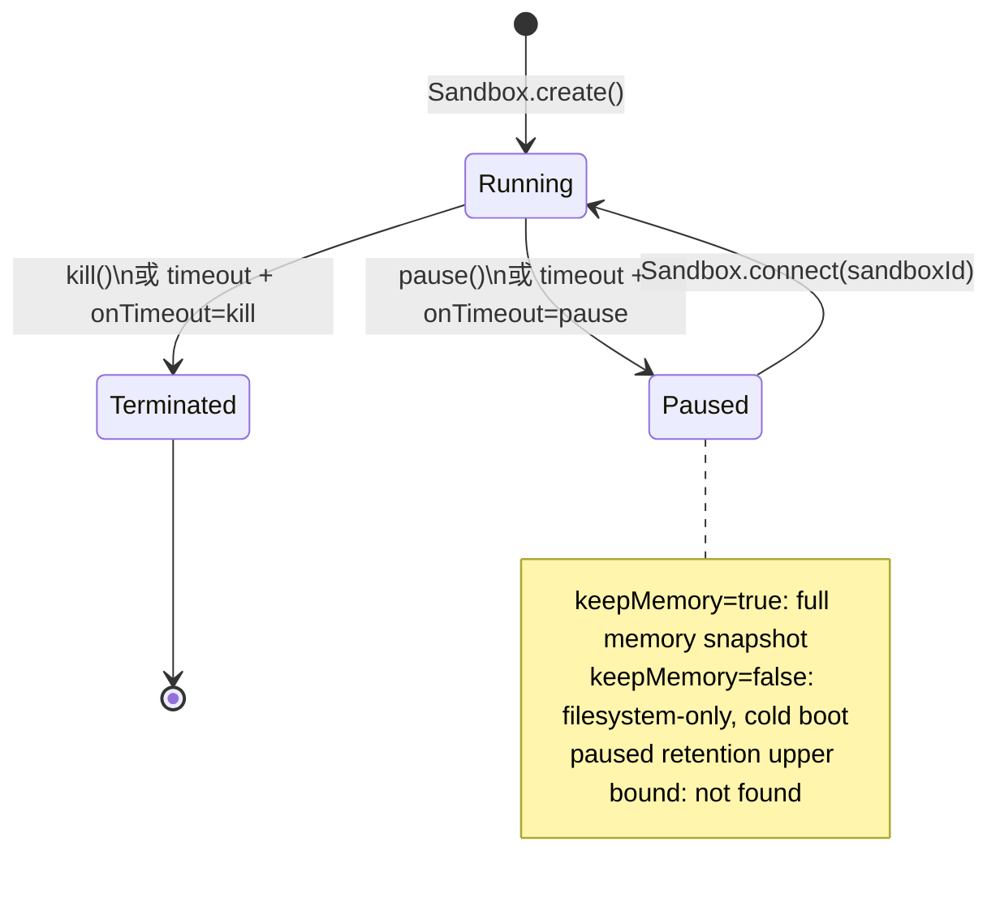

# E2B Sandbox 生命周期调研

核验日期：2026-08-26。源码锚定为 `e2b-dev/E2B` 提交
[`f0facc5dbcf93067326745e1597b05311c0174ea`](https://github.com/e2b-dev/E2B/tree/f0facc5dbcf93067326745e1597b05311c0174ea)。该仓库中的 `spec/openapi.yml` 标注其来自公开 `e2b-dev/infra`，在 [`infra-ref`](https://github.com/e2b-dev/E2B/blob/f0facc5dbcf93067326745e1597b05311c0174ea/spec/infra-ref#L1) 固定为 `e19a12b8fc5d318c6e88a8edba0a94d1f153a841`；它是客户端可见 API 合约，不是云端控制面的实现。

**取证限制。** 本机的 `e2b.dev`、浏览器访问、以及 `e2b-dev/infra` clone 均被失效本地代理/DNS 阻断。本文实际读到的是上述固定版本的 E2B SDK、OpenAPI、测试和 README；没有把搜索摘要或第三方材料当作证据。因此，官方文档的 GA 声明、暂停保留上限、官方云的计费维度，以及 infra 的服务端并发实现均明确标为“查不到”，而非推断。

## 结论

1. **一个会话绑定一个 sandbox，并跨多次 agent operation 以同一 `sandboxId` 重连，在 API 层成立。** `Sandbox.create()` 新建，`Sandbox.connect(sandboxId)` 定位既有 sandbox；后者会恢复 paused sandbox，而 kill 后按原 ID connect 会报 not-found。会话必须 durable 地保存 `sandboxId`，不能仅靠进程内对象。([SDK create/connect](https://github.com/e2b-dev/E2B/blob/f0facc5dbcf93067326745e1597b05311c0174ea/packages/js-sdk/src/sandbox/index.ts#L264-L395), [connect 集成测试](https://github.com/e2b-dev/E2B/blob/f0facc5dbcf93067326745e1597b05311c0174ea/packages/js-sdk/tests/sandbox/connect.test.ts#L45-L69))
2. **pause/resume 是现有 API，不是仅在 roadmap：当前入口为 `Sandbox.pause()` 和 `Sandbox.connect(id)`，旧 `betaPause()` 与 `/resume` 已弃用。** `keepMemory: true` 默认取完整内存快照；`false` 则只保留文件系统，明确会丢失内存、运行中进程和连接。源码没有单独的 GA 公告，也查不到暂停最长保留期，不能把“当前可用”写成未证实的 GA/SLA。详见第 2 节。([pause 实现](https://github.com/e2b-dev/E2B/blob/f0facc5dbcf93067326745e1597b05311c0174ea/packages/js-sdk/src/sandbox/index.ts#L639-L668), [状态保留合约](https://github.com/e2b-dev/E2B/blob/f0facc5dbcf93067326745e1597b05311c0174ea/packages/js-sdk/src/sandbox/sandboxApi.ts#L414-L474))
3. **`Sandbox.create` 的 JavaScript SDK 默认 TTL 为 5 分钟；`setTimeout` 可在运行中从请求时刻重写 TTL。** `connect` 也发送 timeout，但当前 OpenAPI 与集成测试表明它只延长、绝不缩短，不是每次连接无条件重置。([默认值](https://github.com/e2b-dev/E2B/blob/f0facc5dbcf93067326745e1597b05311c0174ea/packages/js-sdk/src/connectionConfig.ts#L8-L10), [timeout 合约](https://github.com/e2b-dev/E2B/blob/f0facc5dbcf93067326745e1597b05311c0174ea/spec/openapi.yml#L2876-L2902), [connect 测试](https://github.com/e2b-dev/E2B/blob/f0facc5dbcf93067326745e1597b05311c0174ea/packages/js-sdk/tests/sandbox/connect.test.ts#L72-L120))
4. **超时动作可显式选 `kill` 或 `pause`。** 未设 lifecycle 时，SDK 让 API 采用默认；源码注释称当前为 `kill`，OpenAPI 的 `autoPause` 默认值也为 `false`。若设计依赖空闲暂停，必须显式传 `lifecycle: { onTimeout: { action: 'pause', keepMemory: true } }`，不能依赖默认值。([lifecycle 映射](https://github.com/e2b-dev/E2B/blob/f0facc5dbcf93067326745e1597b05311c0174ea/packages/js-sdk/src/sandbox/sandboxApi.ts#L1612-L1677), [原始请求默认值](https://github.com/e2b-dev/E2B/blob/f0facc5dbcf93067326745e1597b05311c0174ea/spec/openapi.yml#L763-L790))
5. **metadata 可作为业务 key 的查询条件，但不是唯一键或原子 get-or-create。** 创建可写 `Record<string, string>`；`Sandbox.list({ query: { metadata } })` 以 AND 过滤并返回候选集。应用必须处理 0、1、多个结果，以及 create/list 竞争。([metadata 与 list 类型](https://github.com/e2b-dev/E2B/blob/f0facc5dbcf93067326745e1597b05311c0174ea/packages/js-sdk/src/sandbox/sandboxApi.ts#L565-L596), [查询编码](https://github.com/e2b-dev/E2B/blob/f0facc5dbcf93067326745e1597b05311c0174ea/packages/js-sdk/src/sandbox/sandboxApi.ts#L1848-L1905))
6. **kill 后不能再按 sandbox ID 访问该 sandbox；根文件系统是否“物理彻底删除”没有查到服务端承诺。** 不应把 sandbox root 当 durable storage。显式 snapshot 是“survives sandbox deletion”的持久镜像；Volume 是独立 create/destroy 的资源，也可在创建 sandbox 时 mount。([kill API](https://github.com/e2b-dev/E2B/blob/f0facc5dbcf93067326745e1597b05311c0174ea/packages/js-sdk/src/sandbox/sandboxApi.ts#L1200-L1229), [snapshot 存活承诺](https://github.com/e2b-dev/E2B/blob/f0facc5dbcf93067326745e1597b05311c0174ea/packages/js-sdk/src/sandbox/sandboxApi.ts#L1519-L1562), [volume mount](https://github.com/e2b-dev/E2B/blob/f0facc5dbcf93067326745e1597b05311c0174ea/packages/js-sdk/src/sandbox/sandboxApi.ts#L647-L665))
7. **同一 ID 的跨地点重连是被 SDK 注释明确支持的，但 E2B 不是并发协调器。** 未找到多个 client 同时 connect 的服务端测试、lease/owner 协议或冲突解决语义；并行 agent operation 可能读写同一状态，项目必须自建单写者/每 session mutex。([跨地点 connect 说明](https://github.com/e2b-dev/E2B/blob/f0facc5dbcf93067326745e1597b05311c0174ea/packages/js-sdk/src/sandbox/index.ts#L350-L395), [connect OpenAPI](https://github.com/e2b-dev/E2B/blob/f0facc5dbcf93067326745e1597b05311c0174ea/spec/openapi.yml#L2829-L2874))
8. **E2B 的源码 README 明确支持自托管：指向公开 `e2b-dev/infra` 的 Terraform self-host guide，并列 AWS/GCP。** 这否定“只能锁在官方云”的绝对说法；但 infra 源码在本次环境无法 clone，不能据此确认自托管的功能覆盖、运维成本或与官方云完全等价。([self-host README](https://github.com/e2b-dev/E2B/blob/f0facc5dbcf93067326745e1597b05311c0174ea/README.md#L104-L112), [公开 infra spec 来源](https://github.com/e2b-dev/E2B/blob/f0facc5dbcf93067326745e1597b05311c0174ea/spec/README.md#L1-L31))
9. **官方云的“运行中、暂停中、snapshot/volume storage”分别如何计费，查不到可复核的一手材料。** 因此不能得出“暂停一定省钱”或“暂停免费”的结论；计费核验是采用该设计前的阻断项。

## 1. Create、connect、metadata 与查询

### Create 与 connect 的签名

| 动作 | JavaScript SDK 签名 | 控制面请求 | 语义 |
| --- | --- | --- | --- |
| 创建 | `Sandbox.create(opts?: SandboxOpts)` 或 `Sandbox.create(template: string, opts?: SandboxOpts)` | `POST /sandboxes` | 从默认或指定 template 创建新的 sandbox。SDK 传入 template、timeout、metadata、lifecycle 等。([实现](https://github.com/e2b-dev/E2B/blob/f0facc5dbcf93067326745e1597b05311c0174ea/packages/js-sdk/src/sandbox/index.ts#L264-L347), [请求体构造](https://github.com/e2b-dev/E2B/blob/f0facc5dbcf93067326745e1597b05311c0174ea/packages/js-sdk/src/sandbox/sandboxApi.ts#L1612-L1692)) |
| 连接/恢复 | `Sandbox.connect(sandboxId: string, opts?: SandboxConnectOpts)` | `POST /sandboxes/{sandboxID}/connect`，body 必含 `timeout` | 必须提供 `sandboxId`。running 时返回 200；paused 时恢复并返回 201；不存在时 404。没有 metadata/custom key 重载。([实现](https://github.com/e2b-dev/E2B/blob/f0facc5dbcf93067326745e1597b05311c0174ea/packages/js-sdk/src/sandbox/sandboxApi.ts#L1784-L1821), [API 合约](https://github.com/e2b-dev/E2B/blob/f0facc5dbcf93067326745e1597b05311c0174ea/spec/openapi.yml#L2829-L2874)) |

`connect` 返回响应中的 `sandboxID`，而不是创建一个替代资源；请求路径也以既有 ID 为对象。当前 API/SDK 没有 ID 改写字段或新 ID 的分支，故恢复应继续使用同一个 ID。服务端代码及“ID 永不变化”的单独断言没有查到，因而这是一项当前 API 合约上的结论，不是独立的持久性保证。([响应映射](https://github.com/e2b-dev/E2B/blob/f0facc5dbcf93067326745e1597b05311c0174ea/packages/js-sdk/src/sandbox/sandboxApi.ts#L1784-L1821))

### 用业务 key 找回

创建时 `metadata` 是字符串键值表。`Sandbox.list` 默认查 `running` 与 `paused`，可按 metadata、state、startedAfter、template 过滤；多个 metadata 条件为 AND。SDK 把其编码为 `/v2/sandboxes?metadata=...`，没有 `getByMetadata`，也没有唯一性/原子占用契约。([list 选项](https://github.com/e2b-dev/E2B/blob/f0facc5dbcf93067326745e1597b05311c0174ea/packages/js-sdk/src/sandbox/sandboxApi.ts#L692-L733), [OpenAPI 过滤项](https://github.com/e2b-dev/E2B/blob/f0facc5dbcf93067326745e1597b05311c0174ea/spec/openapi.yml#L2403-L2471))

分页是 cursor 模式：`limit` 取值 1 至 100，默认 100；响应 `x-next-token` 驱动 `SandboxPaginator.hasNext`。([分页参数](https://github.com/e2b-dev/E2B/blob/f0facc5dbcf93067326745e1597b05311c0174ea/spec/openapi.yml#L101-L118), [paginator 实现](https://github.com/e2b-dev/E2B/blob/f0facc5dbcf93067326745e1597b05311c0174ea/packages/js-sdk/src/paginator.ts#L24-L76))

## 2. Pause / resume 与状态保留

### 当前能力与发布状态

当前源码有正式的 `Sandbox.pause()`，发 `POST /sandboxes/{id}/pause`；已暂停时返回 `false`，不是新的状态。`Sandbox.betaPause()` 只是转发到 `pause()` 的弃用兼容别名。旧的 `POST /resume` 在 OpenAPI 标为 deprecated；当前恢复入口是 `connect(id)`，而非独立 `resume()`。这是可执行实现和当前 API 合约，不是 roadmap。([pause 实现](https://github.com/e2b-dev/E2B/blob/f0facc5dbcf93067326745e1597b05311c0174ea/packages/js-sdk/src/sandbox/sandboxApi.ts#L1464-L1517), [pause/resume OpenAPI](https://github.com/e2b-dev/E2B/blob/f0facc5dbcf93067326745e1597b05311c0174ea/spec/openapi.yml#L2707-L2779))

源码没有找到带“GA”或 “beta rollout”定义的官方发布公告，且本次无法访问 `changelog.e2b.dev/docs` 核对。因此精确阶段结论是：**API 已存在且 `betaPause` 已弃用；GA 文档承诺查不到。** 不能把旧名、同一 OpenAPI 片段上方的陈旧 TODO，或 roadmap 文字作为该能力不存在的证据。

### 保存什么，丢什么

| 暂停方式 | 文件系统 | 内存、运行中进程、连接 | 恢复方式 |
| --- | --- | --- | --- |
| `pause()` 或 `{ keepMemory: true }`，默认 | 完整内存 snapshot 的组成部分 | API/SDK 的承诺是完整内存 snapshot；源码未单独以进程 ID 做集成测试 | `Sandbox.connect(id)`；也可设置合格的 auto-resume。([选项定义](https://github.com/e2b-dev/E2B/blob/f0facc5dbcf93067326745e1597b05311c0174ea/packages/js-sdk/src/sandbox/sandboxApi.ts#L509-L520)) |
| `{ keepMemory: false }` | **保留**，为 filesystem-only snapshot | **明确丢失**内存、运行进程、打开连接 | 必须显式 `connect()`，恢复为 cold boot；不能 auto-resume。([OpenAPI 合约](https://github.com/e2b-dev/E2B/blob/f0facc5dbcf93067326745e1597b05311c0174ea/spec/openapi.yml#L896-L908)) |

Paused 状态可由 `Sandbox.list({ query: { state: ['paused'] } })` 查询，且集成测试验证 pause 后能以同一 ID connect 回 running。([state 定义与查询](https://github.com/e2b-dev/E2B/blob/f0facc5dbcf93067326745e1597b05311c0174ea/packages/js-sdk/src/sandbox/sandboxApi.ts#L682-L733), [恢复测试](https://github.com/e2b-dev/E2B/blob/f0facc5dbcf93067326745e1597b05311c0174ea/packages/js-sdk/tests/sandbox/connect.test.ts#L45-L54))

**暂停最长可持续多久：查不到。** `SandboxInfo` 暴露 `state` 和 `endAt`，但公开客户端合约未说明 paused 期间 TTL 是否继续递减，也未给出 paused retention 上限。SDK 注释中的 Hobby 1 小时、Pro 24 小时是“sandbox can be kept alive”的 timeout 上限，不能外推为暂停存留上限。([状态和 `endAt`](https://github.com/e2b-dev/E2B/blob/f0facc5dbcf93067326745e1597b05311c0174ea/packages/js-sdk/src/sandbox/sandboxApi.ts#L802-L876), [套餐上限注释](https://github.com/e2b-dev/E2B/blob/f0facc5dbcf93067326745e1597b05311c0174ea/packages/js-sdk/src/sandbox/sandboxApi.ts#L565-L596))

## 3. Timeout、自动动作与计时基准

### 值、上限与重置规则

`Sandbox.create()` 和 `connect()` 走 JS SDK 时默认传 `300_000 ms`。SDK 类型注释称 Hobby 最大 1 小时、Pro 最大 24 小时；这不是云端套餐校验的服务端源码。需注意，raw `NewSandbox` OpenAPI schema 写的默认值为 15 秒，但高层 SDK 会显式传 5 分钟，所以两者不能混用。([SDK 默认值](https://github.com/e2b-dev/E2B/blob/f0facc5dbcf93067326745e1597b05311c0174ea/packages/js-sdk/src/connectionConfig.ts#L8-L10), [SDK 选项上限](https://github.com/e2b-dev/E2B/blob/f0facc5dbcf93067326745e1597b05311c0174ea/packages/js-sdk/src/sandbox/sandboxApi.ts#L565-L596), [raw schema](https://github.com/e2b-dev/E2B/blob/f0facc5dbcf93067326745e1597b05311c0174ea/spec/openapi.yml#L763-L790))

| 操作 | 对 TTL 的源码合约 |
| --- | --- |
| `create` | SDK 初始化为 5 分钟；原始 create 合约没有像 `setTimeout` 一样明确说明计时起点，故“从 API 收到请求”还是“sandbox 启动完成”**查不到**。 |
| `setTimeout(ms)` | 可缩短或延长。新 TTL 从此次请求的当前时刻开始，覆盖之前的 TTL；测试覆盖了先缩短、后延长。([API 合约](https://github.com/e2b-dev/E2B/blob/f0facc5dbcf93067326745e1597b05311c0174ea/spec/openapi.yml#L2876-L2902), [测试](https://github.com/e2b-dev/E2B/blob/f0facc5dbcf93067326745e1597b05311c0174ea/packages/js-sdk/tests/sandbox/timeout.test.ts#L5-L25)) |
| `connect(id, { timeoutMs })` | 请求 timeout 从当前时刻表达，但服务端只在结果更晚时延长，短值不缩短；paused 时还会恢复。([OpenAPI](https://github.com/e2b-dev/E2B/blob/f0facc5dbcf93067326745e1597b05311c0174ea/spec/openapi.yml#L2829-L2857), [测试](https://github.com/e2b-dev/E2B/blob/f0facc5dbcf93067326745e1597b05311c0174ea/packages/js-sdk/tests/sandbox/connect.test.ts#L72-L120)) |
| `/refreshes` | 原始 OpenAPI 另有“extend its time to live”的 endpoint，接受 duration（schema 最大 3600 秒）；当前高层 JS SDK 没有找到其公开包装。它说明控制面还有显式延长操作，但不改变 `setTimeout` 的“从当前请求时刻覆盖 TTL”语义。([endpoint](https://github.com/e2b-dev/E2B/blob/f0facc5dbcf93067326745e1597b05311c0174ea/spec/openapi.yml#L2935-L2960), [请求模型](https://github.com/e2b-dev/E2B/blob/f0facc5dbcf93067326745e1597b05311c0174ea/spec/openapi.yml#L880-L887)) |
| `pause`、业务操作 | 没有查到它们自动重置 TTL 的合约；不能假定任意 activity 会 keep-alive。 |

超时 lifecycle 的 `onTimeout` 有 `kill` 与 `pause` 两种值；`pause` 时可选择 `keepMemory`，且 `autoResume: true` 只允许完整内存快照。([类型与限制](https://github.com/e2b-dev/E2B/blob/f0facc5dbcf93067326745e1597b05311c0174ea/packages/js-sdk/src/sandbox/sandboxApi.ts#L414-L485))

## 4. Kill、snapshot、Volume

`kill` 就是 `DELETE /sandboxes/{sandboxID}`。此后 SDK 的 connect 集成测试得到 not-found，故原 sandbox 不可恢复；公开源代码没有“删磁盘块”的实现或协议文字，不能把“物理彻底丢失”伪造成已证实事实。([kill 调用](https://github.com/e2b-dev/E2B/blob/f0facc5dbcf93067326745e1597b05311c0174ea/packages/js-sdk/src/sandbox/sandboxApi.ts#L1200-L1229), [killed 后 connect 测试](https://github.com/e2b-dev/E2B/blob/f0facc5dbcf93067326745e1597b05311c0174ea/packages/js-sdk/tests/sandbox/connect.test.ts#L56-L69))

可验证的持久化途径有两种：

- **Snapshot**：`createSnapshot()` 暂停 sandbox 后生成可用于 `Sandbox.create(snapshotId)` 的持久镜像，SDK 注释明确说它 survives sandbox deletion；测试确认从 snapshot 新建的 sandbox 可取得写入前的状态。([API](https://github.com/e2b-dev/E2B/blob/f0facc5dbcf93067326745e1597b05311c0174ea/packages/js-sdk/src/sandbox/sandboxApi.ts#L1519-L1562), [测试](https://github.com/e2b-dev/E2B/blob/f0facc5dbcf93067326745e1597b05311c0174ea/packages/js-sdk/tests/sandbox/snapshot-api.test.ts#L23-L50))
- **Volume mount**：Volume 是具有独立 create/connect/list/destroy 生命周期的资源，sandbox 创建选项可把它 mount 到指定路径。源码没有本次所需的“sandbox kill 后 mounted Volume 内容”集成测试，因此它是独立持久化机制的强信号，但其精确 retention/SLA 仍应向 E2B 核验。([Volume 生命周期](https://github.com/e2b-dev/E2B/blob/f0facc5dbcf93067326745e1597b05311c0174ea/packages/js-sdk/src/volume/index.ts#L112-L282), [mount 选项](https://github.com/e2b-dev/E2B/blob/f0facc5dbcf93067326745e1597b05311c0174ea/packages/js-sdk/src/sandbox/sandboxApi.ts#L647-L665))

## 5. 并发与自托管

`connect` 的公共说明明确写着可以凭同一 `sandboxId` 从不同地点或 serverless 环境重连。客户端不会维护 lease、owner 或排他锁；OpenAPI 也没有这些字段。它能说明“多处可以尝试连接”，不能说明“同时连接没有干扰”。没有查到官方云端调度器的互斥实现或多个 client 并发 connect 的测试，因此同一会话的 agent operation 必须在项目侧串行化，尤其要保护 pause/connect/kill 与状态写入。([SDK 说明](https://github.com/e2b-dev/E2B/blob/f0facc5dbcf93067326745e1597b05311c0174ea/packages/js-sdk/src/sandbox/index.ts#L350-L395), [connect 请求模型](https://github.com/e2b-dev/E2B/blob/f0facc5dbcf93067326745e1597b05311c0174ea/spec/openapi.yml#L858-L867))

自托管方面，E2B 的同一固定提交 README 指向 `e2b-dev/infra` 的 self-host guide，并称以 Terraform 部署、支持 AWS/GCP。SDK 的 spec README 还说明这些 API specs 的源头是公开 infra repo。**结论是可自托管，不是只能官方云；但本次无法读到 infra 服务端源码，所以不能断言 feature parity，也不能给出实施难度。**([README](https://github.com/e2b-dev/E2B/blob/f0facc5dbcf93067326745e1597b05311c0174ea/README.md#L104-L112), [spec provenance](https://github.com/e2b-dev/E2B/blob/f0facc5dbcf93067326745e1597b05311c0174ea/spec/README.md#L1-L31))

## 6. 计费维度

本次查到的 SDK、OpenAPI、README 和 changelog 都不定义 E2B Cloud 的计费账本，也未找到可访问的官方 Pricing/Billing 页面原文。以下问题均为**查不到**：

- running sandbox 是否按 wall-clock、CPU/内存规格、请求，或它们的组合计费；
- paused sandbox 的 memory snapshot、filesystem-only snapshot 是否计费以及如何计费；
- snapshot 与 Volume 的存储、读写是否单列计费；
- `connect` 恢复和 auto-resume 是否另收费。

所以“空闲暂停是否省钱”尚不能评估。即使暂停降低运行资源，也不能据此推导实际账单；上线前应取得 E2B 当前官方 pricing 条款或账单样本，并将其版本/访问日期存档。

## 对本项目的影响

设计假设可实现，但目前只能判定为**条件成立**，不能直接批准为完整的成本与可靠性方案：

1. 创建时写入 session 业务 key 的 metadata，持久化返回的 `sandboxId`；后续 operation 首选 `Sandbox.connect(sandboxId)`，metadata list 仅用于遗失 ID 的恢复和必须处理重复候选。
2. 明确创建 lifecycle：`onTimeout: { action: 'pause', keepMemory: true }`。下一次 operation 用 `connect(id)` 恢复，预期保留文件和内存状态；不得用 `keepMemory: false` 满足“进程状态也保留”的需求。
3. 每个 session 加本项目的单写者锁。E2B 没有被证实提供并发操作隔离，尤其不能让一个 operation pause/kill 而另一个正在使用该 sandbox。
4. 在每次 operation 开始时检查/延长 TTL；只有 `setTimeout` 明确重置，而 connect 只会延长。不要假定命令、文件操作或 pause 会 keep-alive。
5. sandbox root 不承担 durable source of truth。kill/超时 kill 的恢复要依赖本项目自身的持久化，或显式 snapshot/Volume；snapshot 会产生新 sandbox，不是恢复同一 ID。
6. 该方案的两个未关闭前提是 paused retention 上限和 paused/storage 计费。两者没有一手可复核证据前，不能承诺“长时间空闲仍可恢复”或“暂停节省成本”。
