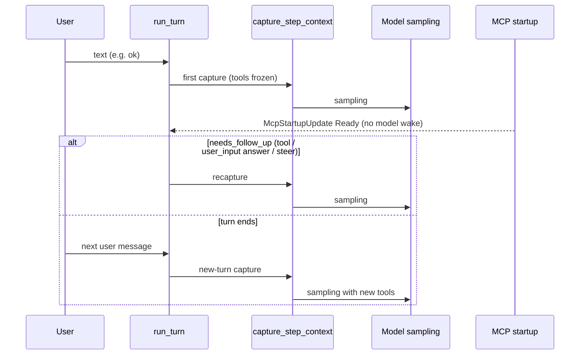

# Codex：MCP 连接完成 / tools/list_changed 后模型何时得知工具变化

核验日期：2026-09-27。钉住 `openai/codex` `main` @ `8f195c93d7e7acfef95acf273f0e49cce917e291`（`gh api repos/openai/codex/commits/main --jq .sha`），避免后续 main 变动混进结论。范围：`codex-rs`（core session turn loop、MCP runtime / binding、rmcp client handler）。边界：不查提示词原文细节；不查其他产品。

## 结论

1. 模型不会因为 MCP 连接完成或 `notifications/tools/list_changed` 而被立刻唤醒；也不会插入一条像用户指令的消息来逼模型马上行动。[`logging_client_handler.rs#L82-L91`](https://github.com/openai/codex/blob/8f195c93d7e7acfef95acf273f0e49cce917e291/codex-rs/rmcp-client/src/logging_client_handler.rs#L82-L91) · [`mcp_prewarm.rs#L1-L18`](https://github.com/openai/codex/blob/8f195c93d7e7acfef95acf273f0e49cce917e291/codex-rs/core/src/session/mcp_prewarm.rs#L1-L18) · [`turn.rs#L2114-L2161`](https://github.com/openai/codex/blob/8f195c93d7e7acfef95acf273f0e49cce917e291/codex-rs/core/src/session/turn.rs#L2114-L2161)
2. 模型可见工具集冻结在每次 `capture_step_context` 得到的 `McpBinding` / `tool_router` 上；同 turn 内若还有下一次 sampling（tool follow-up、`request_user_input` 应答、steer 输入等），循环会重新 capture，那时才带上已恢复的工具。[`binding.rs#L31-L37`](https://github.com/openai/codex/blob/8f195c93d7e7acfef95acf273f0e49cce917e291/codex-rs/codex-mcp/src/binding.rs#L31-L37) · [`turn.rs#L459-L469`](https://github.com/openai/codex/blob/8f195c93d7e7acfef95acf273f0e49cce917e291/codex-rs/core/src/session/turn.rs#L459-L469) · [`mod.rs#L3895-L3925`](https://github.com/openai/codex/blob/8f195c93d7e7acfef95acf273f0e49cce917e291/codex-rs/core/src/session/mod.rs#L3895-L3925)
3. 若当前 turn 在 MCP Ready 前就以「无 follow-up」结束，模型要等到用户下一条消息开启的新 turn 才会看到新工具；集成测试对此有明确断言。[`mcp_tool_exposure.rs#L1599-L1614`](https://github.com/openai/codex/blob/8f195c93d7e7acfef95acf273f0e49cce917e291/codex-rs/core/tests/suite/mcp_tool_exposure.rs#L1599-L1614)
4. `on_tool_list_changed` 在 Codex 侧只打日志，不 invalidate、不 refresh catalog、不 mark dirty；因此单纯的 `notifications/tools/list_changed` 不会驱动模型侧工具更新。[`logging_client_handler.rs#L82-L91`](https://github.com/openai/codex/blob/8f195c93d7e7acfef95acf273f0e49cce917e291/codex-rs/rmcp-client/src/logging_client_handler.rs#L82-L91)
5. 后台可预热 / 重投影 MCP runtime（`request_mcp_runtime_refresh` → dirty + prewarm worker），但注释写明「exact model steps remain the correctness path」——预热不替代下一次 step capture。[`mcp_prewarm.rs#L1-L18`](https://github.com/openai/codex/blob/8f195c93d7e7acfef95acf273f0e49cce917e291/codex-rs/core/src/session/mcp_prewarm.rs#L1-L18)

限制：以上针对钉住 SHA 的 `codex-rs` 行为。Apps Live catalog 的 `watch` 更新可改变 client 内 catalog revision，但模型广告仍以当次 binding 为准；普通 MCP 的 `list_changed` 无消费路径。

## 具体 trace：用户已开 session，发了与 MCP 无关的消息，MCP 在 turn 中途 Ready

输入：会话已开始；用户发送普通文本（例如 `"use an app after it recovers"` / 类比 `"ok"`）；Apps MCP 首次 initialize 失败后在后台恢复；同 turn 内模型先发出 `request_user_input`，用户应答后才有第二次 sampling。

| 步 | 事件 / 状态 | 代码 |
|---|---|---|
| 1 | `run_turn` 开头按用户输入收集 required MCP，然后 `capture_step_context_with_required_mcp_servers` 冻结本步工具视图 | [`turn.rs#L257-L265`](https://github.com/openai/codex/blob/8f195c93d7e7acfef95acf273f0e49cce917e291/codex-rs/core/src/session/turn.rs#L257-L265) |
| 2 | capture 内 `mcp_runtime_for_step` →（必要时）`refresh_mcp_if_dirty` → `current_binding_with_requirements` → `built_tools` | [`mod.rs#L3895-L3925`](https://github.com/openai/codex/blob/8f195c93d7e7acfef95acf273f0e49cce917e291/codex-rs/core/src/session/mod.rs#L3895-L3925) · [`mcp.rs#L345-L378`](https://github.com/openai/codex/blob/8f195c93d7e7acfef95acf273f0e49cce917e291/codex-rs/core/src/session/mcp.rs#L345-L378) |
| 3 | `next_step_context = Some(first_step_context)`；第一次 sampling 复用该 step（pending 为空时不重 capture） | [`turn.rs#L422`](https://github.com/openai/codex/blob/8f195c93d7e7acfef95acf273f0e49cce917e291/codex-rs/core/src/session/turn.rs#L422) · [`turn.rs#L459-L461`](https://github.com/openai/codex/blob/8f195c93d7e7acfef95acf273f0e49cce917e291/codex-rs/core/src/session/turn.rs#L459-L461) |
| 4 | 第一次 model request：无 `<apps_instructions>`、无 Calendar deferred namespace | 测试断言见下节摘录 |
| 5 | 后台 Apps Ready → 发 `EventMsg::McpStartupUpdate(... Ready)`；该事件不进入 realtime model text | [`connection_manager.rs#L738-L764`](https://github.com/openai/codex/blob/8f195c93d7e7acfef95acf273f0e49cce917e291/codex-rs/codex-mcp/src/connection_manager.rs#L738-L764) · [`turn.rs#L2114`](https://github.com/openai/codex/blob/8f195c93d7e7acfef95acf273f0e49cce917e291/codex-rs/core/src/session/turn.rs#L2114) |
| 6 | 用户应答 `request_user_input` → turn 继续；`next_step_context` 已 `take()` 为空 → 再次 `capture_step_context_with_required_mcp_servers` | [`turn.rs#L459-L469`](https://github.com/openai/codex/blob/8f195c93d7e7acfef95acf273f0e49cce917e291/codex-rs/core/src/session/turn.rs#L459-L469) · [`turn.rs#L741`](https://github.com/openai/codex/blob/8f195c93d7e7acfef95acf273f0e49cce917e291/codex-rs/core/src/session/turn.rs#L741) |
| 7 | 第二次 sampling 前 `record_step_world_state_if_changed` 用**新** step 的 deferred namespaces 写 history diff | [`turn.rs#L505-L507`](https://github.com/openai/codex/blob/8f195c93d7e7acfef95acf273f0e49cce917e291/codex-rs/core/src/session/turn.rs#L505-L507) · [`world_state.rs#L279-L287`](https://github.com/openai/codex/blob/8f195c93d7e7acfef95acf273f0e49cce917e291/codex-rs/core/src/session/world_state.rs#L279-L287) |
| 8 | 第二次 model request：出现 `Added deferred tool namespaces` 与 `tool_search` | 测试 snapshot 标题：`Deferred namespaces appear after Apps recovers between sampling requests.` |

对「用户只说 `ok`、模型直接结束 turn」：跳到步 4 后若 `!needs_follow_up` 则 `break`，不会有步 6–8；新工具落在下一条用户消息的新 turn。



### 主张摘录：list_changed 仅日志

[`logging_client_handler.rs#L82-L91`](https://github.com/openai/codex/blob/8f195c93d7e7acfef95acf273f0e49cce917e291/codex-rs/rmcp-client/src/logging_client_handler.rs#L82-L91)

```rs
// codex-rs/rmcp-client/src/logging_client_handler.rs:82-91 @ 8f195c93d7e7acfef95acf273f0e49cce917e291
    async fn on_resource_list_changed(&self, _context: NotificationContext<RoleClient>) {
        info!("MCP server resource list changed");
    }

    async fn on_tool_list_changed(&self, _context: NotificationContext<RoleClient>) {
        info!("MCP server tool list changed");
    }

    async fn on_prompt_list_changed(&self, _context: NotificationContext<RoleClient>) {
        info!("MCP server prompt list changed");
    }
```

仓库内 `on_tool_list_changed` 仅此实现（`gh search code "on_tool_list_changed" --repo openai/codex` 只命中该文件）。

### 主张摘录：预热不唤醒模型 step

[`mcp_prewarm.rs#L1-L18`](https://github.com/openai/codex/blob/8f195c93d7e7acfef95acf273f0e49cce917e291/codex-rs/core/src/session/mcp_prewarm.rs#L1-L18)

```rs
// codex-rs/core/src/session/mcp_prewarm.rs:1-18 @ 8f195c93d7e7acfef95acf273f0e49cce917e291
//! Best-effort MCP prewarming.
//!
//! A bounded channel coalesces refresh requests. The worker only prepares the
//! newest thread state; exact model steps remain the correctness path.

use super::*;

impl Session {
    pub(crate) fn request_mcp_runtime_refresh(&self) {
        // Plugin changes can reuse connections but still change their skill resources.
        self.services.mcp_runtime.invalidate_resource_caches();
        self.request_mcp_runtime_reprojection();
    }

    /// Reproject contributor state without invalidating cached MCP resources.
    pub(crate) fn request_mcp_runtime_reprojection(&self) {
        self.mark_mcp_runtime_dirty();
        self.schedule_mcp_prewarm();
    }
```

### 主张摘录：binding 冻结工具目录

[`binding.rs#L31-L37`](https://github.com/openai/codex/blob/8f195c93d7e7acfef95acf273f0e49cce917e291/codex-rs/codex-mcp/src/binding.rs#L31-L37) · [`binding.rs#L80-L83`](https://github.com/openai/codex/blob/8f195c93d7e7acfef95acf273f0e49cce917e291/codex-rs/codex-mcp/src/binding.rs#L80-L83)

```rs
// codex-rs/codex-mcp/src/binding.rs:31-37,80-83 @ 8f195c93d7e7acfef95acf273f0e49cce917e291
/// The exact tool catalog and execution handles shared by compatible sampling steps.
pub struct McpBinding {
    connections: Arc<McpConnectionSet>,
    clients: Arc<McpBindingClients>,
    config: Arc<McpConfig>,
    plugins_available: bool,
    tools: Vec<ToolInfo>,
    …
    /// Returns the frozen model-visible catalog captured for this binding.
    pub fn tools(&self) -> &[ToolInfo] {
        &self.tools
    }
```

### 主张摘录：follow-up 时重 capture

[`turn.rs#L459-L469`](https://github.com/openai/codex/blob/8f195c93d7e7acfef95acf273f0e49cce917e291/codex-rs/core/src/session/turn.rs#L459-L469)

```rs
// codex-rs/core/src/session/turn.rs:459-469 @ 8f195c93d7e7acfef95acf273f0e49cce917e291
        // Capture once so context, advertised tools, and tool calls share one request view.
        let step_context = match next_step_context.take() {
            Some(step_context) if pending_input.is_empty() => step_context,
            None if pending_input.is_empty() => {
                sess.capture_step_context_with_required_mcp_servers(
                    Arc::clone(&turn_context),
                    &cancellation_token,
                    required_servers,
                    required_plugins,
                )
                .await?
            }
```

follow-up 循环在 `needs_follow_up` 时 `continue`（[`turn.rs#L741`](https://github.com/openai/codex/blob/8f195c93d7e7acfef95acf273f0e49cce917e291/codex-rs/core/src/session/turn.rs#L741)），此时 `next_step_context` 已空，故走上面的 `None` 分支重 capture。

### 主张摘录：capture 内绑定 MCP 与 tools

[`mod.rs#L3895-L3925`](https://github.com/openai/codex/blob/8f195c93d7e7acfef95acf273f0e49cce917e291/codex-rs/core/src/session/mod.rs#L3895-L3925)

```rs
// codex-rs/core/src/session/mod.rs:3895-3925 @ 8f195c93d7e7acfef95acf273f0e49cce917e291
            let (mcp, prepared_recommendations) = tokio::join!(
                // MCP refresh can be large; keep it off the sampling request's stack.
                Box::pin(self.mcp_runtime_for_step(
                    turn_context.as_ref(),
                    &selected_capability_roots,
                    required_servers,
                    required_plugins,
                )),
                turn::prepare_tool_recommendations(self.as_ref(), turn_context.as_ref()),
            );
            …
            let tool_router = turn::built_tools(
                self.as_ref(),
                turn_context.as_ref(),
                &settings.model_info,
                &environments,
                &mcp,
                &extension_data,
                prepared_recommendations,
            )
            .await?;
```

### 主张摘录：同 turn 内两次 sampling 间恢复

[`mcp_tool_exposure.rs#L1318-L1496`](https://github.com/openai/codex/blob/8f195c93d7e7acfef95acf273f0e49cce917e291/codex-rs/core/tests/suite/mcp_tool_exposure.rs#L1318-L1496)（节选）

```rs
// codex-rs/core/tests/suite/mcp_tool_exposure.rs @ 8f195c93d7e7acfef95acf273f0e49cce917e291
async fn apps_guidance_and_deferred_namespace_appear_after_recovery_within_a_turn() -> Result<()> {
    …
    // first model response: request_user_input; Apps held offline
    …
    release_apps_recovery.send(()).expect("background Apps recovery should still be waiting");
    wait_for_event(&test.codex, |event| {
        matches!(
            event,
            EventMsg::McpStartupUpdate(update)
                if update.server == CODEX_APPS_MCP_SERVER_NAME
                    && matches!(update.status, …::McpStartupStatus::Ready)
        )
    }).await;
    // user answers request_user_input → second sampling in same turn
    …
    insta::assert_snapshot!(
        "deferred_tools_recover_during_sampling",
        format_labeled_requests_snapshot(
            "Deferred namespaces appear after Apps recovers between sampling requests.",
            &[
                ("Apps unavailable", &requests[0]),
                ("Apps recovered", &requests[1]),
            ],
        )
    );
}
```

### 主张摘录：Ready 不产生 realtime model text

[`turn.rs#L2114-L2161`](https://github.com/openai/codex/blob/8f195c93d7e7acfef95acf273f0e49cce917e291/codex-rs/core/src/session/turn.rs#L2114-L2161)

```rs
// codex-rs/core/src/session/turn.rs:2114-2161 @ 8f195c93d7e7acfef95acf273f0e49cce917e291
        | EventMsg::McpStartupUpdate(_)
        | EventMsg::McpStartupComplete(_)
        | EventMsg::McpToolCallBegin(_)
        | EventMsg::McpToolCallEnd(_)
        …
        | EventMsg::SubAgentActivity(_) => None,
    }
}
```

（`realtime_text_for_event` 忽略分支；Ready 事件本身不注入可采样文本。）

### 主张摘录：dirty / claim 门闩

[`mcp_refresh.rs#L7-L32`](https://github.com/openai/codex/blob/8f195c93d7e7acfef95acf273f0e49cce917e291/codex-rs/core/src/session/mcp_refresh.rs#L7-L32) · [`mcp.rs#L172-L199`](https://github.com/openai/codex/blob/8f195c93d7e7acfef95acf273f0e49cce917e291/codex-rs/core/src/session/mcp.rs#L172-L199)

```rs
// codex-rs/core/src/session/mcp_refresh.rs:7-32 @ 8f195c93d7e7acfef95acf273f0e49cce917e291
pub(super) struct McpRefresh {
    pending: AtomicBool,
    gate: Semaphore,
}
…
    pub(super) fn invalidate(&self) {
        self.pending.store(true, Ordering::Release);
    }
…
    pub(super) fn claim(&self) -> bool {
        self.pending.swap(false, Ordering::AcqRel)
    }
```

```rs
// codex-rs/core/src/session/mcp.rs:172-199 @ 8f195c93d7e7acfef95acf273f0e49cce917e291
    /// Publishes changed MCP state, waiting for any refresh already in progress.
    pub(crate) async fn refresh_mcp_if_dirty(self: &Arc<Self>) {
        let Ok(_refresh) = self.mcp_refresh.acquire().await else { … };
        loop {
            …
            if !self.mcp_refresh.claim() {
                return;
            }
            …
```

同一 published connection set 上，后续 `current_binding_with_requirements` 仍可按 catalog revision 再 `capture_binding_with_metadata`（不必总走 dirty），但触发点仍是 step capture，不是 notification 回调。见 [`runtime.rs#L416-L463`](https://github.com/openai/codex/blob/8f195c93d7e7acfef95acf273f0e49cce917e291/codex-rs/codex-mcp/src/runtime.rs#L416-L463)。

### 主张摘录：world_state 工具 diff 跟 step 走

[`world_state.rs#L279-L287`](https://github.com/openai/codex/blob/8f195c93d7e7acfef95acf273f0e49cce917e291/codex-rs/core/src/session/world_state.rs#L279-L287) · [`mod.rs#L3685-L3702`](https://github.com/openai/codex/blob/8f195c93d7e7acfef95acf273f0e49cce917e291/codex-rs/core/src/session/mod.rs#L3685-L3702)

```rs
// codex-rs/core/src/session/world_state.rs:279-287 @ 8f195c93d7e7acfef95acf273f0e49cce917e291
        if turn_context
            .config
            .features
            .enabled(Feature::DeferredToolWorldState)
        {
            world_state.add_section(ToolsState::new(
                step_context.tool_router.deferred_tool_namespaces(),
                Arc::clone(&extension_metrics),
            ));
        }
```

```rs
// codex-rs/core/src/session/mod.rs:3685-3702 @ 8f195c93d7e7acfef95acf273f0e49cce917e291
        // Render model-visible state from the same step used to build and run tools.
        let world_state = Arc::new(self.build_world_state_for_step(step_context).await?);
        …
        let items = crate::context_manager::updates::merge_contextual_fragments(
            world_state.render_history_diff(
                Some(&previous_snapshot),
                self.state.lock().await.history.raw_items(),
            ),
        );
        if !items.is_empty() {
            self.record_conversation_items(…).await;
        }
```

这是「工具变化如何写进 history」的路径：developer/world_state delta，不是伪造的用户消息。需启用 `Feature::DeferredToolWorldState` 才有 ToolsState 段；未启用时模型主要靠 tools 参数本身在下次 sampling 变化。

## 失败模式与边界

### A. MCP 在 turn 中途连上，但当前 turn 无 follow-up

背景恢复完成后，下一次**用户发起的 turn** 才看到工具。

[`mcp_tool_exposure.rs#L1599-L1614`](https://github.com/openai/codex/blob/8f195c93d7e7acfef95acf273f0e49cce917e291/codex-rs/core/tests/suite/mcp_tool_exposure.rs#L1599-L1614)（`later_follow_up_uses_background_recovered_apps_after_mid_thread_startup_failures`）：

```rs
// codex-rs/core/tests/suite/mcp_tool_exposure.rs:1599-1614 @ 8f195c93d7e7acfef95acf273f0e49cce917e291
    .expect("background Apps reconnect should complete");
    test.submit_turn("use Calendar after background Apps recovery")
        .await?;

    let requests = response.requests();
    assert_eq!(requests.len(), 3);
    let recovered_request = requests[2].body_json();
    assert!(
        namespace_child_tool(
            &recovered_request,
            SEARCH_CALENDAR_NAMESPACE,
            SEARCH_CALENDAR_CREATE_TOOL,
        )
        .is_some(),
        "Calendar should recover on the follow-up turn: {recovered_request}",
    );
```

### B. 首次 tools/list 为空 / optional server 尚未 Ready

`optional_mcp_startup_grace`：grace 内未 Ready 的 optional server 可从首次 catalog 省略；之后需新的 turn（或配置 refresh 改变 grace 后再 capture）才会纳入。

[`tool_catalog.rs#L288-L337`](https://github.com/openai/codex/blob/8f195c93d7e7acfef95acf273f0e49cce917e291/codex-rs/codex-mcp/src/connection_manager/tool_catalog.rs#L288-L337)

```rs
// codex-rs/codex-mcp/src/connection_manager/tool_catalog.rs:288-337 @ 8f195c93d7e7acfef95acf273f0e49cce917e291
                if !must_wait_for_startup && optional_mcp_startup_grace.is_zero() {
                    …
                    let _ = view.connection.client().await;
                } else if !must_wait_for_startup {
                    …
                    if tokio::time::timeout_at(startup_deadline, view.connection.client())
                        .await
                        .is_err()
                    {
                        trace!(server_name = %server_name, "omitting pending optional MCP server");
                    }
                    return (server_name, view, cached_tools);
                }
```

[`mcp_optional_startup_grace.rs#L35-L36`](https://github.com/openai/codex/blob/8f195c93d7e7acfef95acf273f0e49cce917e291/codex-rs/core/tests/suite/mcp_optional_startup_grace.rs#L35-L36) · [`#L160-L166`](https://github.com/openai/codex/blob/8f195c93d7e7acfef95acf273f0e49cce917e291/codex-rs/core/tests/suite/mcp_optional_startup_grace.rs#L160-L166)

```rs
// codex-rs/core/tests/suite/mcp_optional_startup_grace.rs @ 8f195c93d7e7acfef95acf273f0e49cce917e291
#[test_case(StartupGraceScenario::ShortGraceOmitsPending; "custom grace omits a pending server")]
…
            "a pending optional MCP tool must be absent after its configured grace expires"
```

首次 deferred tools 为空时，不渲染/不持久化 tools world_state（[`mcp_tool_exposure.rs#L1208-L1238`](https://github.com/openai/codex/blob/8f195c93d7e7acfef95acf273f0e49cce917e291/codex-rs/core/tests/suite/mcp_tool_exposure.rs#L1208-L1238) `initially_empty_deferred_tool_world_state_is_not_rendered_or_persisted`）。

### C. list_changed 与正在执行的 tool call 并发

1. **通知侧**：`on_tool_list_changed` 不刷新，故并发通知本身不改 binding。  
2. **显式 refresh / Apps catalog revision 变化时**：已 prepare 的 call 在 `run_with_snapshot` 下若 revision 不匹配则拒绝执行。

[`client_tool_catalog.rs#L1-L6`](https://github.com/openai/codex/blob/8f195c93d7e7acfef95acf273f0e49cce917e291/codex-rs/codex-mcp/src/client_tool_catalog.rs#L1-L6) · [`#L180-L204`](https://github.com/openai/codex/blob/8f195c93d7e7acfef95acf273f0e49cce917e291/codex-rs/codex-mcp/src/client_tool_catalog.rs#L180-L204) · [`binding.rs#L320-L364`](https://github.com/openai/codex/blob/8f195c93d7e7acfef95acf273f0e49cce917e291/codex-rs/codex-mcp/src/binding.rs#L320-L364)

```rs
// codex-rs/codex-mcp/src/client_tool_catalog.rs:1-6 @ 8f195c93d7e7acfef95acf273f0e49cce917e291
//! Client-local catalog revisions and synchronization for MCP calls.
//!
//! Apps clients read the provider's current catalog without retaining old arrays.
//! Only active readers, calls, and frozen model bindings pin earlier snapshots.
//! Explicit refreshes publish after calls using this client's current revision finish.
//! Equivalent shared publications preserve calls, but explicit refreshes invalidate them.
```

```rs
// codex-rs/codex-mcp/src/binding.rs:320-364 @ 8f195c93d7e7acfef95acf273f0e49cce917e291
        self.client
            .tool_catalog
            .run_with_snapshot(&self.catalog_snapshot, || async {
                …
            })
            .await
            .ok_or_else(|| anyhow::anyhow!(
                "tool call rejected because the catalog changed after `{}/{tool_name}` was prepared",
                self.server_name
            ))?
```

**待验证**：普通（非 Apps）MCP 在未走 `RefreshMcpServers` / reconnect / dirty refresh 时，仅靠 `tools/list_changed` 是否存在任何旁路刷新 catalog——当前源码未见；缺「消费 list_changed 的第二个 ClientHandler 或订阅」证据，按无消费处理。

### D. 显式 RefreshMcpServers

[`handlers.rs#L235-L238`](https://github.com/openai/codex/blob/8f195c93d7e7acfef95acf273f0e49cce917e291/codex-rs/core/src/session/handlers.rs#L235-L238)

```rs
// codex-rs/core/src/session/handlers.rs:235-238 @ 8f195c93d7e7acfef95acf273f0e49cce917e291
pub fn refresh_mcp_servers(sess: &Session) {
    sess.services.mcp_runtime.reconnect_on_next_refresh();
    sess.request_mcp_runtime_refresh();
}
```

这是 reconnect + dirty + prewarm，仍不单独插入用户指令；模型侧仍等下一次 step capture。

## 时序对照表

| 触发 | runtime / catalog | 模型何时得知 | 是否插入类用户消息并立刻行动 |
|---|---|---|---|
| MCP 连接完成（`McpStartupUpdate Ready`） | 连接置 Ready；可被后续 capture 列入 | 同 turn 下一次 sampling，或下一用户 turn | 否 |
| `notifications/tools/list_changed` | 仅 `info!` 日志 | 不因此更新 | 否 |
| `Op::RefreshMcpServers` | reconnect + dirty + prewarm | 下次 capture | 否 |
| optional grace 省略后稍后 Ready | 同 published set 上可再 capture | 下次 capture / 下 turn | 否 |
| 显式 Apps catalog refresh 与在飞 call | revision 冲突则 reject call | 不影响「唤醒」 | 否 |

## 来源覆盖

| 来源类别 | 查到了什么 |
|---|---|
| 官方文档 / 源码 | `codex-rs` @ `8f195c93d7e7acfef95acf273f0e49cce917e291`：`session/{turn,mcp,mcp_refresh,mcp_prewarm,mod,world_state}.rs`，`codex-mcp/{binding,runtime,connection_manager,client_tool_catalog,tool_catalog}.rs`，`rmcp-client/logging_client_handler.rs`，测试 `mcp_tool_exposure.rs` / `mcp_optional_startup_grace.rs` |
| 作者或维护者本人的说法 | 未找到独立 blog/RFC；设计意图以源码注释与测试文案为准（如 prewarm「exact model steps remain the correctness path」、snapshot「between sampling requests」）。issue 检索遇 API rate limit，未系统扫维护者回复 |
| 同类方案 | 按任务边界未查其他产品 |
| issue / PR / 社区实践 | 未系统查（rate limit + 本题以源码时序为准）；未用 issue 支撑结论 |
| 历史演变 | 未查 changelog / 旧实现替换史；结论仅对钉住 SHA 成立 |

## 对本项目的影响

- 若要对齐 Codex：MCP Ready / list_changed **不应**伪造用户消息去立刻再跑一轮；应在**下一次模型请求**（同 turn follow-up 或下一条用户消息）重绑 tools / world_state。
- `list_changed` 在 Codex 当前几乎是空操作——若 jai 需要 list_changed 生效，那是相对 Codex 的增强，不是照搬。
- 中途连上且 turn 已结束时，接受「等用户下一条」的延迟；若产品要更激进的即时行动，需另做设计，Codex 未提供该机制。
