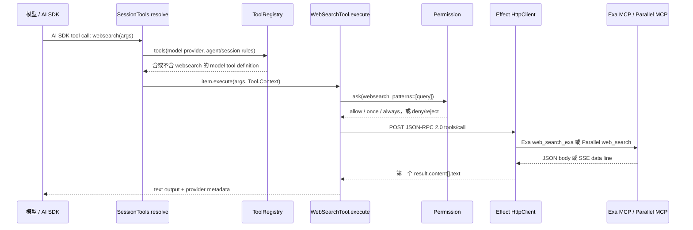

# OpenCode 网络搜索（`websearch`）实现笔记

核验日期：2026-09-03（Asia/Singapore）。本文将事实固定在 OpenCode 最新稳定版 **`v1.18.27`**：该 release 在 2026-09-02 21:41 UTC 发布，tag `v1.18.27` 的 Git ref 直接指向 commit **`4b7e19e315cca414121ba1d61523fef74bb3ae8b`**。所有源码链接均为此 SHA 的 GitHub permalink，避免后续 `main` 演进混入结论。[release](https://github.com/anomalyco/opencode/releases/tag/v1.18.27) · [tag ref](https://api.github.com/repos/anomalyco/opencode/git/ref/tags/v1.18.27) · [commit](https://github.com/anomalyco/opencode/commit/4b7e19e315cca414121ba1d61523fef74bb3ae8b)

来源边界：仅使用 OpenCode 官方仓库、同仓库官方文档源码和 GitHub Release/API。没有调用 Exa 或 Parallel 的服务，也没有采用它们的第三方文档或隐私政策；因此本文只陈述 OpenCode 客户端明确实现的请求与边界。

## 结论

1. OpenCode 的网络发现工具名是 **`websearch`**，是注册表内的原生 built-in，不是用户安装的 MCP server 或 extension；同一官方文档将它与 `webfetch`、custom tools 和 MCP servers 分为不同类别。[工具注册](https://github.com/anomalyco/opencode/blob/4b7e19e315cca414121ba1d61523fef74bb3ae8b/packages/opencode/src/tool/registry.ts#L209-L249) · [官方工具文档](https://github.com/anomalyco/opencode/blob/4b7e19e315cca414121ba1d61523fef74bb3ae8b/packages/web/src/content/docs/tools.mdx#L143-L171)
2. 原生 `websearch` 的后台是 **Exa 或 Parallel**。OpenCode 自己以 HTTP JSON-RPC/MCP 客户端调用 `https://mcp.exa.ai/mcp` 的 `web_search_exa` 或 `https://search.parallel.ai/mcp` 的 `web_search`；它并不把这两个服务作为用户可配置/已连接的通用 MCP server 注册到模型工具列表。[适配器](https://github.com/anomalyco/opencode/blob/4b7e19e315cca414121ba1d61523fef74bb3ae8b/packages/opencode/src/tool/mcp-websearch.ts#L1-L88) · [调用方](https://github.com/anomalyco/opencode/blob/4b7e19e315cca414121ba1d61523fef74bb3ae8b/packages/opencode/src/tool/websearch.ts#L55-L130)
3. 模型可见 schema 要求 `query: string`，可选 `numResults`、`livecrawl`、`type`、`contextMaxCharacters`；执行时 Exa 的默认值是 `numResults=8`、`livecrawl="fallback"`、`type="auto"`，`contextMaxCharacters` 未填时不发送。`packages/opencode` 的该实现未对两个数字字段施加上限；同一 release 中 V2/core 版本则校验 `numResults` 为 1--20、`contextMaxCharacters` 为 1--50,000，因此两者不能混作一个“现行上限”。[V1 schema/defaults](https://github.com/anomalyco/opencode/blob/4b7e19e315cca414121ba1d61523fef74bb3ae8b/packages/opencode/src/tool/websearch.ts#L10-L25) · [V2 约束](https://github.com/anomalyco/opencode/blob/4b7e19e315cca414121ba1d61523fef74bb3ae8b/packages/core/src/tool/websearch.ts#L20-L64)
4. 该工具只会在模型 provider 为 `opencode` / `opencode-go`，或启用了 Exa/Parallel flag 时暴露给模型。`OPENCODE_ENABLE_EXA`、`OPENCODE_EXPERIMENTAL_EXA` 或总开关 `OPENCODE_EXPERIMENTAL` 打开 Exa；`OPENCODE_ENABLE_PARALLEL` 或 `OPENCODE_EXPERIMENTAL_PARALLEL` 打开 Parallel。`OPENCODE_WEBSEARCH_PROVIDER=exa|parallel` 可强制选择，否则按 session ID checksum 稳定地二选一。[可见性判断](https://github.com/anomalyco/opencode/blob/4b7e19e315cca414121ba1d61523fef74bb3ae8b/packages/opencode/src/tool/registry.ts#L53-L61) · [环境 flag](https://github.com/anomalyco/opencode/blob/4b7e19e315cca414121ba1d61523fef74bb3ae8b/packages/opencode/src/effect/runtime-flags.ts#L26-L37) · [选择逻辑](https://github.com/anomalyco/opencode/blob/4b7e19e315cca414121ba1d61523fef74bb3ae8b/packages/opencode/src/tool/websearch.ts#L29-L35)
5. API key 是可选的客户端附加认证，而不是此工具开启的前提：官方文档称 hosted MCP service 无需 API key；源码在设置 `EXA_API_KEY` 时将其 URL-encode 到 Exa 查询参数 `exaApiKey`，在设置 `PARALLEL_API_KEY` 时加入 Parallel 的 `Authorization: Bearer ...`，并始终带 `User-Agent: opencode/<version>`。仅凭 OpenCode 源码不能确认未带 key 时两个远端服务各自的接受、配额或拒绝行为。[官方文档](https://github.com/anomalyco/opencode/blob/4b7e19e315cca414121ba1d61523fef74bb3ae8b/packages/web/src/content/docs/tools.mdx#L143-L171) · [认证与 endpoint](https://github.com/anomalyco/opencode/blob/4b7e19e315cca414121ba1d61523fef74bb3ae8b/packages/opencode/src/tool/mcp-websearch.ts#L1-L8) · [Parallel headers](https://github.com/anomalyco/opencode/blob/4b7e19e315cca414121ba1d61523fef74bb3ae8b/packages/opencode/src/tool/websearch.ts#L49-L90)
6. OpenCode 只保留 MCP 返回的第一个非空 `result.content[].text`，接受直接 JSON body 或 SSE 的 `data: ` 行；对 URL、citation、单条 result 等没有稳定字段、没有 canonicalization，也没有本地 citation renderer。供应商若把 URL/引用写进该 text，它们会随文本传给模型；否则 OpenCode 不会补出来源元数据。[响应 schema/解析](https://github.com/anomalyco/opencode/blob/4b7e19e315cca414121ba1d61523fef74bb3ae8b/packages/opencode/src/tool/mcp-websearch.ts#L10-L53)
7. 网络请求前，原生工具会以权限名 `websearch` 和查询字符串作为 pattern 调用审批；批准后才进入 HTTP 调用。`deny` 立即失败，`allow` 跳过交互；无匹配规则时权限引擎的 fallback 是 `ask`，而“always”会把 `websearch:*:allow` 保存在当前 OpenCode instance 的内存批准表。实际默认是否弹窗仍取决于合并后的 agent/session/config rules；同版官方文档写的是“默认全部 enabled 且不需 permission”，两者不应被简化为“总是默认询问”。[工具审批点](https://github.com/anomalyco/opencode/blob/4b7e19e315cca414121ba1d61523fef74bb3ae8b/packages/opencode/src/tool/websearch.ts#L104-L122) · [规则求值和一次/长期批准](https://github.com/anomalyco/opencode/blob/4b7e19e315cca414121ba1d61523fef74bb3ae8b/packages/opencode/src/permission/index.ts#L28-L160) · [官方文档的默认行为说明](https://github.com/anomalyco/opencode/blob/4b7e19e315cca414121ba1d61523fef74bb3ae8b/packages/web/src/content/docs/tools.mdx#L5-L32)
8. 传出的数据至少包括查询；Parallel 还会收到 `session_id` 和（V1）最多 100 字符的模型 ID，Exa 会收到 query 及其搜索控制字段。源码中没有看到查询脱敏、host allowlist、代理转发或供应商保留期处理，因此这些不是 OpenCode 在该调用点提供的隐私控制；用户可用 `permission.websearch` deny/ask/allow 决定是否允许出站调用。[Parallel 参数](https://github.com/anomalyco/opencode/blob/4b7e19e315cca414121ba1d61523fef74bb3ae8b/packages/opencode/src/tool/websearch.ts#L39-L90) · [权限配置文档](https://github.com/anomalyco/opencode/blob/4b7e19e315cca414121ba1d61523fef74bb3ae8b/packages/web/src/content/docs/tools.mdx#L9-L32)
9. Extension/plugin 与原生工具是两条机制：注册表会动态 import 配置目录中 `{tool,tools}/*.{js,ts}`，也会加入 loaded plugin 的 `p.tool`；插件还可在模型看到工具定义前触发 `tool.definition` hook。它们可以自行实现网络搜索，但 registry 不会自动替 plugin custom tool 调用权限审批，plugin 需要主动使用提供的 `toolCtx.ask`。已配置 MCP server 的工具则由另一段代码转成模型工具，并由 wrapper 以该工具 key 申请权限。[动态 custom/plugin 工具](https://github.com/anomalyco/opencode/blob/4b7e19e315cca414121ba1d61523fef74bb3ae8b/packages/opencode/src/tool/registry.ts#L125-L204) · [定义发现 hook](https://github.com/anomalyco/opencode/blob/4b7e19e315cca414121ba1d61523fef74bb3ae8b/packages/opencode/src/tool/registry.ts#L310-L339) · [通用 MCP 工具与权限](https://github.com/anomalyco/opencode/blob/4b7e19e315cca414121ba1d61523fef74bb3ae8b/packages/opencode/src/session/tools.ts#L388-L420)

## 工具暴露、启用与配置

### 原生工具与可见性

`WebSearchTool` 以 ID `websearch` 初始化后直接放入 `builtin` 数组。每次针对模型构造可用工具时，注册表再用 `webSearchEnabled()` 过滤它：内建 OpenCode provider（`opencode`、`opencode-go`）可见；其他 provider 只有当 Exa 或 Parallel feature flag 为 true 才可见。也就是说，**工具实例可以存在于注册表中但不会必然暴露给该模型**。[内建初始化/数组](https://github.com/anomalyco/opencode/blob/4b7e19e315cca414121ba1d61523fef74bb3ae8b/packages/opencode/src/tool/registry.ts#L209-L249) · [provider/flag 过滤](https://github.com/anomalyco/opencode/blob/4b7e19e315cca414121ba1d61523fef74bb3ae8b/packages/opencode/src/tool/registry.ts#L53-L61)

官方文档对用户侧的最小开启方式是：

```sh
OPENCODE_ENABLE_EXA=1 opencode
# 或
OPENCODE_ENABLE_PARALLEL=1 opencode
```

并允许通过 `opencode.json` 的 `permission.websearch` 使用 `allow`、`ask` 或 `deny` 控制调用行为。[官方工具文档的 websearch 段](https://github.com/anomalyco/opencode/blob/4b7e19e315cca414121ba1d61523fef74bb3ae8b/packages/web/src/content/docs/tools.mdx#L143-L171) · [权限配置格式](https://github.com/anomalyco/opencode/blob/4b7e19e315cca414121ba1d61523fef74bb3ae8b/packages/web/src/content/docs/tools.mdx#L9-L32)

### Provider 选择顺序

| 优先级 | 条件 | 结果 | 证据 |
| --- | --- | --- | --- |
| 1 | `OPENCODE_WEBSEARCH_PROVIDER` 精确为 `exa` 或 `parallel` | 强制该 provider | [选择函数](https://github.com/anomalyco/opencode/blob/4b7e19e315cca414121ba1d61523fef74bb3ae8b/packages/opencode/src/tool/websearch.ts#L29-L35) |
| 2 | Parallel flag 为 true | `parallel` | [选择函数](https://github.com/anomalyco/opencode/blob/4b7e19e315cca414121ba1d61523fef74bb3ae8b/packages/opencode/src/tool/websearch.ts#L29-L35) |
| 3 | Exa flag 为 true | `exa` | [选择函数](https://github.com/anomalyco/opencode/blob/4b7e19e315cca414121ba1d61523fef74bb3ae8b/packages/opencode/src/tool/websearch.ts#L29-L35) |
| 4 | 都未开启且未覆写 | `checksum(sessionID)` 解析为 36 进制后的奇偶性稳定映射为 Exa 或 Parallel | [选择函数](https://github.com/anomalyco/opencode/blob/4b7e19e315cca414121ba1d61523fef74bb3ae8b/packages/opencode/src/tool/websearch.ts#L29-L35) |

| 环境变量 | 作用 | 证据 |
| --- | --- | --- |
| `OPENCODE_ENABLE_EXA` | 启用 Exa flag | [runtime flags](https://github.com/anomalyco/opencode/blob/4b7e19e315cca414121ba1d61523fef74bb3ae8b/packages/opencode/src/effect/runtime-flags.ts#L26-L37) |
| `OPENCODE_EXPERIMENTAL_EXA` | Exa 的 legacy alias | [runtime flags](https://github.com/anomalyco/opencode/blob/4b7e19e315cca414121ba1d61523fef74bb3ae8b/packages/opencode/src/effect/runtime-flags.ts#L26-L37) |
| `OPENCODE_EXPERIMENTAL` | 同时使 `enableExa=true`；不直接打开 Parallel | [runtime flags](https://github.com/anomalyco/opencode/blob/4b7e19e315cca414121ba1d61523fef74bb3ae8b/packages/opencode/src/effect/runtime-flags.ts#L26-L37) |
| `OPENCODE_ENABLE_PARALLEL` | 启用 Parallel flag | [runtime flags](https://github.com/anomalyco/opencode/blob/4b7e19e315cca414121ba1d61523fef74bb3ae8b/packages/opencode/src/effect/runtime-flags.ts#L26-L37) |
| `OPENCODE_EXPERIMENTAL_PARALLEL` | Parallel 的 legacy alias | [runtime flags](https://github.com/anomalyco/opencode/blob/4b7e19e315cca414121ba1d61523fef74bb3ae8b/packages/opencode/src/effect/runtime-flags.ts#L26-L37) |
| `OPENCODE_WEBSEARCH_PROVIDER=exa|parallel` | 覆盖上述选择 | [选择函数](https://github.com/anomalyco/opencode/blob/4b7e19e315cca414121ba1d61523fef74bb3ae8b/packages/opencode/src/tool/websearch.ts#L29-L35) |
| `EXA_API_KEY` | 如存在，追加为 Exa URL 的 `exaApiKey` 查询参数 | [endpoint 构造](https://github.com/anomalyco/opencode/blob/4b7e19e315cca414121ba1d61523fef74bb3ae8b/packages/opencode/src/tool/mcp-websearch.ts#L1-L8) |
| `PARALLEL_API_KEY` | 如存在，追加为 `Authorization: Bearer` | [header 构造](https://github.com/anomalyco/opencode/blob/4b7e19e315cca414121ba1d61523fef74bb3ae8b/packages/opencode/src/tool/websearch.ts#L49-L53) |

## 模型请求到 HTTP client 的调用链



`SessionTools.resolve()` 将注册表得到的 `Tool.Def` 转成 AI SDK `tool()`：它建造带 session ID、message ID、model、权限 ruleset、`ask()` 与 metadata 回写能力的 `Tool.Context`，随后在 `execute` 中触发 plugin before/after hooks 并调用 `item.execute()`。[工具到 AI SDK 的桥接](https://github.com/anomalyco/opencode/blob/4b7e19e315cca414121ba1d61523fef74bb3ae8b/packages/opencode/src/session/tools.ts#L41-L134) 默认 LLM runtime 再把 `prepared.tools` 交给 AI SDK 的 `streamText()`，由 AI SDK 进行 provider 执行与 tool dispatch。[`streamText` 调用](https://github.com/anomalyco/opencode/blob/4b7e19e315cca414121ba1d61523fef74bb3ae8b/packages/opencode/src/session/llm.ts#L276-L353)

原生 `WebSearchTool.execute()` 的顺序是：选择 provider，写入执行 metadata，审批，再调用 provider。因而在正常实现顺序中，未获许可的查询不应到达 Exa/Parallel endpoint。[执行顺序](https://github.com/anomalyco/opencode/blob/4b7e19e315cca414121ba1d61523fef74bb3ae8b/packages/opencode/src/tool/websearch.ts#L92-L130)

## 输入与远端 HTTP 合约

### 模型可见输入 schema（V1/`packages/opencode`）

| 字段 | 类型 | 是否必填 | 默认/含义 | 本地范围限制 |
| --- | --- | --- | --- | --- |
| `query` | string | 是 | 检索词 | 无额外长度限制 |
| `numResults` | number | 否 | Exa 调用时未填为 `8` | 无正数/上限校验 |
| `livecrawl` | `fallback` \| `preferred` | 否 | 未填为 `fallback` | enum 校验 |
| `type` | `auto` \| `fast` \| `deep` | 否 | 未填为 `auto` | enum 校验 |
| `contextMaxCharacters` | number | 否 | 描述写默认 `10000`；执行时若未传则省略该字段 | 无正数/上限校验 |

schema 与默认值描述来自 [V1 schema](https://github.com/anomalyco/opencode/blob/4b7e19e315cca414121ba1d61523fef74bb3ae8b/packages/opencode/src/tool/websearch.ts#L10-L25)，实际 Exa 参数填充来自 [V1 调用](https://github.com/anomalyco/opencode/blob/4b7e19e315cca414121ba1d61523fef74bb3ae8b/packages/opencode/src/tool/websearch.ts#L55-L90)。这里的 `contextMaxCharacters=10000` 是工具 description 的文档默认值；当前 V1 调用代码没有用 `|| 10000` 填入它，因此不能声称这个数一定出现在每一个 HTTP 请求中。

所有 builtin tool 会先由 wrapper 以对应 Effect schema 解码；不合 schema 时，模型收到 `ToolInvalidArgumentsError` 的“rewrite the input”错误。由于 V1 `numResults` 和 `contextMaxCharacters` 均是 `Schema.Number`，负数、小数和很大的数能通过这一层，是否被远端拒绝不由 OpenCode 源码定义。[通用解码/错误](https://github.com/anomalyco/opencode/blob/4b7e19e315cca414121ba1d61523fef74bb3ae8b/packages/opencode/src/tool/tool.ts#L18-L34) · [wrapper](https://github.com/anomalyco/opencode/blob/4b7e19e315cca414121ba1d61523fef74bb3ae8b/packages/opencode/src/tool/tool.ts#L99-L145)

### Provider 请求表

| provider | endpoint | HTTP / protocol | JSON-RPC `params.name` | arguments | 认证/标识 | timeout |
| --- | --- | --- | --- | --- | --- | --- |
| Exa | `https://mcp.exa.ai/mcp`，若有 key 则 `?exaApiKey=<URL-encoded EXA_API_KEY>` | `POST`; `Accept: application/json, text/event-stream`; JSON-RPC 2.0 | `web_search_exa` | `{ query, type: type || "auto", numResults: numResults || 8, livecrawl: livecrawl || "fallback", contextMaxCharacters }` | `EXA_API_KEY` 在 URL 查询参数；缺失时不发送 | 25 秒 |
| Parallel | `https://search.parallel.ai/mcp` | 同上 | `web_search` | `{ objective: query, search_queries: [query], session_id, model_name? }` | `User-Agent: opencode/<version>`；有 `PARALLEL_API_KEY` 才发 Bearer header | 25 秒 |

统一请求封装固定为：

```json
{
  "jsonrpc": "2.0",
  "id": 1,
  "method": "tools/call",
  "params": {
    "name": "<provider tool name>",
    "arguments": { "...": "..." }
  }
}
```

上表与请求体见 [endpoint、远端参数 schema、JSON-RPC 请求和 25 秒 timeout](https://github.com/anomalyco/opencode/blob/4b7e19e315cca414121ba1d61523fef74bb3ae8b/packages/opencode/src/tool/mcp-websearch.ts#L1-L88) 及 [provider-specific 调用](https://github.com/anomalyco/opencode/blob/4b7e19e315cca414121ba1d61523fef74bb3ae8b/packages/opencode/src/tool/websearch.ts#L49-L90)。`HttpClient.filterStatusOk` 表示非 2xx 不能走成功解析分支。[HTTP 调用](https://github.com/anomalyco/opencode/blob/4b7e19e315cca414121ba1d61523fef74bb3ae8b/packages/opencode/src/tool/mcp-websearch.ts#L69-L88)

## 返回格式、URL/引用与截断

### 从远端响应到模型文本

OpenCode 期待形如以下的 JSON 字符串（无论它是整个 body，还是 SSE 中以 `data: ` 起始的一行）：

```json
{
  "result": {
    "content": [
      { "type": "text", "text": "<provider-produced search result text>" }
    ]
  }
}
```

解析器只返回 `content.find((item) => item.text)?.text`：即第一个 truthy text。它不使用 `type` 做 text 过滤，也不枚举余下 entries；body 不是 JSON、没有可用 text 或没有匹配 SSE data line 时返回 `undefined`，上层转为固定文本 `No search results found. Please try a different query.`。[远端结果 schema 与 SSE/direct parser](https://github.com/anomalyco/opencode/blob/4b7e19e315cca414121ba1d61523fef74bb3ae8b/packages/opencode/src/tool/mcp-websearch.ts#L10-L53) · [空结果 fallback](https://github.com/anomalyco/opencode/blob/4b7e19e315cca414121ba1d61523fef74bb3ae8b/packages/opencode/src/tool/websearch.ts#L124-L129)

因此，`websearch` 的模型输出结构是：

```ts
{
  title: "Exa Web Search: <query>" | "Parallel Web Search: <query>",
  output: "<opaque provider text>",
  metadata: { provider: "exa" | "parallel", truncated: boolean, outputPath?: string }
}
```

`URL`、网页标题、结果排序、citation ID、引用格式都不是这个原生工具的字段。它们只能作为 provider text 的一部分透传；模型不能依赖 OpenCode 提供的结构化 URL/citation API。结论来自 [工具返回对象](https://github.com/anomalyco/opencode/blob/4b7e19e315cca414121ba1d61523fef74bb3ae8b/packages/opencode/src/tool/websearch.ts#L124-L129) 与 [只取 text 的 parser](https://github.com/anomalyco/opencode/blob/4b7e19e315cca414121ba1d61523fef74bb3ae8b/packages/opencode/src/tool/mcp-websearch.ts#L10-L53)。

### 本地输出截断

`websearch` 没有自带 `metadata.truncated`，所以通用 Tool wrapper 会在返回模型前执行截断。默认最多 **2,000 行**且最多 **50 KiB UTF-8**；可由 `opencode.json` 的 `tool_output.max_lines`、`tool_output.max_bytes` 覆盖。超限时保留 head preview，完整文本写到 truncation directory，并在 output 加入 saved-file 提示；清理任务会删除超过 **7 天** 的 `tool_*` 文件。[通用 wrapper 的接入点](https://github.com/anomalyco/opencode/blob/4b7e19e315cca414121ba1d61523fef74bb3ae8b/packages/opencode/src/tool/tool.ts#L116-L138) · [默认值、配置和算法](https://github.com/anomalyco/opencode/blob/4b7e19e315cca414121ba1d61523fef74bb3ae8b/packages/opencode/src/tool/truncate.ts#L12-L140)

这条截断是 OpenCode 在**远端响应已完整读入**之后施加的；V1 `mcp-websearch.ts` 对 `response.text` 没有 body size ceiling。因此它控制模型上下文/本地保存量，不是 V1 的网络下载大小限制。[V1 先读 response.text 再解析](https://github.com/anomalyco/opencode/blob/4b7e19e315cca414121ba1d61523fef74bb3ae8b/packages/opencode/src/tool/mcp-websearch.ts#L69-L88)

## 错误、审批与隐私边界

| 阶段 | V1 行为 | 对模型/调用的结果 | 证据 |
| --- | --- | --- | --- |
| 入参不合 schema | wrapper 将 Effect decode error 映射为 `ToolInvalidArgumentsError` | 要求模型重写 input | [通用错误](https://github.com/anomalyco/opencode/blob/4b7e19e315cca414121ba1d61523fef74bb3ae8b/packages/opencode/src/tool/tool.ts#L18-L34) |
| 权限 deny | `Permission.evaluate` 返回 `deny` | `DeniedError`，不会到 HTTP | [权限规则](https://github.com/anomalyco/opencode/blob/4b7e19e315cca414121ba1d61523fef74bb3ae8b/packages/opencode/src/permission/index.ts#L28-L107) |
| 无 allow/deny 规则 | fallback action 为 `ask`，发布 `Permission.Asked` 并等待 reply | 模型 tool call 等待用户/host；`reject` 失败 | [权限规则](https://github.com/anomalyco/opencode/blob/4b7e19e315cca414121ba1d61523fef74bb3ae8b/packages/opencode/src/permission/index.ts#L28-L160) |
| 用户选 always | `always: ["*"]` 被加入本 instance 的 approved rules | 同一运行实例后续 `websearch` 可自动放行 | [websearch 请求的 always](https://github.com/anomalyco/opencode/blob/4b7e19e315cca414121ba1d61523fef74bb3ae8b/packages/opencode/src/tool/websearch.ts#L104-L122) · [in-memory approved state](https://github.com/anomalyco/opencode/blob/4b7e19e315cca414121ba1d61523fef74bb3ae8b/packages/opencode/src/permission/index.ts#L46-L160) |
| 非 2xx / JSON schema 不匹配 / transport error | `filterStatusOk` 或 Effect decode 失败；工具 execution 使用 `Effect.orDie` | 该路径不是“无结果” fallback；最终 host/AI SDK 可见的错误 envelope 需由上层处理 | [HTTP/parser](https://github.com/anomalyco/opencode/blob/4b7e19e315cca414121ba1d61523fef74bb3ae8b/packages/opencode/src/tool/mcp-websearch.ts#L10-L88) · [tool wrapper 的 `orDie`](https://github.com/anomalyco/opencode/blob/4b7e19e315cca414121ba1d61523fef74bb3ae8b/packages/opencode/src/tool/tool.ts#L99-L145) |
| 25 秒超时 | `timeoutOrElse` 以 `die(new Error(... timed out))` | 不会转成“无结果”文本 | [timeout](https://github.com/anomalyco/opencode/blob/4b7e19e315cca414121ba1d61523fef74bb3ae8b/packages/opencode/src/tool/mcp-websearch.ts#L69-L88) |
| 成功但无 text | parser 返回 `undefined` | 固定 `No search results found...` | [parser/fallback](https://github.com/anomalyco/opencode/blob/4b7e19e315cca414121ba1d61523fef74bb3ae8b/packages/opencode/src/tool/mcp-websearch.ts#L10-L53) · [fallback](https://github.com/anomalyco/opencode/blob/4b7e19e315cca414121ba1d61523fef74bb3ae8b/packages/opencode/src/tool/websearch.ts#L124-L129) |

### 审批与出站数据

审批 metadata 包含 `query`、`numResults`、`livecrawl`、`type`、`contextMaxCharacters` 和已经选定的 provider；审批 pattern 是精确的查询 string，长期批准的 pattern 则是 `*`。这给宿主 UI/CLI 一个查询级提示机会，但它不是 destination-specific permission：许可对象是 `websearch` 和 query，不是 `mcp.exa.ai` 或 `search.parallel.ai`。[审批请求](https://github.com/anomalyco/opencode/blob/4b7e19e315cca414121ba1d61523fef74bb3ae8b/packages/opencode/src/tool/websearch.ts#L104-L122)

请求实际发往第三方 endpoint 的字段为：

| provider | 明确送出的数据 |
| --- | --- |
| Exa | query、search type、请求结果数、live crawl 策略、可选 context character cap；若配置 API key，还会位于 URL query string。 |
| Parallel | query（同时在 `objective` 和单元素 `search_queries`）、OpenCode session ID、可选 model API ID/model ID（前 100 字符）、OpenCode version；若配置 API key，还会在 Authorization header。 |

上述字段能从 [Exa/Parallel 参数构造](https://github.com/anomalyco/opencode/blob/4b7e19e315cca414121ba1d61523fef74bb3ae8b/packages/opencode/src/tool/websearch.ts#L39-L90) 和 [HTTP request](https://github.com/anomalyco/opencode/blob/4b7e19e315cca414121ba1d61523fef74bb3ae8b/packages/opencode/src/tool/mcp-websearch.ts#L56-L88) 直接核验。**没有发现**此调用链内的 PII redaction、查询 hash、destination hostname allowlist、OpenCode 自营 proxy、retention control 或供应商隐私条款引用；这表示 OpenCode 源码没有为这些点提供已验证的控制，不能据此推断供应商端究竟如何处理数据。

## Extension、plugin 与 MCP 的关系

### 原生 `websearch` 不等于 MCP extension

虽然 Exa/Parallel 请求使用 MCP 风格的 `tools/call` JSON-RPC，原生实现直接构造 HTTP request 并调用 `HttpClient`。它不经过 `MCP.Service` 的用户 server 配置、发现或 catalog；它是内置 provider adapter。[原生直接 HTTP 适配器](https://github.com/anomalyco/opencode/blob/4b7e19e315cca414121ba1d61523fef74bb3ae8b/packages/opencode/src/tool/mcp-websearch.ts#L1-L88) · [内置注册](https://github.com/anomalyco/opencode/blob/4b7e19e315cca414121ba1d61523fef74bb3ae8b/packages/opencode/src/tool/registry.ts#L209-L249)

反过来，用户配置的 MCP servers 会经 `mcp.tools()` 被转换为单独的模型工具（非 experimental code mode），调用时根据该 MCP tool key 走 `ctx.ask()`；这条路径可以承载另一个 web search MCP tool，但它与内置 `websearch` 的 endpoint、schema、响应解析和 API key 逻辑无关。[配置 MCP 工具暴露与审批](https://github.com/anomalyco/opencode/blob/4b7e19e315cca414121ba1d61523fef74bb3ae8b/packages/opencode/src/session/tools.ts#L388-L487)

### 动态发现与插件影响面

| 机制 | 如何被发现/暴露 | 对网络搜索的含义 | 权限处理 |
| --- | --- | --- | --- |
| Native built-in | `WebSearchTool` 由 registry 初始化；按 provider/flag 过滤 | 只有一个内置名字 `websearch`，固定走 Exa/Parallel adapter | 内置 execute 显式 `ctx.ask({ permission: "websearch" ... })` |
| File custom tool | 扫描每个 config directory 的 `{tool,tools}/*.{js,ts}`，动态 `import()` 导出 | 用户可自定义另一个网络工具 | registry 将 `ask` bridge 放入 plugin context；工具自身决定是否调用 |
| Plugin `p.tool` | 遍历已加载 plugin 的 `p.tool` | plugin 可增加独立 web search 工具；也可与内置同名，冲突/优先级行为未在此笔记中验证 | 同上，非自动审批 |
| Plugin hook | 对每个可见 tool 触发 `tool.definition`，再把 output definition 交给模型 | plugin 可改变模型看到的 native `websearch` description/schema 表达 | 该 hook 不替代原生 execute 内的审批 |
| Configured MCP server | `mcp.tools()` 转为模型 tools；experimental code mode 例外 | 可带来另一个搜索服务，不是内置 backend 的配置入口 | wrapper 统一以 MCP tool key 请求权限 |

来源：[file/plugin tool 发现和 `ask` bridge](https://github.com/anomalyco/opencode/blob/4b7e19e315cca414121ba1d61523fef74bb3ae8b/packages/opencode/src/tool/registry.ts#L125-L204) · [native 加载/可见性/definition hook](https://github.com/anomalyco/opencode/blob/4b7e19e315cca414121ba1d61523fef74bb3ae8b/packages/opencode/src/tool/registry.ts#L209-L339) · [configured MCP tool wrapper](https://github.com/anomalyco/opencode/blob/4b7e19e315cca414121ba1d61523fef74bb3ae8b/packages/opencode/src/session/tools.ts#L388-L487)。

## 同版 V2/core 实现：必须单独看待

`packages/core/src/tool/websearch.ts` 在同一 pinned tree 中存在一个明确标注为“provider-independent local tool retained in V2 core for launch parity”的实现。它同样直接调用 legacy Exa/Parallel backends，并明确与 model provider 自己托管的 web-search tool 区分。[V2 说明与 schema](https://github.com/anomalyco/opencode/blob/4b7e19e315cca414121ba1d61523fef74bb3ae8b/packages/core/src/tool/websearch.ts#L20-L64)

| 维度 | `packages/opencode` V1 路径 | `packages/core` V2 路径 | 证据 |
| --- | --- | --- | --- |
| 数字入参限制 | `Schema.Number`，无本地上限 | `numResults` 为正整数且最大 20；`contextMaxCharacters` 为正整数且最大 50,000 | [V1](https://github.com/anomalyco/opencode/blob/4b7e19e315cca414121ba1d61523fef74bb3ae8b/packages/opencode/src/tool/websearch.ts#L10-L25) · [V2](https://github.com/anomalyco/opencode/blob/4b7e19e315cca414121ba1d61523fef74bb3ae8b/packages/core/src/tool/websearch.ts#L20-L64) |
| 网络响应上限 | `response.text` 后解析；此文件内未限 body 大小 | 最大 256 KiB，超限失败 | [V1](https://github.com/anomalyco/opencode/blob/4b7e19e315cca414121ba1d61523fef74bb3ae8b/packages/opencode/src/tool/mcp-websearch.ts#L69-L88) · [V2](https://github.com/anomalyco/opencode/blob/4b7e19e315cca414121ba1d61523fef74bb3ae8b/packages/core/src/tool/websearch.ts#L20-L21) · [V2 HTTP](https://github.com/anomalyco/opencode/blob/4b7e19e315cca414121ba1d61523fef74bb3ae8b/packages/core/src/tool/websearch.ts#L131-L166) |
| 错误映射 | HTTP/parser/timeout 可 die 到上层 | 把 provider 层错误映射为 `ToolFailure("Unable to search the web for <query>")` | [V1](https://github.com/anomalyco/opencode/blob/4b7e19e315cca414121ba1d61523fef74bb3ae8b/packages/opencode/src/tool/mcp-websearch.ts#L69-L88) · [V2](https://github.com/anomalyco/opencode/blob/4b7e19e315cca414121ba1d61523fef74bb3ae8b/packages/core/src/tool/websearch.ts#L168-L221) |
| 工具输出 | `{ title, output: text, metadata: { provider } }`，随后 V1 generic truncation | 一等 output `{ provider, text }`，`toModelOutput` 只发 `text` | [V1](https://github.com/anomalyco/opencode/blob/4b7e19e315cca414121ba1d61523fef74bb3ae8b/packages/opencode/src/tool/websearch.ts#L124-L129) · [V2](https://github.com/anomalyco/opencode/blob/4b7e19e315cca414121ba1d61523fef74bb3ae8b/packages/core/src/tool/websearch.ts#L168-L221) |

本次没有从 release packaging/entry composition root 完整证明常规 CLI、Desktop、App 在 `v1.18.27` 中究竟何时选择 V1 与 V2 core tool lifecycle。因此本文把 V2 的上限和错误行为记录为“同版源码中存在的 V2 路径”，不把它冒充为所有 OpenCode 运行形态的默认行为。

## 未确认项与范围结论

1. `v1.18.27` 各发行产物（CLI、Desktop、App）在所有 runtime flag/provider 组合下，V1 `packages/opencode` 与 V2/core `websearch` 的精确选路尚未逐个从 composition root 和二进制产物验证。
2. Exa/Parallel 实际返回的 text 内 citation/URL 格式、排序、livecrawl/`type`/`contextMaxCharacters` 的服务端语义与配额，不在 OpenCode 官方源码的可验证范围内。
3. 没有从允许的一手 OpenCode 来源确认第三方 endpoint 在没有 key 时的真实鉴权、限流或计费；只能确认 OpenCode 文档声明 key 非必需，且客户端可选地附带 key。
4. 没有在 OpenCode 源码/官方文档中找到 Exa 或 Parallel 的数据保留、训练使用、日志或地域处理政策；不能从“请求直接出站”推断其服务端隐私实践。
5. Plugin custom tool 与 native `websearch` 同名时的 registry 冲突/覆盖顺序，以及 `tool.definition` hook 是否可造成 schema 与执行器不一致的实际行为，本次未做运行验证。

## 对本项目的影响

若为 Jai 建立网络搜索 Extension，应把它作为固定的 `web_search`（以及确有需求时的 `web_fetch`）静态工具，而不是放进动态 `ToolCatalog`：其 schema、权限和呈现都应在 agent 创建前可审查。

Pi 证明网络搜索不需要由 agent core 内置；OpenCode 则证明单纯透传 provider 文本会丢失稳定的 URL 和引用边界。首版应让 provider adapter 返回显式白名单结果 DTO，再投影为模型文本和 UI 可用的来源列表，不能跨进程传递原始 HTTP/MCP 响应。审批必须在任何出站请求前完成，且 provider credential 只能由 Host 在运行时注入。响应预算应在读取 body 时执行，不能只在完整响应进内存后再截断。

本次未修改 Jai 产品代码或配置。
