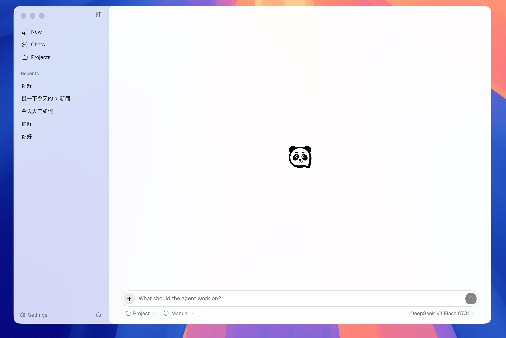
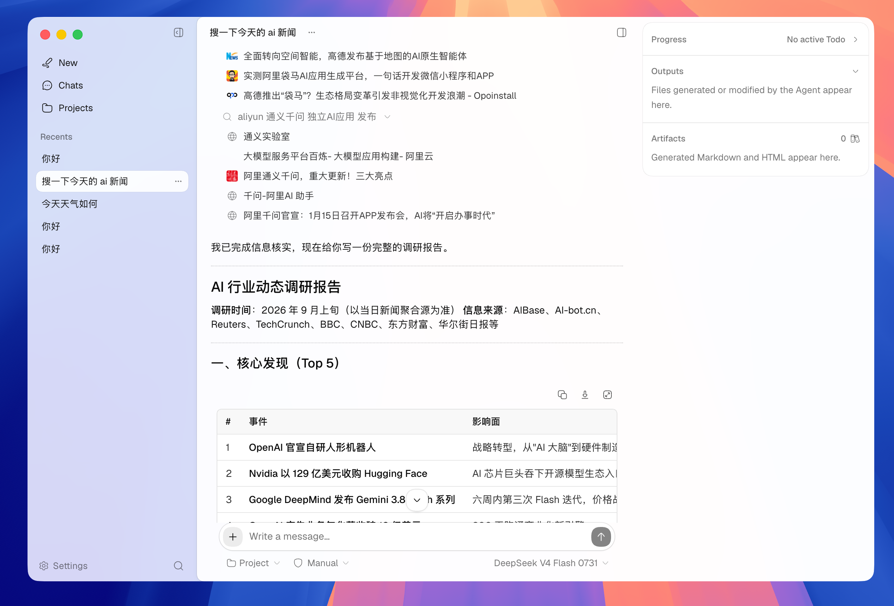

<p align="center">
  
</p>

<h1 align="center">PandaWork</h1>

<p align="center">
  一个本地优先、以对话为中心的桌面 AI coding agent。
</p>

Jai Mono 是 PandaWork 的 TypeScript monorepo。它同时包含底层的 provider、agent 和 coding 能力，以及基于 Electron 的桌面应用。PandaWork 直接理解并操作用户选择的项目目录，但它不是 IDE：agent 负责执行工作，用户仍可使用自己习惯的编辑器查看和修改产出。

## 应用展示

<p align="center">
  
  
</p>

> [!NOTE]
> 项目仍处于早期开发阶段。当前 workspace 中的包均为 private、`0.0.0` 版本，尚未作为稳定 npm 包发布。

## Features

- 对话优先的桌面工作空间，支持项目、会话历史和会话恢复
- 流式回复、思考过程、tool call、steering、follow-up 和中断
- 面向项目工作区的 `read`、`glob`、`grep`、`write`、`edit` 和 `bash` 工具
- 权限规则、危险命令扫描和需要确认的操作审批
- 持久化 session、Todo 进度、输出文件和 context compaction
- Anthropic、OpenAI Responses 以及 OpenAI-compatible provider 适配层
- 可配置 API provider 和模型，也可连接兼容 OpenAI API 的本地或远程服务
- 构造期显式装配的 Agent hooks、skills 和 subagent delegation
- 明暗主题，以及对 `prefers-reduced-motion` 的支持

## Architecture

```text
PandaWork Desktop (Electron + React) ──┐
jai CLI (TTY / subprocess)             ├── Host adapter
WorkBuddy harness                      ┘        |
                                                v
@jai/coding-agent   Public Coding Agent SDK plus the coding product assembly it
                    is built on: Agent lifecycle, tools, permissions, config,
                    skills, connectors, session facts, state and canonical events
                                                |
                                                v
@jai/agent          Agent loop, harness, hooks, compaction and durable sessions
                                                |
                                                v
@jai/ai             Provider-neutral messages, streaming events and model registry
                                                |
                                                v
                  Anthropic / OpenAI / OpenAI-compatible APIs
```

Desktop、CLI 和 WorkBuddy 都只通过 Host adapter 消费 `@jai/coding-agent`；它们分别负责 UI/IPC、TTY/subprocess 和 benchmark 环境，不复制 Agent loop、工具装配或 session 事实。SDK 负责 Agent 的执行与状态，宿主只提供模型、workspace、session、approval 等 authority，并把 canonical events 投影成自己的传输格式。

## Getting Started

### Prerequisites

- [Bun](https://bun.sh/)
- 一个可用的 provider 和模型。API provider 需要对应的 API key；本地或自托管 endpoint 需要兼容项目支持的协议。

### Run the desktop app

```bash
git clone https://github.com/jiahao-jayden/jai-mono.git
cd jai-mono
bun install
bun run desktop:dev
```

首次启动后：

1. 创建或选择一个项目目录。
2. 打开 `Settings` → `Providers`，添加 provider，填写 API key 和可选的 Base URL。
3. 获取并启用要使用的模型。
4. 新建会话，选择项目、模型和 agent mode，然后发送消息。

### Run the headless CLI

```bash
bun run cli -- --help
cat task.md | bun run cli -- -p --output-format stream-json --permission-mode bypassPermissions --no-session-persistence
```

发布后的包提供同名 `jai` binary；WorkBuddy、CI 和其他 subprocess host 只需要调用这个普通 CLI，不需要导入 Desktop 或 SDK。

需要为隔离容器准备固定安装包时，可运行：

```bash
bun run cli:pack
```

桌面端内置 Anthropic、OpenAI、DeepSeek、MiniMax 和 Kimi provider preset，也可以添加自定义 OpenAI-compatible provider。配置、会话和项目索引保存在本地应用数据目录中。

## Repository Layout

| Path | Purpose |
| --- | --- |
| `app/desktop` | Electron desktop application and React UI |
| `app/cli` | Headless `jai` CLI for interactive and automation hosts |
| `app/docs` | Blume-powered public SDK, CLI and WorkBuddy documentation site |
| `packages/ai` | Provider-neutral model types, streaming protocol and provider adapters |
| `packages/agent` | Core agent loop, harness, tools, hooks, sessions and compaction |
| `packages/coding` | Coding-agent assembly, project config, permissions, skills and business services |
| `packages/coding-agent` | Public Coding Agent SDK facade used by Desktop, CLI and external hosts |
| `packages/common` | Shared JSON types and wire-safe error utilities |
| `docs/build-agent` | Agent framework design notes and implementation specifications |
| `docs/build-coding-agent` | Coding-agent configuration and product-layer specifications |
| `PRODUCT.md` | Product positioning, users, capabilities and constraints |
| `DESIGN.md` | PandaWork Desktop design system and interaction principles |

## Development

Format and lint the repository from its root:

```bash
bun run lint
bun run format
```

Run package tests and type checks with the package-local scripts:

```bash
(cd packages/common && bun test)
(cd packages/ai && bun test)
(cd packages/agent && bun test)
(cd packages/coding && bun test)
(cd packages/ai && bun run typecheck)
(cd packages/agent && bun run typecheck)
(cd packages/coding && bun run typecheck)
bun test app/desktop/test
```

The AI integration tests are opt-in and require provider credentials. For example, Anthropic and OpenAI integration tests read `ANTHROPIC_API_KEY` and `OPENAI_API_KEY`; test models and base URLs can be overridden with the corresponding environment variables. Run them from `packages/ai` with:

```bash
AI_E2E=1 bun run test:e2e
```

## Package Highlights

### `@jai/ai`

Defines common messages, content blocks, tool schemas, model metadata, usage and fine-grained streaming events. `AnthropicProvider`, `OpenAIProvider`, `OpenAIResponsesProvider` and `ModelRegistry` let the agent layer use one provider-neutral contract.

### `@jai/agent`

Provides the `Agent` facade and lower-level `CoreAgent`, including invocation, streaming, steering, follow-ups and abort. The harness adds Node execution environments, six general-purpose workspace tools, hooks, session stores and context compaction. Tools and hooks are assembled explicitly when an Agent is constructed; the package has no runtime Extension registry. `FileSessionStore` is available from `@jai/agent/node`.

### `@jai/coding-agent`

The public SDK surface consumed by hosts: Agent creation, Host authorities, session execution, and JSON-safe event/state/error DTOs. Jai product defaults — user/project configuration, provider catalog, model authority, plugin discovery, and data-directory conventions — live on `@jai/coding-agent/jai-host`. Desktop project/session persistence stays in the Desktop app.

## Safety and Data Boundaries

PandaWork is local-first, but choosing a remote model sends the relevant conversation and project context to that provider. Local models and compatible endpoints can be configured when the data should stay within a local service.

The `bash` tool runs commands as the current user. Workspace path checks, permission rules and approval prompts reduce accidental access and dangerous actions, but they are not an OS-level sandbox. Use a container or another operating-system isolation boundary when running untrusted instructions or repositories.

## Project Status

The provider and agent foundations are implemented. `@jai/coding-agent` is the shared SDK for the Desktop and headless `jai` CLI, and the CLI has a stable print/JSON contract for subprocess hosts such as WorkBuddy-Bench. The next implementation phase is provider-backed smoke testing and the four WorkBuddy harness suites; browser capability packaging and richer TTY workflows remain incremental work on top of the same SDK boundary.

More detailed decisions and implementation history live in [`docs/build-agent/overview.md`](docs/build-agent/overview.md).
